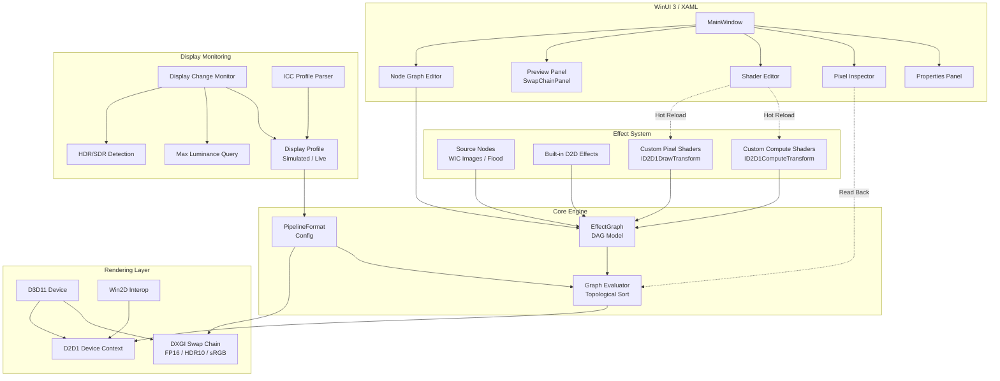
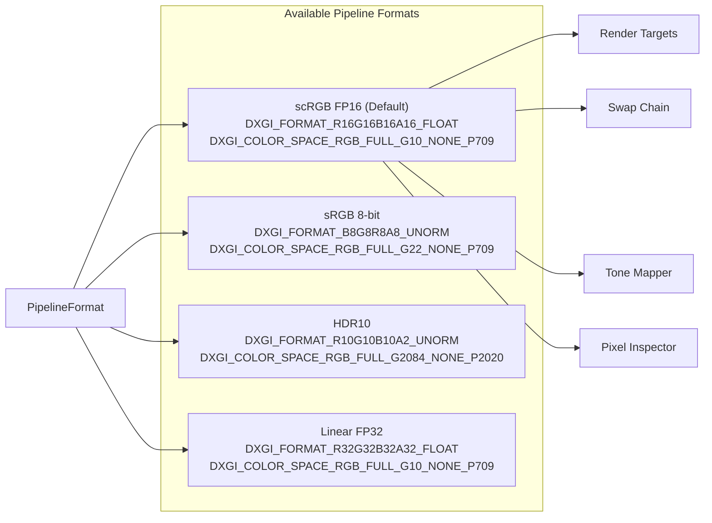
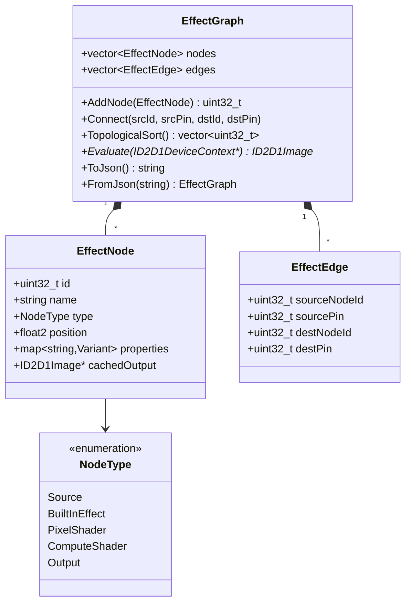
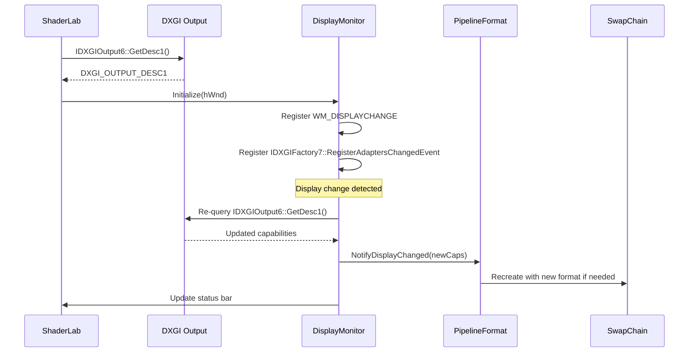
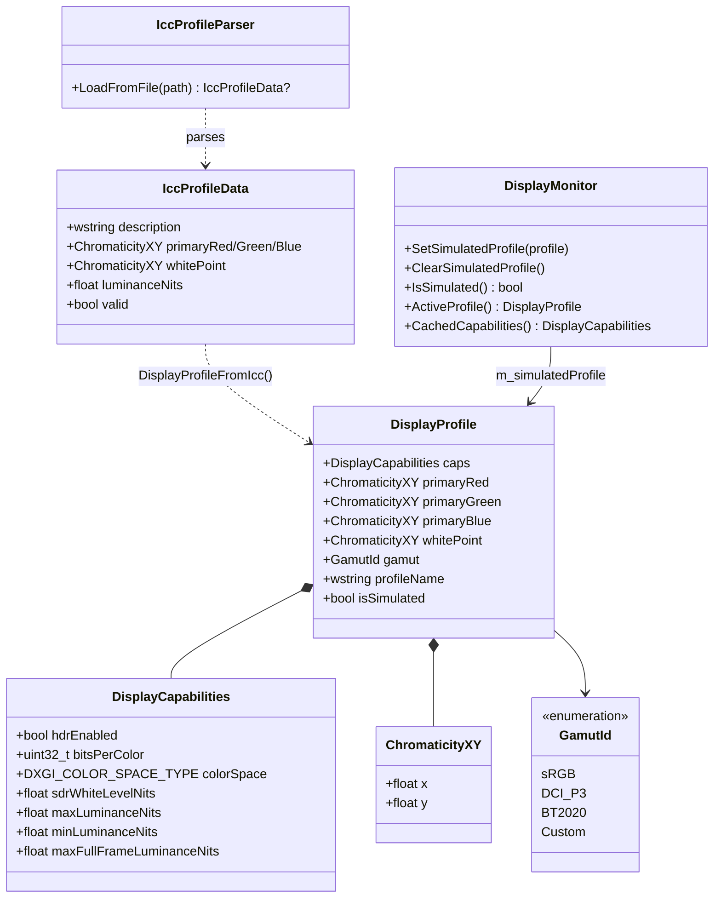
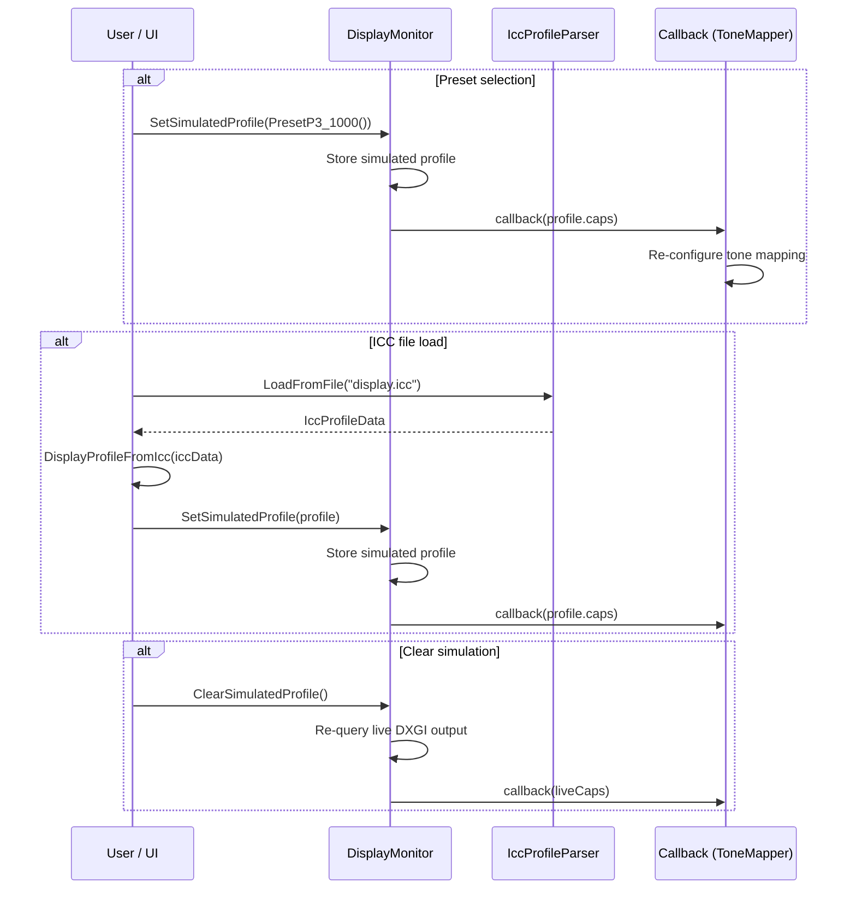
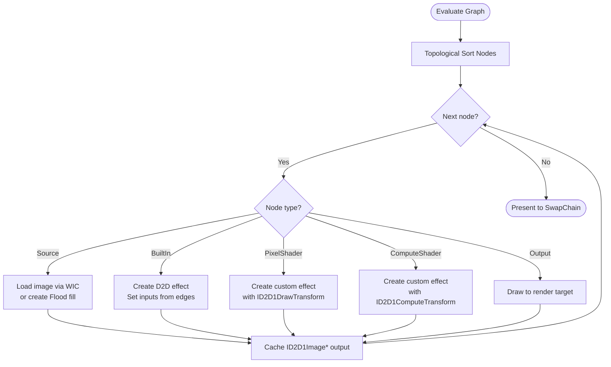

# ShaderLab

**HDR / WCG / SDR Shader Effect Development and Debugging Tool**

A WinUI 3 desktop application (C++/WinRT) for developing, testing, and debugging Direct2D and Win2D shader effects with full HDR and wide color gamut support.

---

## Architecture Overview



## Pipeline Format Strategy

The rendering pipeline format is configurable rather than hardwired. All render targets, the swap chain, and tone mapping adapt to the selected format.



## Effect Graph Model



## Display Monitoring



## Display Profile Mocking

Allows overriding the live display's characteristics with values from a preset or ICC profile, enabling tone mapping development targeting arbitrary displays without physical hardware.





## Topological Evaluation



---

## Decision Log

| # | Decision | Rationale | Date |
|---|----------|-----------|------|
| 1 | C++/WinRT, not C# | Direct COM access to ID2D1EffectImpl, ID2D1DrawTransform, ID2D1ComputeTransform for custom effect authoring. No marshaling overhead. | Day 1 |
| 2 | packages.config NuGet (not PackageReference) | Standard for C++/WinRT WinUI 3 projects; matches VS template wiring for .props/.targets imports. | Day 1 |
| 3 | scRGB FP16 as default pipeline format | Linear floating-point preserves HDR range and precision; scRGB covers full BT.2020 gamut with negative values. | Day 1 |
| 4 | Configurable PipelineFormat (not hardwired) | Users need sRGB for SDR debugging, HDR10 for PQ content, FP32 for precision work. Format affects swap chain, RTs, tone mapper, inspector. | Day 1 |
| 5 | Node-based DAG graph editor as primary UI | Visual effect chaining matches D2D effect graph model naturally. Enables per-node preview and pixel inspection. | Day 1 |
| 6 | Live HLSL editing with D3DCompile hot-reload | Core value prop: edit shader code, see results immediately. D3DReflect discovers constant buffers for auto-generated UI. | Day 1 |
| 7 | Win2D interop via native headers | Use Win2D's built-in effect wrappers where convenient, fall back to raw D2D for custom effects. Native interop via GetWrappedResource/CreateDrawingSession. | Day 1 |
| 8 | MSIX packaged desktop app | Required for WinUI 3 full functionality, AppContainer=false for full trust (DirectX device access). | Day 1 |
| 9 | Clean project at E:\source\ShaderLab | Avoid MSIX/manifest conflicts from nesting inside existing workspace. Fresh project with all NuGet wiring from scratch. | Day 1 |
| 10 | Kahn's algorithm for topological sort | Linear-time O(V+E), naturally detects cycles (sorted count ≠ node count), simple queue-based — no recursion. | Day 2 |
| 11 | Windows.Data.Json for graph serialization | Ships with WinRT (zero extra dependencies), sufficient for graph persistence. PropertyValue variant uses tagged type/value pairs for round-trip fidelity. | Day 2 |
| 12 | Hidden message-only window for WM_DISPLAYCHANGE | Decouples display monitoring from XAML window; no subclassing needed. HWND_MESSAGE keeps it invisible. | Day 2 |
| 13 | jthread + event for adapter hot-plug | IDXGIFactory7::RegisterAdaptersChangedEvent fires a Win32 event; std::jthread with stop_token provides clean shutdown without manual flag management. | Day 2 |
| 14 | Header-only PipelineFormat with inline constants | Four formats as `inline const` globals; `AllFormats[]` array for UI enumeration; `RecommendedFormat(caps)` ties display detection to default selection. No .cpp needed. | Day 2 |
| 15 | CreateSwapChainForComposition + ISwapChainPanelNative | WinUI 3 SwapChainPanel requires composition swap chain; SetColorSpace1 configures HDR/SDR color space on the swap chain. D2D1Bitmap1 wraps back buffer as render target. | Day 2 |
| 16 | Per-node D2D effect cache in GraphEvaluator | Effects created once and reused across frames; only properties re-applied on dirty nodes. GetPropertyIndex maps string keys to D2D indices. Topological walk guarantees upstream outputs are ready before wiring. | Day 2 |
| 17 | WIC HDR-aware image loading with format-split | SDR images→PBGRA 32bpp, HDR images→RGBA Half 64bpp (FP16). Flood source uses CLSID_D2D1Flood with D2D1_FLOOD_PROP_COLOR. Both cached per node ID. | Day 2 |
| 18 | Singleton EffectRegistry with categorized D2D catalog | 40+ built-in D2D effects across 9 categories (Blur, Color, Composition, Transform, Detail, Lighting, Distort, HDR, Analysis). EffectDescriptor stores CLSID, pin layout, and default properties. CreateNode() factory produces fully-configured EffectNodes. Case-insensitive name lookup + CLSID lookup for flexibility. | Day 3 |
| 19 | ID2D1EffectImpl + ID2D1DrawTransform for custom pixel shaders | CustomPixelShaderEffect implements both interfaces; registered via CLSID with D2D factory. Only InputCount exposed as D2D property; shader bytecode and constant buffer managed host-side for simplicity. ShaderCompiler wraps D3DCompile + D3DReflect with debug/release flags. PackConstantBuffer maps PropertyValue variant to cbuffer layout via reflection offsets. | Day 3 |
| 20 | ID2D1ComputeTransform for custom compute shaders | CustomComputeShaderEffect mirrors pixel shader pattern with ID2D1ComputeTransform + ID2D1ComputeInfo. CalculateThreadgroups divides output rect by configurable group size (default 8×8×1). CheckFeatureSupport validates compute shader hardware support at Initialize. Reuses ShaderCompiler with cs_5_0 target. | Day 3 |
| 21 | ShaderEditorController for live HLSL hot-reload | Compile-on-demand from TextBox text or file; D3DReflect auto-discovers cbuffer variables and maps D3D_SVT_FLOAT/INT/UINT/BOOL to PropertyValue defaults. Error parsing extracts line number from D3DCompile output. Default PS/CS templates provided. Controller is view-agnostic (no TextBox dependency). | Day 3 |
| 22 | Canvas-based NodeGraphController with D2D rendering | Visual node layout from EffectNode::position, D2D bezier edge curves, color-coded headers per NodeType, hit-test for nodes/pins, drag-move/connection/selection, pan/zoom transform. DWrite text format for node titles. Decoupled from XAML — renders via ID2D1DeviceContext. | Day 3 |
| 23 | GPU readback via D2D1Bitmap1 for pixel inspection | Renders 1×1 target bitmap at pixel coordinates, copies to CPU_READ bitmap, maps for float4 read. Converts scRGB linear → sRGB gamma, PQ (ST.2084), BT.709 luminance (80 nit ref white). Tracked position persists across re-evaluations. | Day 3 |
| 24 | D2D built-in effects for tone mapping | WhiteLevelAdjustment for SDR↔HDR white scaling, HdrToneMap for HDR→SDR, ColorMatrix for exposure (2^stops). Five modes: None, Reinhard, ACES Filmic, Hable, SDR Clamp. Reference math implementations for custom shader fallback. | Day 3 |
| 25 | DispatcherQueueTimer at 16ms for render loop | ~60 FPS render tick drives graph evaluation → tone mapping → swap chain present. FPS counter updated every second in status bar. Ctrl+Enter compiles shader from TextBox. Custom effects (pixel + compute) registered with D2D factory at startup. | Day 3 |
| 26 | Display profile mocking with ICC parser | DisplayProfile wraps DisplayCapabilities with CIE xy chromaticities and gamut ID. Six presets cover sRGB→BT.2020 at various luminances. IccProfileParser reads binary ICC files (v2/v4) extracting rXYZ/gXYZ/bXYZ/wtpt/lumi/desc tags. DisplayMonitor.SetSimulatedProfile overrides live caps and fires existing callback, so the entire downstream pipeline (tone mapper, pipeline format) adapts without changes. | Day 4 |

---

## Build Instructions

### Prerequisites
- Visual Studio 2022 17.8+ (with C++ Desktop and UWP workloads)
- Windows App SDK 1.8
- Windows 10 SDK (10.0.26100+)

### Build
1. Open `ShaderLab.slnx` in Visual Studio
2. NuGet packages restore automatically
3. Build → Debug x64

### Required Libraries (linked via vcxproj)

| Library | Purpose |
|---------|---------|
| `d3d11.lib` | Direct3D 11 device and context |
| `d2d1.lib` | Direct2D rendering and effects |
| `dxgi.lib` | DXGI swap chain, HDR output queries |
| `d3dcompiler.lib` | Runtime HLSL compilation (D3DCompile) |
| `dxguid.lib` | DirectX GUIDs (IID_ID2D1Factory, etc.) |
| `windowscodecs.lib` | WIC image loading |

---

## Project Structure

```
ShaderLab/
├── ShaderLab.slnx              # Solution file
├── ShaderLab.vcxproj           # Project file (C++/WinRT, NuGet, MSIX)
├── packages.config             # NuGet package manifest
├── Package.appxmanifest        # MSIX app identity
├── app.manifest                # DPI awareness, heap type
├── README.md                   # This file
│
├── pch.h / pch.cpp             # Precompiled header (WinRT, D2D, D3D, Win2D, STL)
├── App.xaml / .h / .cpp        # Application entry point
├── MainWindow.xaml / .h / .cpp # Main window layout and initialization
├── MainWindow.idl              # WinRT interface definition
│
├── Graph/                      # Effect graph data model
│   ├── NodeType.h              # NodeType enum (Source, BuiltInEffect, PixelShader, ComputeShader, Output)
│   ├── PropertyValue.h         # std::variant type for node properties (float, int, bool, float2-4, string)
│   ├── EffectNode.h            # EffectNode struct (id, name, type, position, properties, pins, cached output)
│   ├── EffectEdge.h            # EffectEdge struct (source/dest node + pin IDs)
│   ├── EffectGraph.h           # EffectGraph class declaration (DAG, topo sort, JSON)
│   └── EffectGraph.cpp         # EffectGraph implementation
├── Rendering/                  # D3D/D2D device management, swap chain, pipeline
│   ├── DisplayInfo.h           # DisplayCapabilities struct (HDR flag, luminance, color space, SDR white level)
│   ├── DisplayMonitor.h        # DisplayMonitor class (WM_DISPLAYCHANGE + adapter-changed event + simulated profile)
│   ├── DisplayMonitor.cpp      # DisplayMonitor implementation
│   ├── DisplayProfile.h        # DisplayProfile struct, ChromaticityXY, GamutId, preset factory functions
│   ├── IccProfileParser.h      # IccProfileParser class + IccProfileData struct
│   ├── IccProfileParser.cpp    # ICC binary format parsing (v2/v4), XYZ→xy conversion, gamut detection
│   ├── PipelineFormat.h        # PipelineFormat struct + 4 predefined formats (scRGB FP16, sRGB 8-bit, HDR10, Linear FP32)
│   ├── RenderEngine.h          # RenderEngine class (D3D11 + D2D1 + swap chain lifecycle)
│   ├── RenderEngine.cpp        # RenderEngine implementation (device creation, resize, format switch, draw cycle)
│   ├── GraphEvaluator.h        # GraphEvaluator class (topological walk, effect cache, property application)
│   ├── GraphEvaluator.cpp      # GraphEvaluator implementation (per-node evaluation loop)
│   ├── ToneMapper.h            # Tone mapping modes (None, Reinhard, ACES, Hable, SDR Clamp)
│   └── ToneMapper.cpp          # D2D WhiteLevelAdjustment + HdrToneMap + ColorMatrix exposure
├── Effects/                    # Built-in effect wrappers, custom effect base
│   ├── ImageLoader.h           # WIC image loading class (HDR/SDR format detection)
│   ├── ImageLoader.cpp         # WIC decode pipeline (file/stream → FormatConverter → D2D1Bitmap1)
│   ├── SourceNodeFactory.h     # Source node creation (image file + flood fill)
│   ├── SourceNodeFactory.cpp   # PrepareSourceNode: loads images or creates Flood effects
│   ├── EffectRegistry.h        # EffectDescriptor struct + EffectRegistry singleton (catalog API)
│   ├── EffectRegistry.cpp      # 40+ built-in D2D effect registrations (9 categories)
│   ├── ShaderCompiler.h        # D3DCompile + D3DReflect wrapper (compile from file/string, reflect cbuffers)
│   ├── ShaderCompiler.cpp      # HLSL compilation with debug/release flags, constant buffer reflection
│   ├── CustomPixelShaderEffect.h   # ID2D1EffectImpl + ID2D1DrawTransform for user pixel shaders
│   ├── CustomPixelShaderEffect.cpp # Effect registration, PrepareForRender, cbuffer packing from PropertyValue
│   ├── CustomComputeShaderEffect.h   # ID2D1EffectImpl + ID2D1ComputeTransform for user compute shaders
│   └── CustomComputeShaderEffect.cpp # Compute dispatch, CalculateThreadgroups, hardware feature check
├── Controls/                   # Editor controllers and custom UI logic
│   ├── ShaderEditorController.h    # HLSL compile-on-demand, D3DReflect auto-property generation
│   ├── ShaderEditorController.cpp  # Compile, reflect, error parsing, default PS/CS templates
│   ├── NodeGraphController.h       # Canvas-based node graph editor (layout, hit-test, D2D render)
│   ├── NodeGraphController.cpp     # Bezier edges, color-coded nodes, drag/connect/select, pan/zoom
│   ├── PixelInspectorController.h  # GPU readback, scRGB→sRGB/PQ/luminance conversion
│   └── PixelInspectorController.cpp # D2D1Bitmap1 CPU_READ readback, tracked pixel position
├── Shaders/                    # HLSL source files (user shaders)
├── Assets/                     # App icons, splash screen
│
├── .github/
│   └── copilot-instructions.md
└── packages/                   # NuGet packages (restored)
```
