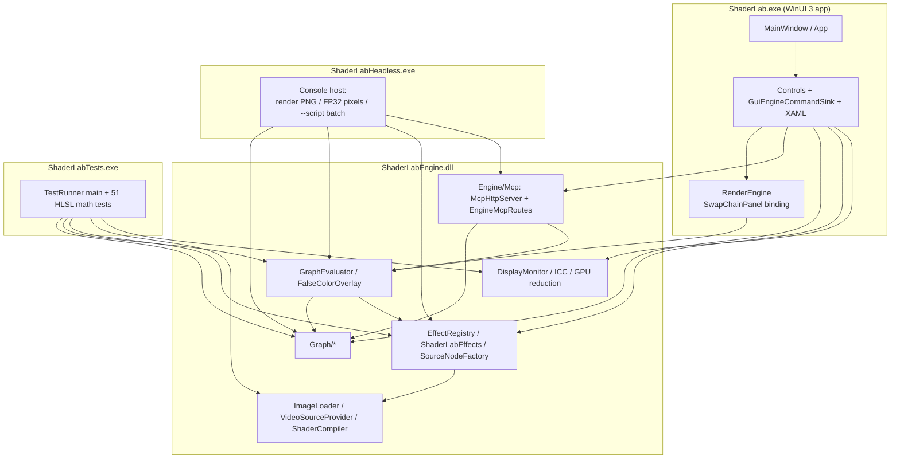
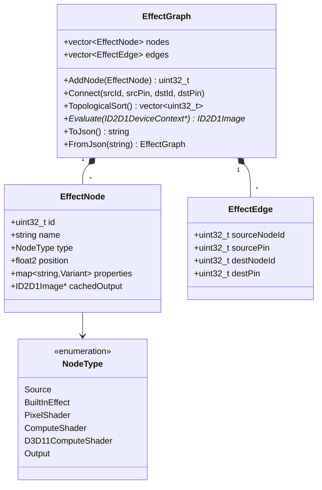
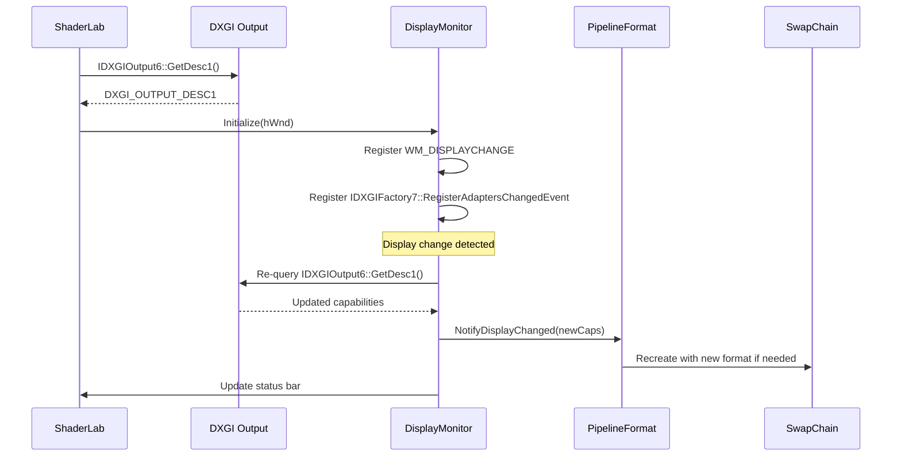
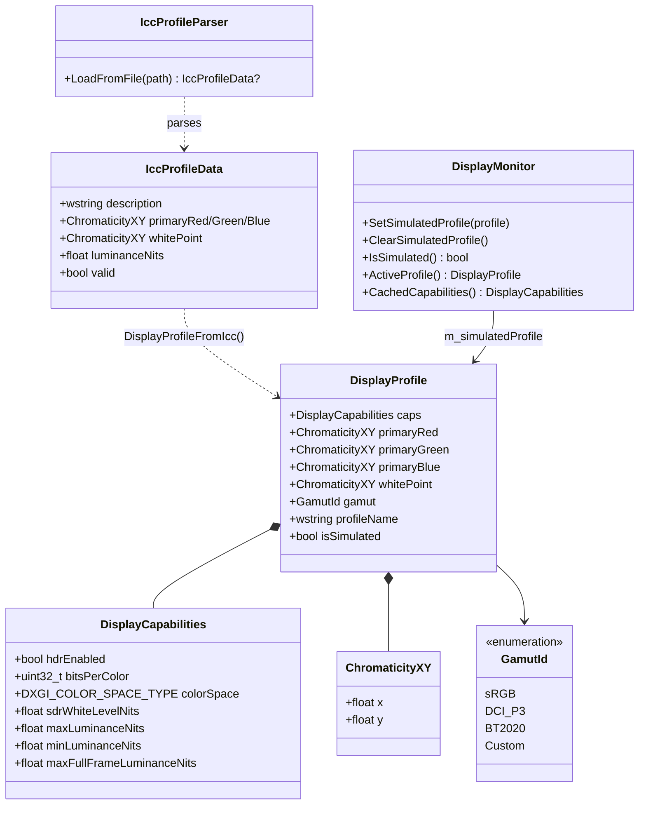
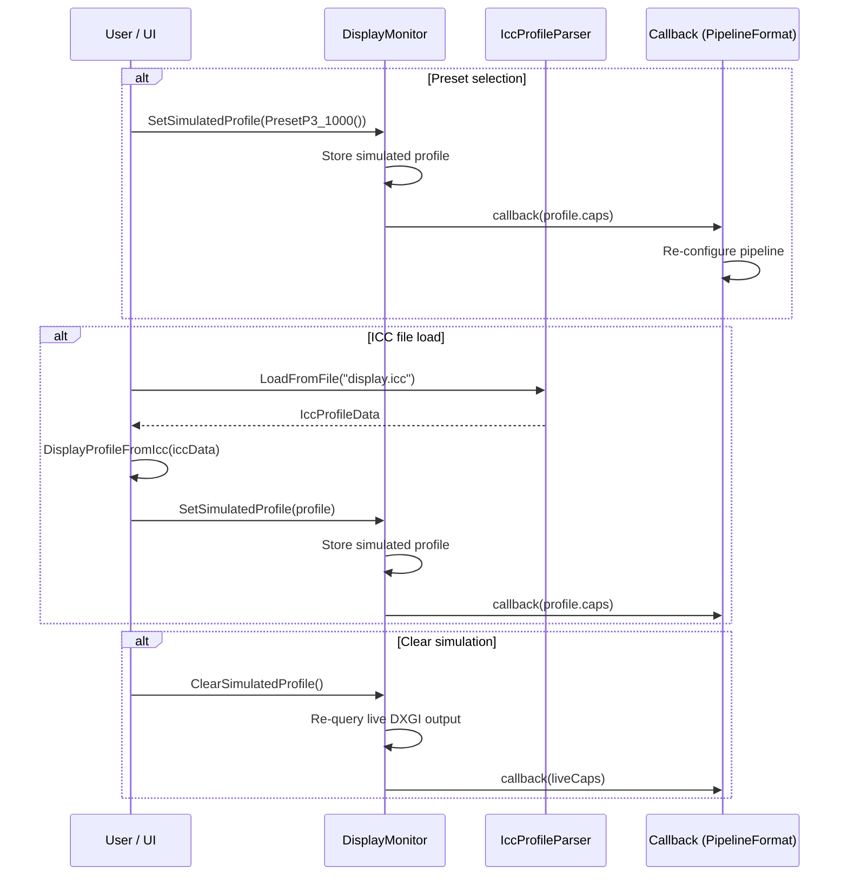
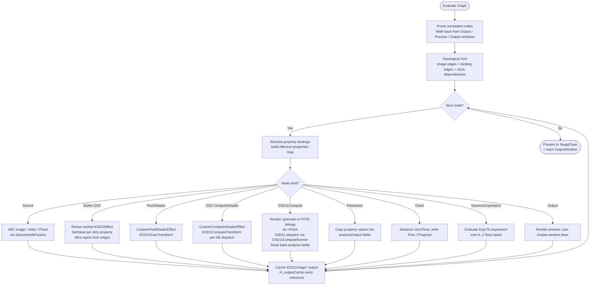
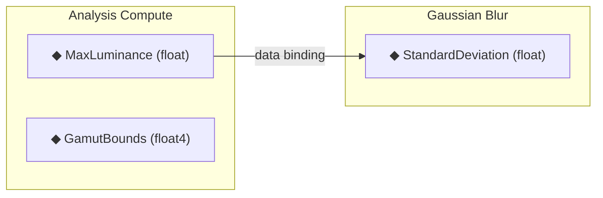
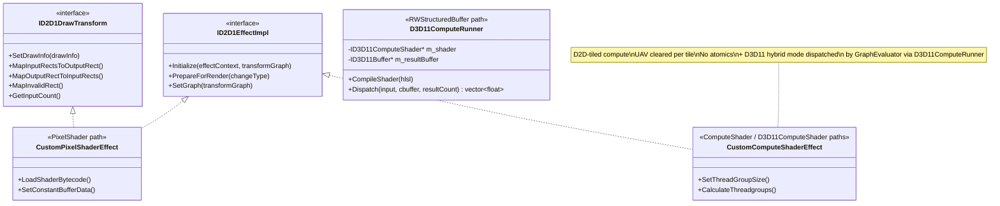

# ShaderLab

**HDR / WCG / SDR Shader Effect Development and Debugging Tool**

A WinUI 3 desktop application (C++/WinRT) for developing, testing, and debugging Direct2D and Win2D shader effects with full HDR and wide color gamut support.

---

## Installing a Release Build

Release builds are distributed as **unsigned MSIX packages** — no signing certificate is required, but the user must enable Developer Mode.

1. Enable Developer Mode: *Settings → Privacy & security → For developers → Developer Mode*.
2. Download the architecture-matched zip from the GitHub Releases page:
   - `ShaderLab-<version>-x64.zip` for AMD64/Intel
   - `ShaderLab-<version>-arm64.zip` for ARM64 (e.g. Snapdragon X / Surface Pro)
3. Extract and run from the extracted folder:
   ```pwsh
   .\Install.ps1
   ```
4. Launch ShaderLab from the Start menu.

`Install.ps1` calls `Add-AppxPackage -AllowUnsigned`, which installs unsigned MSIX packages on systems with Developer Mode enabled (Windows 10 1903+ / Windows 11). The script installs the bundled dependency packages (Microsoft VCLibs, Windows App Runtime) for the host architecture first, then the ShaderLab MSIX itself.

**Why unsigned works**: the manifest's `Publisher` carries the special OID `2.25.311729368913984317654407730594956997722=1` (Windows' "unsigned namespace"), which is the prerequisite for `-AllowUnsigned`. The OID is injected by the release workflow only — the in-repo manifest stays plain `CN=ShaderLab` so signed F5 deploys keep working.

## Local Development Setup

The project ships without a code-signing certificate (the `.pfx` is gitignored). On the first build, MSBuild automatically runs:

- **`scripts\EnsureDevCert.ps1`** — generates a self-signed cert (`CN=ShaderLab`) and imports it into `TrustedPeople` for F5 deploy.
- **`scripts\EnsureExprTk.ps1`** — downloads `exprtk.hpp` (single-header math expression parser, MIT-licensed) into `third_party\exprtk\` for use by the `Numeric Expression` parameter node.

After that, F5 (Debug | x64, startup project = `ShaderLab`) deploys and launches the packaged app. The dev cert is only used for local F5 deploy — it is **not** required for end-user install (see *Installing a Release Build* above).

---

## Table of Contents

- [Architecture Overview](#architecture-overview)
- [Pipeline Format Strategy](#pipeline-format-strategy)
- [Effect Graph Model](#effect-graph-model)
- [Display Monitoring](#display-monitoring)
- [Display Profile Mocking](#display-profile-mocking)
- [Topological Evaluation](#topological-evaluation)
- [ShaderLab Built-in Effects](#shaderlab-built-in-effects)
- [Numeric Expression Node (ExprTk)](#numeric-expression-node-exprtk)
- [Parameter Nodes](#parameter-nodes)
- [Compute Shader Analysis Pipeline](#compute-shader-analysis-pipeline)
- [D2D / D3D11 Hybrid Compute System](#d2d--d3d11-hybrid-compute-system)
- [Property Bindings (Data Pins)](#property-bindings-data-pins)
- [Effect Designer](#effect-designer)
- [Multi-Output Windows](#multi-output-windows)
- [Animation System](#animation-system)
- [Effect Versioning System](#effect-versioning-system)
- [Conditional Parameter Visibility](#conditional-parameter-visibility)
- [Working Space Integration](#working-space-integration)
- [Graph Editor UX](#graph-editor-ux)
- [Engine / Host Split](#engine--host-split)
- [ShaderLabHeadless (Console Host)](#shaderlabheadless-console-host)
- [MCP Server (AI Agent Integration)](#mcp-server-ai-agent-integration)
- [Build Instructions](#build-instructions)
- [Project Structure](#project-structure)
- [Decision Log](#decision-log)

---

## Architecture Overview



## Pipeline Format Strategy

The rendering pipeline always uses **scRGB FP16** (`DXGI_FORMAT_R16G16B16A16_FLOAT` with `DXGI_COLOR_SPACE_RGB_FULL_G10_NONE_P709`). Linear floating-point preserves full HDR range and precision; scRGB covers the full BT.2020 gamut including negative values. DWM/ACM handles the final display conversion to whatever the connected monitor reports. There is no fixed built-in tone mapper in the render path — users build tone mappers as graph effects (e.g. via the `D2D ColorMatrix`/`HdrToneMap`/`WhiteLevelAdjustment` chain), which keeps full HDR accuracy on by default and avoids accidental clipping.

## Effect Graph Model



`NodeType::Output` carries no shader — it is a sink that the evaluator draws to. Parameter and clock nodes (Float / Integer / Toggle / Gamut / Clock / Numeric Expression) are stored as `ComputeShader`-typed nodes whose `customEffect.hlslSource` is empty; the evaluator special-cases them into a CPU-side data path (see [Parameter Nodes](#parameter-nodes) and [Numeric Expression Node](#numeric-expression-node-exprtk)).

## Display Monitoring



### SDR white level

`DisplayCapabilities::sdrWhiteLevelNits` is queried from the OS via `DisplayConfigGetDeviceInfo(DISPLAYCONFIG_DEVICE_INFO_GET_SDR_WHITE_LEVEL)`, decoded as `nits = SDRWhiteLevel / 1000 * 80`. This value tracks the user's **Settings → Display → HDR → "SDR content brightness"** slider when HDR is on; when HDR is off it falls back to 80 nits.

The value is exposed to graphs through the **`Working Space` parameter node** (see [Working Space Integration](#working-space-integration)) on its `SdrWhiteNits` analysis output. Effects that need to know the nit value of scRGB 1.0 (the entire ICtCp suite) consume it via property bindings — wire `working_space.SdrWhiteNits` into the effect's nit-target parameter and it tracks both the OS slider and any simulated `DisplayProfile` preset automatically. There is no longer any per-effect "follow the live monitor" or "follow the working space" host-side plumbing; the Working Space node is the single explicit path.

## Display Profile Mocking

Allows overriding the live display's characteristics with values from a preset or ICC profile, enabling tone mapping development targeting arbitrary displays without physical hardware.





## Topological Evaluation



The evaluator runs at the **monitor's refresh rate** (clamped to 60–240 Hz) via a `DispatcherQueueTimer` whose `Interval` is set from `EnumDisplaySettings(ENUM_CURRENT_SETTINGS).dmDisplayFrequency`. 60 / 120 / 144 / 165 / 240 Hz panels and high-FPS video sources all run at their native cadence. The body is **dirty-gated**: `OnRenderTick` skips `RenderFrame` entirely unless any node is dirty, an output window is open, the preview wants a fit, or `m_forceRender` was set by user input. The interval is re-applied on every display change (so dragging the window across monitors picks up the new rate).

---

## Decision Log

| # | Decision | Rationale | Date |
|---|----------|-----------|------|
| 1 | C++/WinRT, not C# | Direct COM access to ID2D1EffectImpl, ID2D1DrawTransform, ID2D1ComputeTransform for custom effect authoring. No marshaling overhead. | Day 1 |
| 2 | packages.config NuGet (not PackageReference) | Standard for C++/WinRT WinUI 3 projects; matches VS template wiring for .props/.targets imports. | Day 1 |
| 3 | scRGB FP16 as default pipeline format | Linear floating-point preserves HDR range and precision; scRGB covers full BT.2020 gamut with negative values. | Day 1 |
| 4 | Configurable PipelineFormat (not hardwired) | Users need sRGB for SDR debugging, HDR10 for PQ content, FP32 for precision work. Format affects swap chain, RTs, tone mapper, inspector. | Day 1 |
| 5 | Node-based DAG graph editor as primary UI | Visual effect chaining matches D2D effect graph model naturally. Enables per-node preview and pixel inspection. | Day 1 |
| 6 | Live HLSL editing with D3DCompile hot-reload | Core value prop: edit shader code, see results immediately. D3DReflect discovers constant buffers for auto-generated UI. | Day 1 |
| 7 | Win2D interop via native headers | Use Win2D's built-in effect wrappers where convenient, fall back to raw D2D for custom effects. Native interop via GetWrappedResource/CreateDrawingSession. | Day 1 |
| 8 | MSIX packaged desktop app | Required for WinUI 3 full functionality, AppContainer=false for full trust (DirectX device access). | Day 1 |
| 9 | Clean project at E:\source\ShaderLab | Avoid MSIX/manifest conflicts from nesting inside existing workspace. Fresh project with all NuGet wiring from scratch. | Day 1 |
| 10 | Kahn's algorithm for topological sort | Linear-time O(V+E), naturally detects cycles (sorted count ≠ node count), simple queue-based — no recursion. | Day 2 |
| 11 | Windows.Data.Json for graph serialization | Ships with WinRT (zero extra dependencies), sufficient for graph persistence. PropertyValue variant uses tagged type/value pairs for round-trip fidelity. | Day 2 |
| 12 | Hidden message-only window for WM_DISPLAYCHANGE | Decouples display monitoring from XAML window; no subclassing needed. HWND_MESSAGE keeps it invisible. | Day 2 |
| 13 | jthread + event for adapter hot-plug | IDXGIFactory7::RegisterAdaptersChangedEvent fires a Win32 event; std::jthread with stop_token provides clean shutdown without manual flag management. | Day 2 |
| 14 | Header-only PipelineFormat with inline constants | Four formats as `inline const` globals; `AllFormats[]` array for UI enumeration; `RecommendedFormat(caps)` ties display detection to default selection. No .cpp needed. | Day 2 |
| 15 | CreateSwapChainForComposition + ISwapChainPanelNative | WinUI 3 SwapChainPanel requires composition swap chain; SetColorSpace1 configures HDR/SDR color space on the swap chain. D2D1Bitmap1 wraps back buffer as render target. | Day 2 |
| 16 | Per-node D2D effect cache in GraphEvaluator | Effects created once and reused across frames; only properties re-applied on dirty nodes. GetPropertyIndex maps string keys to D2D indices. Topological walk guarantees upstream outputs are ready before wiring. | Day 2 |
| 17 | WIC HDR-aware image loading with format-split | SDR images→PBGRA 32bpp, HDR images→RGBA Half 64bpp (FP16). Flood source uses CLSID_D2D1Flood with D2D1_FLOOD_PROP_COLOR. Both cached per node ID. | Day 2 |
| 18 | Singleton EffectRegistry with categorized D2D catalog | 40+ built-in D2D effects across 9 categories (Blur, Color, Composition, Transform, Detail, Lighting, Distort, HDR, Analysis). EffectDescriptor stores CLSID, pin layout, and default properties. CreateNode() factory produces fully-configured EffectNodes. Case-insensitive name lookup + CLSID lookup for flexibility. | Day 3 |
| 19 | ID2D1EffectImpl + ID2D1DrawTransform for custom pixel shaders | CustomPixelShaderEffect implements both interfaces; registered via CLSID with D2D factory. Only InputCount exposed as D2D property; shader bytecode and constant buffer managed host-side for simplicity. ShaderCompiler wraps D3DCompile + D3DReflect with debug/release flags. PackConstantBuffer maps PropertyValue variant to cbuffer layout via reflection offsets. | Day 3 |
| 20 | ID2D1ComputeTransform for custom compute shaders | CustomComputeShaderEffect mirrors pixel shader pattern with ID2D1ComputeTransform + ID2D1ComputeInfo. CalculateThreadgroups divides output rect by configurable group size (default 8×8×1). CheckFeatureSupport validates compute shader hardware support at Initialize. Reuses ShaderCompiler with cs_5_0 target. | Day 3 |
| 21 | ShaderEditorController for live HLSL hot-reload | Compile-on-demand from TextBox text or file; D3DReflect auto-discovers cbuffer variables and maps D3D_SVT_FLOAT/INT/UINT/BOOL to PropertyValue defaults. Error parsing extracts line number from D3DCompile output. Default PS/CS templates provided. Controller is view-agnostic (no TextBox dependency). | Day 3 |
| 22 | Canvas-based NodeGraphController with D2D rendering | Visual node layout from EffectNode::position, D2D bezier edge curves, color-coded headers per NodeType, hit-test for nodes/pins, drag-move/connection/selection, pan/zoom transform. DWrite text format for node titles. Decoupled from XAML — renders via ID2D1DeviceContext. | Day 3 |
| 23 | GPU readback via D2D1Bitmap1 for pixel inspection | Renders 1×1 target bitmap at pixel coordinates, copies to CPU_READ bitmap, maps for float4 read. Converts scRGB linear → sRGB gamma, PQ (ST.2084), BT.709 luminance (80 nit ref white). Tracked position persists across re-evaluations. | Day 3 |
| 24 | D2D built-in effects for tone mapping | WhiteLevelAdjustment for SDR↔HDR white scaling, HdrToneMap for HDR→SDR, ColorMatrix for exposure (2^stops). Five modes: None, Reinhard, ACES Filmic, Hable, SDR Clamp. Reference math implementations for custom shader fallback. | Day 3 |
| 25 | DispatcherQueueTimer at 16ms for render loop | ~60 FPS render tick drives graph evaluation → tone mapping → swap chain present. FPS counter updated every second in status bar. Ctrl+Enter compiles shader from TextBox. Custom effects (pixel + compute) registered with D2D factory at startup. | Day 3 |
| 26 | Display profile mocking with ICC parser | DisplayProfile wraps DisplayCapabilities with CIE xy chromaticities and gamut ID. Six presets cover sRGB→BT.2020 at various luminances. IccProfileParser reads binary ICC files (v2/v4) extracting rXYZ/gXYZ/bXYZ/wtpt/lumi/desc tags. DisplayMonitor.SetSimulatedProfile overrides live caps and fires existing callback, so the entire downstream pipeline (tone mapper, pipeline format) adapts without changes. | Day 4 |
| 27 | ShaderLab effects library with embedded HLSL + shared color math | 9 built-in effects (4 analysis, 5 source) with HLSL embedded as string constants in ShaderLabEffects.cpp. Shared color math library (BT.709/BT.2020/P3 matrices, PQ/HLG transfer functions, CIE xy conversions) prepended to each shader. Auto-compiled at first use via ShaderCompiler. Categories: Analysis (Luminance Heatmap, OOG Highlight, CIE Chromaticity, Vectorscope) and Source (Gamut Source, Color Checker, Zone Plate, Gradient Generator, HDR Test Pattern). | Day 5 |
| 28 | Per-component property bindings (Grasshopper-style) | Analysis output fields from compute shaders can be bound to downstream effect properties with per-component picking (float4.x → float). Visual orange diamond data pins on node graph. Bindings participate in topological sort and cycle detection. Bound values resolved every frame (bypass dirty logic). Authored properties never mutated — bindings build effective properties map at evaluation time. | Day 5 |
| 29 | Versioning system (app + graph format) | Version.h defines app version (1.1.0) and graph format version (2). Both stored in saved graph JSON. Forward compatibility check on load — newer format version shows error dialog. Version displayed in status bar and title bar. | Day 5 |
| 30 | Always scRGB FP16 pipeline (no fallback) | Removed sRGB/HDR10/FP32 pipeline format switching. Pipeline is always scRGB FP16. DWM/ACM handles final display conversion. Simplifies swap chain management, tone mapper, and render target creation. PipelineFormat.h retained but only one format used. | Day 5 |
| 31 | MCP server for AI agent integration | Embedded Winsock2 HTTP server with JSON-RPC 2.0 on port 47808. 21 tools for graph manipulation, property control, HLSL compilation, render capture, analysis readback, pixel trace, effect listing, and display info. Enables AI agents (Copilot, Claude, etc.) to programmatically control ShaderLab. Routes in MainWindow.McpRoutes.cpp. | Day 5 |
| 32 | Remove built-in tone mapper | Pipeline passes raw scRGB through. Users build tone mappers as graph effects. Full accuracy by default. | Day 6 |
| 33 | Multi-output windows via OutputWindow | Each Output node gets its own SwapChainPanel window. Shares D2D device context. Bidirectional sync: close window ↔ delete node. | Day 6 |
| 34 | Effect versioning with effectId/effectVersion | Stable IDs survive renames. Per-node and batch upgrade buttons. Preserves user property values on upgrade. | Day 6 |
| 35 | _hidden suffix convention (retired) | Originally used to hide host-managed working-space cbuffer properties from the Properties panel and pin list. **Retired in v1.4.x** — superseded by decision #51 (Working Space node + bindings) and then fully removed in the Phase-0 cleanup. The filter no longer exists in the codebase. Saved graphs that still carry stale `_hidden` keys load with the keys present in memory but inert (no shader cbuffer references them; non-customEffect nodes never had them; customEffect nodes filter their Properties panel by declared parameters, so stale keys remain invisible). Old graph compatibility is not promised. | Day 6 / retired Day 12 |
| 36 | D3D11 compute via evaluator dispatch | Bypass D2D tiling for reduction operations. The original `GpuReduction` helper used a 32×32 thread group with groupshared memory and 32-byte readback. **Retired in decision #63** when the `/render/image-stats` route was dropped — the equivalent capability is provided by user-authored `D3D11ComputeShader` effects (Channel / Luminance / Chromaticity Statistics) dispatched through `D3D11ComputeRunner`. | Day 6 |
| 37 | ID2D1StatisticsEffect COM interface | D2D-compatible effect wrapper with custom interface for analysis results. Pass-through pixel shader + D3D11 compute dispatch. | Day 6 |
| 38 | Parameter nodes as data-only graph elements | No shader, evaluator handles directly. Teal color, inline slider, don't switch preview. Four types: Float, Integer, Toggle, Gamut. | Day 6 |
| 39 | CPU analysis → GPU reduction for Image Statistics | Moved from pixel shader (512K redundant reads) to CPU readback (exact, single pass) to D3D11 compute (GPU-resident, 32-byte readback). | Day 6 |
| 40 | dc->Flush() for D2D→D3D11 texture handoff | D2D batches DrawImage commands until EndDraw/Flush. When rendering to a bitmap then reading it with D3D11 compute, Flush() must be called between DrawImage and D3D11 dispatch — otherwise D3D11 reads zeros from the uninitialized texture. Applied in both ComputeImageStatistics and DispatchUserD3D11Compute. | Day 7 |
| 41 | Split engine code into ShaderLabEngine.dll | Graph/effect/rendering logic now builds once into a native DLL shared by the WinUI app and a standalone console runner. This removes WinUI from the test path, enables direct engine regression runs, and keeps RenderEngine/XAML-specific code isolated in the app project. | Day 8 |
| 42 | Viewport-aware AddNode placement | New nodes created via toolbar / context menu / MCP land at the center of the current viewport (in graph coordinates) rather than the canvas origin, so they appear where the user is looking even after pan / zoom. | Day 9 |
| 43 | Force-render on output-window close | Closing an OutputWindow deletes its Output node and explicitly bumps `m_forceRender`, so the dirty-gated render loop repaints once and the node disappears from the canvas immediately. | Day 9 |
| 44 | Alt+click edge delete via bezier hit-test | `NodeGraphController::HitTestEdge` samples the cubic bezier of each edge with a small distance tolerance; Alt+click and right-click delete share the same `RemoveEdge` path for both image edges and orange data-binding edges. | Day 9 |
| 45 | Multi-arch matrix release (x64 + ARM64) | `release.yml` runs MSBuild as a matrix; `Install.ps1` detects the host architecture, installs the bundled VCLibs / WinAppRuntime dependency MSIXes first, then the matching ShaderLab MSIX. Release zips are named `ShaderLab-<version>-<arch>.zip`. | Day 9 |
| 46 | Inject unsigned-namespace OID only at release-build time | The Windows "unsigned namespace" OID `2.25.…` in `Publisher` is required by `Add-AppxPackage -AllowUnsigned` but breaks signed F5 deploy. Solution: keep `Package.appxmanifest` plain (`CN=ShaderLab`) in the repo; the release workflow inserts the OID immediately before MSBuild runs. | Day 9 |
| 47 | Numeric Expression node via ExprTk single-header
| 48 | ExprTk feature-disable macros for Release safety | The MSVC Release optimizer crashed in ExprTk's regex / IO paths on first evaluation. Defining `exprtk_disable_string_capabilities`, `exprtk_disable_rtl_io`, `exprtk_disable_rtl_io_file`, `exprtk_disable_rtl_vecops`, `exprtk_disable_enhanced_features`, and `exprtk_disable_caseinsensitivity` before `#include`-ing `exprtk.hpp` (with PCH disabled on `MathExpression.cpp`) keeps the math-only core and eliminates the crash. | Day 9 |
| 49 | Switch ICC reader to mscms.dll | Removed the in-house ICC binary parser in favor of `OpenColorProfileW` + `GetColorProfileElement` (mscms.dll). We still interpret the small XYZType / textDescriptionType / multiLocalizedUnicodeType tag bodies, but mscms owns container layout, tag addressing, and v2/v4 version handling. Public `IccProfileParser::LoadFromFile` API and `IccProfileData` struct are unchanged. Engine link list gains `mscms.lib`. | Day 10 |
| 50 | Refresh-rate-driven render loop (60\u2013240 Hz) | Render `DispatcherQueueTimer` interval is now derived from the active monitor's `dmDisplayFrequency` (via `MonitorFromWindow` \u2192 `GetMonitorInfoW` \u2192 `EnumDisplaySettingsW`), clamped to [60, 240] Hz, refreshed on every display change. 120 / 144 / 165 / 240 Hz panels and high-FPS video sources run at native cadence. Interval is set in microseconds so non-integer-ms periods stay accurate. | Day 10 |
| 51 | Working Space node is the single path for display tracking | Removed every per-effect "follow the live monitor" / "follow the working space" enum mode (`Current Monitor`, `Working Space` entries on `TargetGamut` / `SourceGamut` / `TargetRange`, plus `SdrWhiteSource` / `ClipSource` switches) and dropped all 5 host-side per-frame writer blocks (`PrimRed/Green/BlueX/Y_hidden`, `MonRed/Green/BlueX/Y_hidden`, `WsRed/Green/BlueX/Y_hidden`, `MonMin/MaxNits_hidden`, `(Ws)SdrWhiteNits_hidden`) from `MainWindow.xaml.cpp`. 12 ShaderLab effects now expose a `Custom` enum entry plus first-class `RedPrimary` / `GreenPrimary` / `BluePrimary` `Float2` parameters (gated by `visibleWhen`), and the SDR-white-consuming ICtCp effects use their existing numeric peak-nit parameters as the sole source. CIE Chromaticity Plot exposes its primaries unconditionally. To follow the active profile, the user wires the `Working Space` parameter node's analysis outputs into the relevant effect properties via the existing binding system. **Breaks saved graphs that used the old enum entries** — accepted because graph-format-version 2 doesn't compatibility-gate this. The `_hidden` filter that previously hid stale legacy keys was removed in the Phase-0 cleanup (decision #35); cross-version graph compatibility is no longer promised. | Day 11 |
| 52 | ICtCp Tone Map gains a configurable `ToneLift` knob; the D2D `HdrToneMap` mid-tone lift is fixed and not adaptive | A/B testing on the *Colors of Journey* HDR clip (3442 → 1015 nits) showed `D2D HdrToneMap` *brightening* mid-tones by 38–350 % of source while ICtCp Tone Map slightly *darkened* them (−9 % to −24 %). Setting `D2D InputMaxLuminance` to 10000 vs the actual 3442 nits left the boost **unchanged** at 140 / 270 / 364 % — confirming D2D applies a fixed BT.2408-style "make HDR readable on SDR" dark-end lift unrelated to the source peak. ICtCp's anchored Möbius/Reinhard `f(I) = I / (1 + k·I)` (with `k = 1/peakOut − 1/peakIn`) is mathematically correct: `f(0) = 0`, `f(peakIn) = peakOut`, `f'(0) = 1`. The two effects encode different *philosophies* — neutral peak compression vs. opinionated readability lift — not different correctness. To let users opt in to the D2D look without losing the option of pure compression, ICtCp Tone Map gained a `ToneLift` parameter (default `0.0` = identity, range `[0..1]`) implementing an anchored polynomial mid-bump `f(x) = x + a·x·(1−x)` evaluated in normalized `[0, peakOut]` I-space. Polynomial form was chosen over `pow(I/peak, exp)` after rubber-duck critique: gamma has *infinite* slope at the toe (`f'(0) = ∞`), which would lift sensor noise and shadow detail aggressively; the polynomial has finite controlled slope `1 + a` at the toe. **Follow-up CIEDE2000 fidelity-to-source measurement (post-1.4.1) refined the recommended setting**: using the new `Delta E Comparator` `OutputMode = Grayscale dE` + `Luminance Statistics` live readout pipeline against the source video on three frames (T=8 / 30 / 60 s, source p95 spanning 0.4 → 124 nits), `ToneLift = 0.30` is the global mean-dE-to-source minimum, beating D2D HDR Tone Map by 9 / 32 / 9 % respectively. The dE-vs-ToneLift curve is U-shaped with a clear minimum at TL ≈ 0.3 in every frame. The earlier note that `ToneLift = 0.6` "matches D2D within ~10 %" was matching luminance histograms, not color fidelity — that setting actually *increases* mean dE relative to TL = 0.3 on this content. Default of `0.0` (neutral, no opinion) retained; `0.3` is the recommended starting point for users targeting best color accuracy. Effect version bumped 9 → 10. Also added a defensive `pqLms = saturate(pqLms);` in `ICtCpToScRGB`: out-of-domain LMS components (e.g. when ICtCp I is modified upstream and pushes an LMS row above 1) would otherwise hit `PQ_EOTF`'s denominator-zero region around `V ≈ 1.16` and emit NaN. Benefits all 8 ICtCp-using effects without changing in-domain behavior. | Day 11 |
| 53 | `Delta E Comparator` gains an `OutputMode` parameter (`Heatmap` / `Grayscale dE`) so live mean-dE telemetry can be read straight off `Luminance Statistics` | The Turbo-colormap heatmap is a great visual but it's not directly readable as a scalar — `mean(R)` of a Turbo heatmap is meaningless because Turbo is non-monotonic in luminance (peaks at yellow ≈ 50 % dE, drops at red ≈ 100 %). Adding a second mode that writes `saturate(dE / MaxDeltaE)` to all RGB channels gives a true gray-scale dE image where `r.mean × MaxDeltaE` (read by a downstream `Luminance Statistics` node) IS the mean CIEDE2000 dE in Lab units. Decision: extend the existing effect rather than create a `Delta E Mean` reduction effect, because (a) heatmap + grayscale share 100 % of the dE math and a parameter switch is cheaper than two effects, (b) users normally want to flip between visual and quantitative views interactively while tuning a tone-mapper, (c) adding a parameter doesn't break old graphs (default `0 = Heatmap` matches v2 behavior). All cbuffer reads happen unconditionally before the mode branch (gotcha #2 in CLAUDE.md) so D3DCompile's `WARNINGS_AS_ERRORS` can't strip `OutputMode` if the agent only ever uses heatmap mode. Pairing pattern: `Source → DeltaE(OutputMode=1) ← Test`, then `DeltaE → Luminance Statistics`. Used to discover the `ToneLift = 0.30` optimum in decision #52. Effect version bumped 2 → 3. | Day 11 |
| 54 | `Rendering/ToneMapper` class deleted | Decision #32 (Day 6) removed the built-in tone-mapper from the render path; the class itself lingered as default-`None` dead code through v1.4.1 — never instantiated at runtime, only included by `Controls/OutputWindow.h` for an unused declaration, but still cited by `.github/copilot-instructions.md` as the project's #1 development focus. That stale instruction was actively misleading new contributors / AI agents about where work happens. Phase-1 cleanup deletes `Rendering/ToneMapper.h` + `.cpp` (~280 LoC), removes the include from `OutputWindow.h`, and rewrites the project-identity / architecture / focus sections of `copilot-instructions.md` around the actual workflow: graph-built tone mappers (the ICtCp suite) plus the empirical fidelity loop (`Working Space` node + `Delta E Comparator` Grayscale dE + `Luminance Statistics`). The 5 historical operators (Reinhard, ACES Filmic, Hable, SDR Clamp, None) were never genuinely used on a live D2D context — the LUT-based ColorMatrix + TableTransfer path was a holdover from before the graph editor was usable. If a "filmic curve" operator is needed in future, it goes into `Effects/ShaderLabEffects.cpp` as a graph node, where it benefits from the Working Space binding system and the dE fidelity loop like every other effect. | Day 12 |
| 55 | HLSL compute test bench (`Tests/ShaderTestBench`) — D3D11 compute harness for math correctness | The Phase 2 test bench compiles a small HLSL shader, dispatches `(1,1,1)` against a tiny constant input, reads back FP32 outputs and asserts against reference values from CPU. 51 tests across 5 categories (transfer functions, color matrices, Möbius/Reinhard tone curves, ΔE, gamut boundaries) caught two real bugs: `PQ_InvEOTF` API misuse (the function takes nits, not normalized) and `DeltaE2000` NaN at C == 0 (Sharma reference pair 6). Without this bench those bugs sat in shipping code for months — `Luminance Statistics` and `Delta E Comparator` outputs both consume the affected paths. Bench needs `D3DCOMPILE_IEEE_STRICTNESS` + warning suppressions (3577/4008/3129) so `isnan`/`isinf` still work past warnings-as-errors. **Lesson:** for shipping math primitives that drive analysis output, ship the test bench too. | Day 12 |
| 56 | Engine ABI versioning + `Bootstrap.ps1` + CI bootstrap-smoke job | `EngineExport.h` exports `SHADERLAB_ENGINE_ABI_VERSION` (currently 1) plus a C-linkage `ShaderLab_GetAbiVersion()` from the engine DLL. `MainWindow::MainWindow` and `wmain` in `ShaderLabHeadless` both compare the loaded DLL's reported version against the headers they were compiled with and fail closed (MessageBox + exit code) on mismatch. Catches the "you forgot to redeploy the engine" class of confusion that otherwise manifests as obscure runtime failures. Independent of `Version.h::VersionMajor` (the app version) and `Version.h::GraphFormatVersion` (the JSON schema). Bumped manually whenever a public engine symbol's signature or behavior breaks consumers. Pairs with `Bootstrap.ps1` at the repo root (one-command fresh-clone setup: cert + ExprTk + NuGet restore, optional `-Build`) and a CI `bootstrap-smoke` job that runs Clean clone → `Bootstrap.ps1 -Build` → tests on every PR. Together: the onboarding cliff is now a CI-enforced contract. | Day 12 |
| 57 | `MainWindow.xaml.cpp` split into sibling partial TUs | The single TU was 6088 lines and growing. Phase 4 extracts three clusters — `MainWindow.WorkingSpace.cpp` (~270 LoC: display-profile selection, ICC loader, `UpdateWorkingSpaceNodes` shim), `MainWindow.GraphFileIo.cpp` (~770 LoC: save/load + miniz embedded-media archive + heartbeat / stale-temp-dir reaper), `MainWindow.RenderTick.cpp` (~500 LoC: `OnRenderTick`, `RenderFrame`, dirty-propagation pre-pass, video tick, output-window present, `TickAndUploadLiveCaptures` invocation) — into sibling partial TUs that share the `winrt::ShaderLab::implementation::MainWindow` class via `MainWindow.xaml.h`. Each new TU `#include "pch.h"` and `#include "MainWindow.xaml.h"`; method bodies are members of the same class with no class hierarchy and no behavior change. Result: `MainWindow.xaml.cpp` shrank to **4730 lines (-22%)**. PropertiesPanel and Dialogs extractions deferred — the Properties-panel rebuild is interleaved with the `NodeGraphController` canvas inside one ~2400-line section, and Dialogs are spread across the file; both need a closer look at coupling before extraction. **Pattern note:** sibling partial TUs are friendlier to vcxproj filters and IntelliSense than free functions in a separate `MainWindowImpl.cpp`, and the `pch.h` cost is paid once per TU regardless. | Day 12 |
| 58 | Phase 7 — engine-side MCP server + `IEngineCommandSink` + headless console host | The MCP HTTP server moved from `MainWindow/ShaderLab/McpHttpServer.{h,cpp}` to `Engine/Mcp/McpHttpServer.{h,cpp}` and gains 21 engine-pure routes in `Engine/Mcp/EngineMcpRoutes.{h,cpp}` (`/registry`, `/effect/hlsl/<id>`, `/effect/compile`, `/graph/add-node`, `/graph/remove-node`, `/graph/connect`, `/graph/disconnect`, `/graph/set-property`, `/graph/load`, `/graph/clear`, `/graph/bind-property`, `/graph/unbind-property`, `GET /graph` incl. `/graph/save` + `/graph/node/<id>`, `/custom-effects`, `/analysis/<id>`, `/render/image-stats`, `/render/pixel-region`, `/render/capture-node`, `/display/profiles`, `/display/profile`, `/display/profile/clear`). 16 routes stay in `MainWindow.McpRoutes.cpp` because they are UI-coupled (graph_snapshot, view tools, render/preview-node, render/pixel-trace, render/capture, render/pixel/<x>/<y>) or host-specific (`/`, `POST /` JSON-RPC dispatcher, `/context`, `/perf`, `/node/<id>/logs`). `MainWindow.McpRoutes.cpp` shrank from **2670 → 1478 lines (-44.6%)**. **Architecture choice (Q4 = "functional / closure-based sink"):** routes call `sink.Dispatch(closure)` where the closure receives a fresh `EngineContext` (graph + evaluator + displayMonitor + sourceFactory + dc + d3d + renderFrame + getPreviewNodeId + getLoadedIccProfile + setLoadedIccProfile). The host's `IEngineCommandSink::Dispatch` impl marshals to whatever thread is appropriate (UI thread for the GUI; synchronous for headless). After mutation, the closure invokes one of 8 event hooks (`OnNodeAdded`, `OnNodeRemoved`, `OnNodeChanged`, `OnGraphCleared`, `OnGraphLoaded`, `OnGraphStructureChanged`, `OnCustomEffectRecompiled`, `OnDisplayProfileChanged`); `MainWindow::GuiEngineCommandSink` overrides each to call the same UI methods native interactions use (`AutoLayout`, `RebuildLayout`, `PopulatePreviewNodeSelector`, `PopulateAddNodeFlyout`, `UpdateStatusBar`, `MarkAllDirty`, `CloseOutputWindow`, `ResetAfterGraphLoad`). **MCP-driven mutations are now indistinguishable from native UI interactions** at the host level. The headless host leaves all hooks no-op. Engine-pure helpers extracted along the way: `Rendering/PixelReadback` (FP32 region readback), `Rendering/CaptureNode` (D2D + WIC PNG encode), `Rendering/WorkingSpaceSync` (Working Space parameter node refresh). `ShaderLabHeadless.exe` reuses 100% of the route registry through the same sink interface. | Day 12 |
| 59 | `ShaderLabHeadless` console host — PNG render + FP32 pixel readback + `--script` JSON batch mode | The console host packages the engine's rendering + readback + MCP capabilities for use without a logged-in user. Three modes: PNG render (with optional D2D HdrToneMap pre-pass and `--no-tonemap` / `--input-peak-nits` / `--output-peak-nits` flags), FP32 pixel-region readback (`--pixels x,y,w,h` writing packed binary or CSV — bypasses tonemap entirely for full-accuracy scRGB sampling), and JSON batch script (`--script PATH --script-output PATH` walks an array of MCP-style ops through the engine route registry, accumulating per-step `{step, method, path, status, body}` entries). The script mode uses a `HeadlessSink : IEngineCommandSink` with synchronous `Dispatch` (the script thread is the only consumer of engine state) and no-op event hooks. **Use case:** the empirical fidelity loop the health plan called for now runs without WinUI — an agent can drive thousands of parameter combinations through the engine, sampling pixels and reading analysis fields, with no human in the loop. CI smoke (`Tests/RunHeadlessSmoke.ps1`) asserts a Luminance=80→200 set-property → image-stats sequence produces a 2.5× luminance mean ratio end-to-end, exercising set-property → dirty propagation → evaluator → GPU reduction → JSON response across the whole stack. **Lifetime gotcha discovered during the spike:** `node.cachedOutput` is a non-owning `ID2D1Image*` into the `GraphEvaluator`'s effect cache; the evaluator must outlive any consumer. Hoisted to file scope in the test runner; the headless host's `RunRender` keeps it alive for the duration of the render. | Day 12 |
| 60 | DXGI Desktop Duplication + Windows Graphics Capture sources + graph viewer DPI fix | Two new live-capture sources land alongside the v1.5 work (Zachary's contribution, integrated). `Effects/DxgiDuplicationSourceProvider.{h,cpp}` (engine-side) wraps `IDXGIOutputDuplication` to capture an entire monitor; `Effects/WindowsGraphicsCaptureSourceProvider.{h,cpp}` (app-side) wraps the standard WinUI graphics-capture picker for capturing arbitrary windows or monitors. Both feed the graph as scRGB FP16 frames; SDR monitors land at scRGB 1.0 ≈ 80 nits, HDR monitors preserve their full range. Per-frame ticking goes through `SourceNodeFactory::TickAndUploadLiveCaptures`, called from `MainWindow::OnRenderTick` before the dirty-gated `needsEval` check so live captures advance every frame and trip the gate themselves. (Initial integration missed this wiring — the helper was defined but never called, so DXGI/WGC sources captured one frame and went stale; fixed in v1.5.0.) Same commit also lands a graph viewer DPI fix: the graph `SwapChainPanel` now sizes its backbuffer to physical pixels via `CompositionScaleX/Y` with a `CompositionScaleChanged` handler so nodes render sharp on high-DPI monitors. | Day 12 |
| 61 | Closing an Output node's external window now removes the node from the graph (regression fix) | `PresentOutputWindows` already called `RemoveNode` on close, but `EffectGraph::RemoveNode` historically refused to delete the last Output node ("always keep at least one"). Net effect: closing an Output's X button removed the window but left a dangling Output node in the graph with no display surface. Lifted the protection. The render path tolerates an output-less graph fine — nothing is needed so evaluation no-ops until the user adds a new Output. Both right-click → Delete on the canvas and X-button-on-window paths now work end-to-end. The Image Path / Browse… UI in the Properties panel is also now hidden for live-capture sources (DXGI / WGC) where it makes no sense. | Day 12 |
| 62 | Retire the `StatisticsEffect` D2D wrapper class + dead `GraphEvaluator::ComputeImageStatistics` | The `Effects::StatisticsEffect` class (ID2D1EffectImpl + ID2D1DrawTransform + custom ID2D1StatisticsEffect interface) was the original "Image Statistics" graph node from decision #37 (Day 6). It was superseded by the dedicated `Channel Statistics` / `Luminance Statistics` / `Chromaticity Statistics` ShaderLab effects (custom `D3D11ComputeShader` definitions dispatching through `Rendering::D3D11ComputeRunner`) which expose typed analysis fields directly via the data-pin binding system. The wrapper class still got registered with D2D at startup but no graph node referenced it anymore — and the README's "Standalone D2D Application" usage example pointed at an API path nobody was consuming. `GraphEvaluator::ComputeImageStatistics` was a similar leftover (never called from any live code path). Both deleted. The "Three Effect Types Compared" table in the README now correctly attributes the D3D11 hybrid path to the same `CustomComputeShaderEffect` class that handles D2D-tiled compute (the path is selected by `customEffect.shaderType`, not by a separate COM class). | Day 13 |
| 63 | Drop `/render/image-stats` route + `GraphEvaluator::ComputeStandaloneStats` + `Rendering::GpuReduction` | After decision #62 the only remaining caller of `GpuReduction` was `ComputeStandaloneStats`, backing the `/render/image-stats` MCP route. That route was a parallel implementation of "reduce an image to channel stats" — duplicating logic that the registered `Channel Statistics` / `Luminance Statistics` / `Chromaticity Statistics` graph effects already provide. **Stats stop being architecturally special.** Agents now use the standard MCP workflow: insert the desired Statistics node via `/graph/add-node`, connect it to the target node, force a render, read fields via `/analysis/<id>`. Removes ~480 LoC: 351 LoC `GpuReduction.{h,cpp}` + 43 LoC `ComputeStandaloneStats` + ~90 LoC `RegisterImageStats` route handler + smoke-test migration. **Behavioral discovery during the migration:** `DispatchUserD3D11Compute` calls `dc->DrawImage` internally to pre-render the upstream chain into an FP32 bitmap, and outside an active D2D draw session that DrawImage silently no-ops (compute reads black input). The GUI's `RenderFrame` already wraps `ProcessDeferredCompute` in `BeginDraw/EndDraw` for this reason; the headless host and the test runner did not. `ShaderLabHeadless` `runEval` and `RunRender` and the new `TestLuminanceStatistics` test bench now do, plus dirty propagation BFS to keep downstream analysis nodes re-dispatching after upstream property changes. | Day 13 |

---

## Build Instructions

### Prerequisites
- Visual Studio 2022 17.8+ **or** Visual Studio 2026 Insiders (with C++ Desktop and UWP workloads)
- Windows App SDK 1.8
- Windows 10 SDK (10.0.26100+)
- PowerShell 5.1+ (for the pre-build scripts)
- Internet access on first build (so `EnsureExprTk.ps1` can download `exprtk.hpp`)

### Build
1. Open `ShaderLab.slnx` in Visual Studio.
2. Pre-build steps run automatically on first build:
   - `scripts\EnsureDevCert.ps1` — generates and installs the local F5 dev cert.
   - `scripts\EnsureExprTk.ps1` — downloads `exprtk.hpp` (MIT) into `third_party\exprtk\`.
3. NuGet packages restore automatically.
4. Build configurations:
   - `Debug | x64`, `Release | x64`
   - `Debug | ARM64`, `Release | ARM64`
5. Outputs (per arch):
   - `x64\Debug\ShaderLabEngine\ShaderLabEngine.dll`
   - `x64\Debug\ShaderLab\ShaderLab.exe`
   - `x64\Debug\ShaderLabTests\ShaderLabTests.exe`

### Releases

GitHub Actions workflow `.github/workflows/release.yml` runs as a matrix (`x64`, `ARM64`). Just before MSBuild, the workflow injects the unsigned-namespace OID into the manifest's `Publisher` so that the resulting MSIX is installable via `Add-AppxPackage -AllowUnsigned`. The in-repo `Package.appxmanifest` keeps the plain `CN=ShaderLab` publisher so signed F5 deploys keep working.

### Required Libraries (linked via vcxproj)

| Library | Purpose |
|---------|---------|
| `d3d11.lib` | Direct3D 11 device and context |
| `d2d1.lib` | Direct2D rendering and effects |
| `dxgi.lib` | DXGI swap chain, HDR output queries |
| `d3dcompiler.lib` | Runtime HLSL compilation (D3DCompile) |
| `dxguid.lib` | DirectX GUIDs (IID_ID2D1Factory, etc.) |
| `windowscodecs.lib` | WIC image loading |
| `mfplat.lib`, `mfreadwrite.lib`, `mfuuid.lib` | Media Foundation video source decoding |
| `mscms.lib` | ICC profile reading (Image Color Management) |
| `windowsapp.lib` | Windows Graphics Capture interop (CreateDirect3D11DeviceFromDXGIDevice) |

---

## Project Structure

```
ShaderLab/
├── ShaderLab.slnx                  # Solution file
├── ShaderLab.vcxproj               # WinUI 3 app project (MSIX packaged app)
├── ShaderLabEngine.vcxproj         # Shared native engine DLL project
├── ShaderLabTests.vcxproj          # Standalone console test runner project
├── ShaderLabHeadless.vcxproj       # Console host project (no WinUI dependency)
├── packages.config                 # NuGet package manifest
├── Package.appxmanifest            # MSIX app identity
├── app.manifest                    # DPI awareness, heap type
├── EngineExport.h                  # SHADERLAB_API import/export macro + ABI version constant
├── EngineExport.cpp                # ShaderLab_GetAbiVersion() C export
├── Version.h                       # App version + graph format version
├── README.md                       # This file
├── CHANGELOG.md                    # Version history
├── Bootstrap.ps1                   # One-command fresh-clone setup (cert + ExprTk + restore)
│
├── pch.h / pch.cpp                 # App PCH (WinRT, WinUI, D2D, D3D, Win2D, STL)
├── pch_engine.h / pch_engine.cpp   # Engine/Test/Headless PCH (WinRT base, D2D, D3D, MF, STL)
├── App.xaml / .h / .cpp            # Application entry point
├── MainWindow.xaml / .h / .cpp     # Main window layout + initialization (~4700 lines)
├── MainWindow.WorkingSpace.cpp     # Display-profile selection + ICC loader + UpdateWorkingSpaceNodes shim
├── MainWindow.GraphFileIo.cpp      # Save/load + miniz embedded-media archive + heartbeat reaper
├── MainWindow.RenderTick.cpp       # OnRenderTick / RenderFrame / dirty-propagation pre-pass / output-window present
├── MainWindow.McpRoutes.cpp        # 16 UI-coupled MCP routes + GuiEngineCommandSink + JSON-RPC dispatcher (~1500 lines)
├── MainWindow.idl                  # WinRT interface definition
├── EffectDesignerWindow.xaml / .h / .cpp  # Effect Designer modal window
│
├── Engine/Mcp/                     # Engine DLL: MCP server + engine-pure routes
│   ├── McpHttpServer.h / .cpp      # Winsock2 TCP server, route registration, JSON-RPC
│   ├── EngineMcpRoutes.h / .cpp    # 20 engine-pure routes + IEngineCommandSink + EngineContext
│
├── Tests/                          # ShaderLabTests + smoke scripts
│   ├── TestRunner.cpp              # 113 tests (graph, evaluator, MCP, math bench)
│   ├── TestCommon.h                # Shared TEST() macro across TUs
│   ├── ShaderTestBench.h / .cpp    # D3D11 compute test harness for HLSL math
│   ├── Math/                       # 51 HLSL math tests
│   │   ├── TransferFunctionTests.cpp  # PQ, HLG, sRGB encode/decode round-trips
│   │   ├── ColorMatrixTests.cpp       # BT.709/2020/P3 matrix round-trips
│   │   ├── MobiusReinhardTests.cpp    # ICtCp tone-map curve invariants
│   │   ├── DeltaETests.cpp            # Sharma reference pairs for CIEDE2000
│   │   └── GamutTests.cpp             # CIE xy boundary tests
│   ├── RunMathTests.ps1            # Local runner for the math test bench
│   ├── RunHeadlessSmoke.ps1        # CI smoke (PNG + FP32 pixels + script batch)
│   └── fixtures/test_cli_basic.json   # Golden graph for headless smoke
│
├── ShaderLabHeadless/
│   └── Main.cpp                    # Console host: PNG render / --pixels / --script
│
├── Graph/                          # Engine: effect graph data model
│   ├── NodeType.h                  # NodeType enum
│   ├── PropertyValue.h             # std::variant type for node properties
│   ├── EffectNode.h                # EffectNode struct, ParameterDefinition, AnalysisFieldDef
│   ├── EffectEdge.h                # EffectEdge struct
│   ├── EffectGraph.h / .cpp        # DAG, topological sort, JSON, versioning
│
├── Rendering/                      # Engine: rendering + analysis (RenderEngine stays app-side)
│   ├── DisplayInfo.h               # DisplayCapabilities struct
│   ├── DisplayMonitor.h / .cpp     # WM_DISPLAYCHANGE + adapter-changed event + simulated profile
│   ├── DisplayProfile.h            # DisplayProfile struct + preset factories
│   ├── IccProfileParser.h / .cpp   # mscms.dll-based ICC reader
│   ├── PipelineFormat.h            # PipelineFormat struct (scRGB FP16 always)
│   ├── RenderEngine.h / .cpp       # App-only D3D11 + D2D1 + swap chain lifecycle
│   ├── GraphEvaluator.h / .cpp     # Topological walk, effect cache, dirty gating, D3D11 dispatch
    │   ├── D3D11ComputeRunner.h / .cpp # Generic D3D11 compute dispatch for user shaders
│   ├── D3D11ComputeRunner.h / .cpp # Generic D3D11 compute dispatch for user shaders
│   ├── PixelReadback.h / .cpp      # Engine helper: FP32 RGBA region readback
│   ├── CaptureNode.h / .cpp        # Engine helper: D2D + WIC PNG encode of any node's output
│   ├── WorkingSpaceSync.h / .cpp   # Engine helper: refresh Working Space parameter nodes
│   ├── MathExpression.h / .cpp     # ExprTk-backed expression evaluator (PCH disabled on .cpp)
│
├── Effects/                        # Engine: built-in effect wrappers + custom effect base
│   ├── ShaderLabEffects.h / .cpp   # 20+ ShaderLab effects (versioned) — embedded HLSL
│   ├── ColorMath.cpp               # Shared HLSL color math library (extracted from ShaderLabEffects)
    │   ├── ShaderLabEffects.h / .cpp   # 20+ ShaderLab effects (versioned) — embedded HLSL
│   ├── PropertyMetadata.h          # Effect property metadata for UI generation
│   ├── ImageLoader.h / .cpp        # WIC HDR/SDR image loading
│   ├── SourceNodeFactory.h / .cpp  # Source node creation (image / video / flood / DXGI / WGC) + per-frame tick
│   ├── EffectRegistry.h / .cpp     # 40+ built-in D2D effect registrations (9 categories)
│   ├── ShaderCompiler.h / .cpp     # D3DCompile + D3DReflect wrapper
│   ├── CustomPixelShaderEffect.h / .cpp     # ID2D1EffectImpl + ID2D1DrawTransform for user pixel shaders
│   ├── CustomComputeShaderEffect.h / .cpp   # ID2D1EffectImpl + ID2D1ComputeTransform for user D2D compute
│   ├── DxgiDuplicationSourceProvider.h / .cpp        # Live-capture provider for DXGI Desktop Duplication
│   ├── VideoSourceProvider.h / .cpp                  # Media Foundation video decode + frame upload
│   └── WindowsGraphicsCaptureSourceProvider.h / .cpp # Live-capture provider for the WinUI graphics-capture picker (app-side)
│
├── Controls/                       # App-only: UI controllers (decoupled from XAML views)
│   ├── OutputWindow.h / .cpp           # Per-Output-node OS window (independent SwapChainPanel)
│   ├── ShaderEditorController.h / .cpp # HLSL compile + D3DReflect auto-property generation
│   ├── NodeGraphController.h / .cpp    # Canvas node graph editor (D2D bezier edges, hit-test, pan/zoom)
│   ├── PixelInspectorController.h / .cpp # GPU readback (1×1 D2D1Bitmap1 → scRGB / sRGB / PQ / luminance)
│   ├── PixelTraceController.h / .cpp   # Recursive pixel trace through effect graph
│   ├── LogWindow.h / .cpp              # Per-node log overlay
│   └── NodeLog.h                       # NodeLog data structure
│
├── Shaders/                        # HLSL source files (user shaders)
├── Assets/                         # App icons, splash screen
├── third_party/
│   └── exprtk/                     # exprtk.hpp (downloaded by EnsureExprTk.ps1, gitignored)
├── scripts/
│   ├── EnsureDevCert.ps1           # Generates + installs CN=ShaderLab dev cert for F5
│   ├── EnsureExprTk.ps1            # Downloads exprtk.hpp on first build
│   └── Install.ps1                 # Per-arch unsigned-MSIX installer for end users
├── .github/
│   ├── workflows/
│   │   ├── ci.yml                  # PR / push CI build + tests + bootstrap-smoke
│   │   └── release.yml             # Tagged-release matrix (x64 + ARM64)
│   └── copilot-instructions.md
├── x64\Debug\ShaderLabEngine\      # Engine DLL output
├── x64\Debug\ShaderLab\            # WinUI app output
├── x64\Debug\ShaderLabTests\       # Console test output
├── x64\Debug\ShaderLabHeadless\    # Console host output
└── packages/                       # NuGet packages (restored)
```

## Compute Shader Analysis Pipeline

Custom compute shaders can act as analysis effects, producing typed output fields that are read back to the CPU and can drive downstream effect properties via data bindings.

### Analysis Output Types

| Type | Pixels | Packing |
|------|--------|---------|
| `float` | 1 | `.x` used |
| `float2` | 1 | `.xy` used |
| `float3` | 1 | `.xyz` used |
| `float4` | 1 | all 4 components |
| `floatarray` | ceil(N/4) | 4 floats packed per pixel |
| `float2array` | N | `.xy` per pixel |
| `float3array` | N | `.xyz` per pixel |
| `float4array` | N | all 4 per pixel |

### D2D Compute Shader Conventions

D2D evaluates compute effects in **tiles**. Key conventions:

- **`_TileOffset`** (int2): Auto-injected at cbuffer offset 0 in `CalculateThreadgroups`. Gives the tile's origin in the full image.
- **`Source.GetDimensions()`**: Returns the full source image size (not tile size).
- **`SampleLevel()`**: Must use normalized UVs via `SampleLevel()`. `Load()` is not available in D2D compute shaders.
- **`Output.GetDimensions()`**: Returns the tile size, not the full image.
- **Constant buffer upload**: Done in `CalculateThreadgroups` (not `PrepareForRender`) for correct per-tile values.

### Shader Pattern
```hlsl
cbuffer Constants : register(b0) {
    int2 _TileOffset;  // Auto-injected per tile
    // User parameters here...
};
Texture2D Source : register(t0);
RWTexture2D<float4> Output : register(u0);
SamplerState Sampler0 : register(s0);

[numthreads(8, 8, 1)]
void main(uint3 DTid : SV_DispatchThreadID) {
    uint srcW, srcH;
    Source.GetDimensions(srcW, srcH);
    uint2 globalPos = DTid.xy + uint2(_TileOffset);
    if (globalPos.x >= srcW || globalPos.y >= srcH) return;
    
    float2 uv = (float2(globalPos) + 0.5) / float2(srcW, srcH);
    float4 color = Source.SampleLevel(Sampler0, uv, 0);
    Output[DTid.xy] = color;
}
```

## ShaderLab Built-in Effects

ShaderLab ships with **20+ built-in ShaderLab effects** implemented in `Effects/ShaderLabEffects.h/.cpp`, on top of the **40+ wrapped built-in D2D effects** in `Effects/EffectRegistry.cpp`. Each ShaderLab effect has its HLSL embedded as a string constant, compiled at first use via `ShaderCompiler`, and shares a common color math library (BT.709 / BT.2020 / DCI-P3 matrices, PQ / HLG transfer functions, CIE xy conversions, ICtCp). Every effect is versioned with `effectId` and `effectVersion` so saved graphs can be upgraded in place — see [Effect Versioning System](#effect-versioning-system).

### Analysis Effects

| Effect | Type | Description |
|--------|------|-------------|
| Luminance Heatmap | Pixel Shader | False-color BT.709 luminance overlay (Turbo / Inferno gradients). |
| Nit Map | Pixel Shader | Display-referred nit visualization with configurable luminance bands. |
| Gamut Highlight | Pixel Shader | Highlights pixels outside a target gamut (sRGB / P3 / BT.2020 / current monitor). |
| CIE Histogram | Compute Shader | 2D histogram of pixel chromaticity on the CIE xy plane. |
| CIE Chromaticity Plot | Pixel Shader | Plots image pixels on a CIE 1931 xy diagram with gamut triangle overlays. |
| Vectorscope | Pixel Shader | YCbCr vectorscope with graticule. |
| Waveform Monitor | Pixel Shader | RGB parade waveform display. |
| Delta E Comparator | Pixel Shader | Two-input CIEDE2000 perceptual difference map. |
| Gamut Coverage | Pixel Shader | Percentage of target gamut volume covered by input. |
| Split Comparison | Pixel Shader | Two-input wipe comparator with adjustable split & divider. |
| Effect | Type | Description |
|--------|------|-------------|
| Channel Statistics | D3D11 Compute | Per-channel R/G/B/A min / max / mean / median / P95 / nonzero%. |
| Luminance Statistics | D3D11 Compute | BT.709 Y stats with HDR-aware extras (log-spaced histogram, AvgLog, ClippedFraction). |
| Chromaticity Statistics | D3D11 Compute | ICtCp Ct/Cp stats (mean / max chroma, mean hue). |

### Color Processing Effects

| Effect | Type | Description |
|--------|------|-------------|
| Gamut Map | Pixel Shader | CIE xy gamut mapping: Clip / Nearest / Compress to White / Fit Gamut. |
| ICtCp Gamut Map | Pixel Shader | Perceptual gamut mapping in BT.2100 ICtCp space: Nearest on Shell / Compress to Neutral / Fit to Shell. (Renamed from `Perceptual Gamut Map` in v1.3.8 — old graphs load via legacy alias.) |

### Tone Mapping Effects (ICtCp suite)

A growing set of HDR↔SDR operators built around BT.2100 ICtCp. The key property: I (intensity) is decoupled from Ct/Cp (chromaticity), so compressing or expanding I alone preserves hue and saturation by construction. This is the design thesis of the suite: things that need to be carefully done in linear RGB or CIE xyY (per-channel hue shifts, gamut excursions, chromaticity drift) reduce to one-line manipulations of I in ICtCp.

| Effect | Type | Description |
|--------|------|-------------|
| ICtCp Round-Trip Validator | Pixel Shader | Diagnostic: outputs `\|scRGB→ICtCp→scRGB - in\| × Gain`. Should render black on a correct image; non-zero output indicates a bug in the ICtCp conversion. |
| ICtCp Tone Map (HDR → SDR) | Pixel Shader | I-channel Reinhard compression. Source / target peaks specified in nits; Ct/Cp pass through unchanged. |
| ICtCp Inverse Tone Map (SDR → HDR) | Pixel Shader | Mirror of the above; inverse Reinhard expands SDR-anchored content into the HDR peak. |

Each tone-mapping effect exposes its nit-target as a regular numeric parameter (`TargetPeakNits`, `SourcePeakNits`, etc.) — wire it from `working_space.SdrWhiteNits` / `PeakNits` to track the OS slider or simulated profile automatically. Future variants (BT.2390, hue-preserving ACES, adaptive) will live in this same subcategory and follow the same convention.

### Source / Generator Effects

| Effect | Type | Description |
|--------|------|-------------|
| Gamut Source | Pixel Shader | Swept gamut fill for a target color space. |
| ICtCp Boundary | Pixel Shader | ICtCp gamut boundary visualization. |
| Color Checker | Pixel Shader | Macbeth ColorChecker pattern with accurate sRGB patches. |
| Zone Plate | Pixel Shader | Sine-wave zone plate for resolution / aliasing testing. |
| Gradient Generator | Pixel Shader | Configurable linear / radial gradient with HDR range. |
| HDR Test Pattern | Pixel Shader | Luminance step wedge from 0 to 10,000 nits. |
| Image Source | Host (WIC) | Static image file (PNG / JPEG / JXR / EXR / HDR). HDR formats decode as FP16 BT.709 scRGB. |
| Video Source | Host (Media Foundation) | Decodes a video file frame-by-frame; advances under the animation timeline / Clock node. |
| DXGI Desktop Duplication | Host (DXGI) | Live capture of an entire monitor via `IDXGIOutputDuplication`. Submenu lists each adapter / output. Outputs raw FP16 scRGB so SDR monitors land at scRGB 1.0 ≈ 80 nits and HDR monitors preserve their full range. |
| Windows Graphics Capture | Host (Windows.Graphics.Capture) | Live capture of an arbitrary window or monitor via the standard WinUI graphics-capture picker. Same FP16 scRGB output convention as DXGI duplication. |

### Data / Parameter Nodes

| Node | Description |
|------|-------------|
| Float Parameter | Continuous slider; teal node with inline canvas slider. |
| Integer Parameter | Discrete slider. |
| Toggle Parameter | Boolean on / off. |
| Gamut Parameter | Gamut-id selector (sRGB / DCI-P3 / BT.2020 / Custom). |
| Clock | Time source: outputs `Time` (seconds) and `Progress` (0–1 over a configurable duration). Drives the animation system. |
| Numeric Expression | Single configurable math node powered by ExprTk; user-supplied formula evaluated against dynamic float inputs `A..Z`. Replaces the older Add / Subtract / Multiply / Divide / Min / Max nodes. See [below](#numeric-expression-node-exprtk). |
| Random | Takes a single `Seed` float input and outputs a deterministic, well-mixed `Result` in `[0, 1)`. The output is a pure function of the seed (SplitMix64-style integer mixer on the float's bit pattern), so identical seeds always reproduce identical values and any change — e.g. a tick from an upstream Clock or Numeric Expression — yields a fresh random number. |
| Working Space | Strict sink (no input pins, no output image pin) that mirrors the active display profile from the top-bar profile selector — live OS-reported caps or whatever simulated preset / ICC the user has applied. Exposes 14 typed analysis output fields: `ActiveColorMode` (0=SDR, 1=WCG/ACM, 2=HDR), `HdrSupported`, `HdrUserEnabled`, `WcgSupported`, `WcgUserEnabled`, `IsSimulated`, `SdrWhiteNits`, `PeakNits`, `MinNits`, `MaxFullFrameNits`, plus the four CIE-xy primaries `RedPrimary` / `GreenPrimary` / `BluePrimary` / `WhitePoint` (each Float2). Bind any downstream property to these fields via the property-binding system to drive an effect from the live working space — e.g. wire a tone-mapper's peak-nits to `working_space.PeakNits` and it will track Display Settings or simulated profile changes automatically without touching the graph. |

## Numeric Expression Node (ExprTk)

A single, expression-driven math node replaces the legacy fixed-op math primitives. Implemented in `Rendering/MathExpression.{h,cpp}` (PCH disabled on the .cpp so the heavy ExprTk template instantiations don't leak into the rest of the engine TU).

- **Dynamic inputs**: starts with one input `A`. Use the **➕ Add Input** button in the Properties panel to add `B`, `C`, … up to `Z` (26-input cap). Each row has an **✕** button to remove just that input.
- **Expression**: a `TextBox` at the top of the Properties panel holds the formula. Examples:
  - `A + B * C`
  - `max(A, B, C)`
  - `if (A > B, A, B)`
  - `sin(A) * 0.5 + 0.5`
  - `pow(clamp(A, 0, 1), 2.2)`
- **Canvas display**: the formula is rendered under the node title as `= <expression>` so it's readable at a glance in the graph.
- **Output**: a single `float` analysis field named `Result`, available on the orange data pin and bindable to any downstream scalar property.
- **Errors**: parse / evaluation errors surface in the per-node log pane (`node_logs` MCP tool). The node short-circuits to `0.0` until the expression compiles cleanly.
- **Persistence**: the expression and the live input list both round-trip through graph JSON.

**ExprTk feature flags.** `Rendering/MathExpression.cpp` defines
`exprtk_disable_string_capabilities`, `exprtk_disable_rtl_io`, `exprtk_disable_rtl_io_file`,
`exprtk_disable_rtl_vecops`, `exprtk_disable_enhanced_features`, and
`exprtk_disable_caseinsensitivity` *before* `#include`-ing `exprtk.hpp`. This trims the
library to its math-only core; without these flags the MSVC Release optimizer was
producing a 0xC0000005 in the regex / IO subsystems on first evaluation. Only finite
scalar expressions are supported — no strings, files, or vector return values.

## Property Bindings (Data Pins)

Analysis output fields can be visually connected to downstream effect properties using **data pins** on the node graph canvas.



### Visual Data Pins

- **Image pins**: White circles on node edges (existing D2D image connections)
- **Data pins**: Orange diamonds below image pins
  - Output data pins (right side): analysis fields from compute nodes
  - Input data pins (left side): bindable float/float2/float3/float4 properties
- **Data edges**: Orange bezier curves connecting data pins
- **Type labels**: Each pin shows its type, e.g., `MaxLuminance (float)`

### Binding Rules

| Source → Dest | Behavior |
|---|---|
| float → float | Direct |
| float → float2/3/4 | Replicate (x,x,x,0) |
| float4 → float | Component picker (.x/.y/.z/.w) |
| float4 → float4 | Direct |
| array → array | Direct |
| array ↔ scalar | Rejected |

### Evaluation

- Bindings participate in **topological sort** (source must evaluate before destination)
- **Cycle detection** covers both image edges and binding edges
- Bound values resolved **every frame** (bypass dirty logic — upstream analysis may change)
- **Authored properties never mutated** — bindings build an effective properties map at evaluation time

## Multi-Output Windows

Each **Output** node in the graph gets its own OS window with an independent SwapChainPanel, pan/zoom, and save-to-file. Implemented in `Controls/OutputWindow.h/.cpp`.

- **Bidirectional sync**: closing the window deletes the Output node from the graph; deleting the Output node closes the window. Window-close path forces a graph repaint so the node disappears from the canvas immediately, even when the dirty-gated render loop is otherwise idle.
- **Shared D2D device context**: all output windows share the same D3D11/D2D1 device stack from `RenderEngine`.
- **Independent viewport**: each window has its own pan/zoom transform, separate from the main preview panel.

## Animation System

ShaderLab supports animated parameters and video sources:

- **`isAnimatable` flag**: ParameterDefinition marks parameters that auto-advance over time (e.g., Phase, Speed).
- **Play/Pause toolbar toggle**: Animation starts paused. Press Play to begin advancing animatable parameters.
- **Phase/Speed auto-advance**: Animatable float parameters increment each frame based on Speed.
- **Video sources**: Video source nodes participate in the animation timeline.

## Parameter Nodes

Parameter nodes are data-only graph elements (no HLSL shader) that expose a single value for binding to downstream effect properties.

- **Five built-in parameter types**: Float, Integer, Toggle, Gamut, Clock. The formula-driven [Numeric Expression](#numeric-expression-node-exprtk) is parameter-like (also data-only, also produces a `Result` analysis field) but takes one or more `float` inputs.
- **Teal color** on the node graph canvas.
- **Inline slider**: rendered directly on the D2D canvas for quick adjustment (Float / Integer / Toggle / Gamut).
- **No preview switch**: clicking a parameter node does not change the preview target.
- **Evaluator-populated**: the graph evaluator populates analysis output fields directly from node properties (no shader dispatch).

## Effect Versioning System

Each ShaderLab effect carries an `effectId` (stable GUID) and `effectVersion` (integer). This enables safe upgrades when effects are updated with new parameters or shader changes.

- **`effectId`**: Stable identifier that survives effect renames.
- **`effectVersion`**: Monotonically increasing version per effect.
- **Per-node "Update Effect" button**: Shown in Properties panel when a node's version is behind the registry.
- **"Update Effects (N)" batch button**: Toolbar button to upgrade all outdated nodes at once.
- **Property preservation**: On upgrade, existing user property values are preserved where parameter names match.

## Conditional Parameter Visibility

Effect parameters support conditional visibility via the `visibleWhen` field on `ParameterDefinition`.

- **Format**: `"ParamName == value"` (e.g., `"Mode == 1"`, `"EnableHDR == true"`)
- **Hidden from UI**: When the condition is false, the parameter is hidden from both the Properties panel and data pins on the graph canvas.
- **Dynamic**: Visibility re-evaluates whenever the controlling parameter changes.

## Graph Editor UX

### Adding nodes

- **Toolbar / context menu**: new nodes are placed in the **center of the current viewport** (in graph coordinates), accounting for the user's pan / zoom — they no longer drop at canvas origin behind off-screen pans.
- **Auto-arrange**: `Ctrl+L` (or toolbar button) sorts nodes by topological depth and lays them out in evenly-spaced columns.

### Removing edges (Alt+click)

- **Alt + Left-click** on any edge — image edge or orange data-binding edge — removes it. Hit-testing is done by sampling the cubic bezier with a small distance tolerance (`Controls/NodeGraphController.cpp::HitTestEdge`). The same path also handles right-click delete in the canvas context menu.

### Copy / Paste

- `Ctrl+C` / `Ctrl+V` copy the selected nodes (and any edges that fall entirely between them) into the clipboard, then paste with a small offset and fresh GUIDs.

### Color coding by node kind

| Color | Node kind |
|-------|-----------|
| Green | Source nodes (images, video, generators) |
| Blue | Built-in D2D effects |
| Red | Custom pixel shader effects |
| Orange | Custom D2D compute shader effects |
| Yellow | D3D11 compute shader effects |
| Teal | Parameter / Clock / Numeric Expression |
| Purple | Data-only analysis nodes (Image Statistics) |
| Gray | Output nodes |

### Inline data display

- **Data pin values** are shown inline on the node canvas (current bound value).
- **Enum labels**: enum-typed properties show their label (not raw integer) on data pins.
- **Image input pin labels** are derived from effect input names (e.g., `Source`, `Destination`).
- **“No Input”** text is displayed on image input pins with broken / missing connections.

## D2D / D3D11 Hybrid Compute System

### Problem

D2D's custom compute shader API (`ID2D1ComputeTransform`) has fundamental limitations that prevent full-image reduction operations:

| Limitation | Impact |
|-----------|--------|
| **Per-tile UAV clearing** | D2D clears the output `RWTexture2D<float4>` before each tile dispatch. Scatter writes don't accumulate across tiles. |
| **No custom UAV binding** | `ID2D1ComputeInfo::SetResourceTexture` binds read-only `ID2D1ResourceTexture` (register t), not UAVs (register u). |
| **No uint atomics on output** | The output UAV is `RWTexture2D<float4>`. `InterlockedMin`/`InterlockedMax`/`InterlockedAdd` require `RWBuffer<uint>`. |
| **No input as D3D11 texture** | `PrepareForRender` doesn't expose the input image as a D3D11 surface. The effect context is deliberately isolated from the device. |

The built-in `CLSID_D2D1Histogram` effect works around these via private D2D internals not exposed through the public API.

### Solution: Evaluator-Owned D3D11 Dispatch

The graph evaluator owns a **raw D3D11 compute dispatch path** that bypasses D2D's tiling entirely. D2D handles the effect graph wiring (input/output connections), while D3D11 handles the actual computation.

### COM Class Hierarchy



### Data Flow: D2D → D3D11 Handoff

```mermaid
flowchart TD
    subgraph D2D_Graph["D2D Effect Graph (Evaluator)"]
        SRC[Source Node<br/>ID2D1Image*] --> FX[Upstream Effect<br/>Gamut Map / Delta E / etc.]
        FX --> CACHE["cachedOutput<br/>(deferred ID2D1Image*)"]
    end

    subgraph Realize["Realize to D3D11 Texture"]
        CACHE --> CREATE["dc->CreateBitmap()<br/>DXGI_FORMAT_R32G32B32A32_FLOAT"]
        CREATE --> DRAW["dc->SetTarget(bitmap)<br/>dc->DrawImage(cachedOutput)<br/>dc->SetTarget(prev)"]
        DRAW --> FLUSH["dc->Flush()<br/>⚠ Required — D2D batches<br/>commands until Flush/EndDraw"]
        FLUSH --> SURFACE["bitmap->GetSurface()<br/>→ IDXGISurface"]
        SURFACE --> QI["surface->QueryInterface()<br/>→ ID3D11Texture2D"]
    end

    subgraph D3D11_Compute["D3D11 Compute Dispatch"]
        QI --> SRV["CreateShaderResourceView()<br/>register(t0)"]
        SRV --> CBUF["Update Constant Buffer<br/>(Width, Height, Channel, NonzeroOnly)"]
        CBUF --> CLEAR["ClearUnorderedAccessViewUint()<br/>(reset result buffer)"]
        CLEAR --> DISPATCH["ctx->Dispatch(1, 1, 1)<br/>32×32 = 1024 threads"]
    end

    subgraph GPU_Reduction["GPU Reduction (groupshared)"]
        DISPATCH --> STRIDE["Each thread strides<br/>across entire image"]
        STRIDE --> LOCAL["Per-thread accumulators<br/>min, max, sum, count"]
        LOCAL --> SHARED["groupshared parallel reduction<br/>log2(1024) = 10 steps"]
        SHARED --> WRITE["Thread 0 writes<br/>8 uints to RWBuffer"]
    end

    subgraph Readback["Result Readback (32 bytes)"]
        WRITE --> COPY["CopyResource()<br/>→ staging buffer"]
        COPY --> MAP["Map() + read 8 uints"]
        MAP --> STATS["ImageStats struct<br/>min, max, mean, samples, nonzero"]
        STATS --> ANALYSIS["node.analysisOutput.fields<br/>(data pins on graph)"]
    end
```



### Three Effect Types Compared

| | D2D Pixel Shader | D2D Compute Shader | D3D11 Hybrid Compute |
|---|---|---|---|
| **COM class** | `CustomPixelShaderEffect` | `CustomComputeShaderEffect` (D2D-tiled mode) | `CustomComputeShaderEffect` (D3D11 mode) |
| **D2D interface** | `ID2D1DrawTransform` | `ID2D1ComputeTransform` | `ID2D1DrawTransform` (pass-through) |
| **Shader target** | `ps_5_0` | `cs_5_0` | `cs_5_0` (dispatched by host) |
| **Execution** | D2D renders directly | D2D dispatches per-tile | Evaluator dispatches via D3D11 |
| **Tiling** | D2D-managed | D2D-managed (UAV cleared) | **None** — single dispatch |
| **Atomics** | N/A | No (float4 UAV only) | **Yes** (RWStructuredBuffer / RWBuffer) |
| **groupshared** | N/A | Yes (per-tile only) | **Yes** (full image) |
| **Shader linking** | Yes (D2D optimizes) | No | No |
| **Image output** | Yes | Yes | Optional (pass-through or none) |
| **Analysis output** | Via pixel readback | Via pixel readback | Via `RWStructuredBuffer<float4> Result` |
| **`CustomShaderType`** | `PixelShader` | `ComputeShader` | `D3D11ComputeShader` |

The `D3D11ComputeShader` mode is what powers Channel / Luminance / Chromaticity Statistics, the gamut analysis effects, and any user-authored "analyze the whole image" shader created via the Effect Designer. Internally it dispatches through `Rendering::D3D11ComputeRunner`.

### Usage: ShaderLab Evaluator (Optimized Path)

```cpp
// In GraphEvaluator::ProcessDeferredCompute(), for D3D11ComputeShader nodes:

// 1. Render upstream D2D output to FP32 bitmap
winrt::com_ptr<ID2D1Bitmap1> gpuTarget;
dc->CreateBitmap(D2D1::SizeU(w, h), nullptr, 0, fp32Props, gpuTarget.put());
winrt::com_ptr<ID2D1Image> prevTarget;
dc->GetTarget(prevTarget.put());
dc->SetTarget(gpuTarget.get());
dc->Clear(D2D1::ColorF(0, 0, 0, 0));
dc->DrawImage(upstreamNode->cachedOutput);
dc->SetTarget(prevTarget.get());

// 2. Flush D2D command batch — CRITICAL for D2D→D3D11 handoff.
//    D2D batches DrawImage commands until EndDraw() or Flush().
//    Without this, D3D11 reads uninitialized zeros from the texture.
dc->Flush();

// 3. Get D3D11 texture (zero-copy — same DXGI surface)
winrt::com_ptr<IDXGISurface> surface;
gpuTarget->GetSurface(surface.put());
winrt::com_ptr<ID3D11Texture2D> d3dTexture;
surface->QueryInterface(d3dTexture.put());

// 4. Dispatch GPU reduction (single call)
auto stats = m_gpuReduction.Reduce(d3dCtx, d3dTexture.get(), channel, nonzeroOnly);

// 5. Populate analysis output for graph data pins
node->analysisOutput.fields = { {"Min", stats.min}, {"Max", stats.max}, ... };
```

### Known Limitations

- **D2D→D3D11 flush required**: When rendering a D2D effect chain to a bitmap and then reading it with D3D11, `dc->Flush()` **must** be called between `DrawImage` and any D3D11 access to the underlying texture. D2D batches draw commands until `EndDraw()` or `Flush()` — without an explicit flush, D3D11 reads zeros from the texture. Applied in `DispatchUserD3D11Compute` in `GraphEvaluator`.
- **D2D draw session required**: `ProcessDeferredCompute` must run inside an active `BeginDraw`/`EndDraw` session because `DispatchUserD3D11Compute` calls `dc->DrawImage` internally to pre-render the upstream chain into an FP32 bitmap. Outside a draw session that DrawImage silently no-ops and the compute reads a black input texture. The GUI's `RenderFrame`, the headless host's `runEval` / `RunRender`, and the test bench all wrap the call accordingly.
- **No shader linking**: D3D11 compute shaders are opaque to D2D. They don't participate in D2D's shader linking optimization for chained pixel shader effects.
- **Single thread group per dispatch**: `D3D11ComputeRunner` dispatches `(1,1,1)` — one group of 1024 threads. For images larger than ~33 megapixels (1024² pixels per thread), a multi-dispatch pyramid would be needed.

## Effect Designer

The Effect Designer is a modal window for authoring custom shader effects directly inside ShaderLab. It supports three shader types:

### Supported Types

| Type | Target | Execution | Output |
|------|--------|-----------|--------|
| **Pixel Shader** | `ps_5_0` | D2D render pipeline | Image (RGBA) |
| **D2D Compute Shader** | `cs_5_0` | D2D per-tile dispatch | Image or analysis data |
| **D3D11 Compute Shader** | `cs_5_0` | Host-side D3D11 dispatch | Analysis data only |

### D3D11 Compute Shader Workflow

D3D11 compute shaders run outside D2D's tiling system, enabling full-image reductions with atomics and groupshared memory. The Effect Designer generates a scaffold with the stride-based reduction pattern:

```hlsl
Texture2D<float4> Source : register(t0);
RWStructuredBuffer<float4> Result : register(u0);

cbuffer Constants : register(b0)
{
    uint Width;   // Auto-injected
    uint Height;  // Auto-injected
    // User parameters start at offset 8
};

groupshared float4 gs_sum[32 * 32];

[numthreads(32, 32, 1)]
void main(uint3 GTid : SV_GroupThreadID)
{
    uint tid = GTid.y * 32 + GTid.x;
    float4 acc = float4(0, 0, 0, 0);

    // Stride over entire image
    for (uint y = GTid.y; y < Height; y += 32)
        for (uint x = GTid.x; x < Width; x += 32)
            acc += Source.Load(int3(x, y, 0));

    gs_sum[tid] = acc;
    GroupMemoryBarrierWithGroupSync();

    // Parallel reduction
    for (uint s = 512; s > 0; s >>= 1) {
        if (tid < s) gs_sum[tid] += gs_sum[tid + s];
        GroupMemoryBarrierWithGroupSync();
    }

    if (tid == 0)
        Result[0] = gs_sum[0] / float(Width * Height);
}
```

**Key differences from D2D compute:**
- No `_TileOffset` — single dispatch covers the full image
- `Width`/`Height` auto-injected at cbuffer offset 0 (user params at offset 8)
- Output is `RWStructuredBuffer<float4>` (not `RWTexture2D<float4>`)
- Results map to typed analysis output fields (one `float4` per field)
- Supports atomics, full-image groupshared memory, and arbitrary reduction patterns

### Opening Built-in Effects

ShaderLab's built-in effects can be opened in the Effect Designer via the **"Edit in Effect Designer"** button in the Properties panel. The designer loads the effect's HLSL source, parameters, and analysis field definitions. Edits can be compiled and pushed back into the running graph.

### Export (Future)

The Effect Designer will support exporting D3D11 compute effects as standalone C++ header/module files. The export includes the HLSL source, input/parameter/output schema, and the dispatch contract. Developers can then customize the C++ post-processing (e.g., histogram → median computation) in their own codebase.

### Import from External Binary (Planned)

ShaderLab does not currently support importing a fully compiled effect from an external DLL or binary module. All effects are either built-in (registered at startup) or authored within the Effect Designer from HLSL source. A future release will add the ability to load pre-compiled D2D effect DLLs (implementing `ID2D1EffectImpl`) and D3D11 compute shader binaries (`.cso` files) directly into the graph, enabling teams to develop effects in external toolchains and test them inside ShaderLab without providing source code.

## Working Space Integration

The active display profile (live OS-reported caps or any simulated preset / ICC the user has applied) is exposed to graphs through a single first-class node: **`Working Space`** (Parameter category). Effects that operate in a specific color space pull from it via the property-binding system.

- **Single source of truth**: The Working Space node's 14 typed analysis output fields mirror the active profile — `ActiveColorMode` (0=SDR, 1=WCG/ACM, 2=HDR), `HdrSupported`, `HdrUserEnabled`, `WcgSupported`, `WcgUserEnabled`, `IsSimulated`, `SdrWhiteNits`, `PeakNits`, `MinNits`, `MaxFullFrameNits`, plus the four CIE-xy primaries `RedPrimary` / `GreenPrimary` / `BluePrimary` / `WhitePoint` (each Float2).
- **Updated by `MainWindow::UpdateWorkingSpaceNodes()`**, which runs on `ApplyDisplayProfile`, `RevertToLiveDisplay`, the display-change callback, and once per render tick. Only marks the node dirty when at least one field actually changed, so binding consumers re-evaluate on profile changes only.
- **Bind, don't hide**: Effects that need to know the working-space primaries or peak nits expose them as bindable `Float2` / `Float` parameters (typically a `Custom` enum mode that gates them via `visibleWhen`, plus a few static convenience modes like `sRGB` / `BT.2020`). Wire those parameters from the Working Space node to follow the live profile, or set them by hand for strict static analysis. There is no "follow the working space" toggle anymore — wiring the binding **is** the toggle.
- **No legacy `_hidden` filter**: properties ending in `_hidden` used to be host-managed cbuffer slots filtered from the UI. Decision #51 stopped writing them; a Phase-0 cleanup deleted the filter sites. Old graphs still load — the stale keys sit in memory inert. Cross-version graph compatibility is not promised right now.

## Engine / Host Split

The codebase is divided between a host-agnostic engine DLL and one or more host applications:

- **`ShaderLabEngine.dll`** owns everything that doesn't need a UI thread or a swap chain: the `EffectGraph` model + JSON serialization, the `GraphEvaluator` (per-node D2D effect cache, dirty propagation, two-pass evaluate), `SourceNodeFactory` (image / video / DXGI / WGC sources), `EffectRegistry` (40+ wrapped D2D effects + 20+ ShaderLab effects with embedded HLSL), `DisplayMonitor` + ICC parsing, the `Effects/CustomPixelShaderEffect` / `CustomComputeShaderEffect` COM classes, the generic D3D11 compute dispatch helper (`Rendering/D3D11ComputeRunner.{h,cpp}`), the `ShaderCompiler` (D3DCompile + D3DReflect), and **the MCP HTTP server itself plus all 20 engine-pure routes** (`Engine/Mcp/McpHttpServer.{h,cpp}` + `Engine/Mcp/EngineMcpRoutes.{h,cpp}`). Engine-pure helpers extracted for reuse: `Rendering/PixelReadback.{h,cpp}` (FP32 RGBA region readback), `Rendering/CaptureNode.{h,cpp}` (D2D + WIC PNG encode), `Rendering/WorkingSpaceSync.{h,cpp}` (Working Space parameter node refresh).

- **`ShaderLab.exe`** (the WinUI 3 host) keeps everything that genuinely needs WinUI: `MainWindow.xaml.{h,cpp}` (which itself is split into sibling partial TUs `MainWindow.WorkingSpace.cpp`, `MainWindow.GraphFileIo.cpp`, `MainWindow.RenderTick.cpp`, `MainWindow.McpRoutes.cpp` for the 16 UI-coupled routes), `Controls/NodeGraphController` (canvas rendering), `Controls/OutputWindow` (per-Output OS window), `Controls/ShaderEditorController`, the Effect Designer modal window, and `RenderEngine` (D3D11 + D2D1 device stack, `SwapChainPanel` binding).

- **`ShaderLabHeadless.exe`** (see below) reuses everything from the engine DLL with no WinUI dependency.

### `IEngineCommandSink` event hook architecture

When MCP routes mutate engine state, they fire through an `IEngineCommandSink` (`Engine/Mcp/EngineMcpRoutes.h`) so that:

1. The host marshals the mutation closure to whatever thread is appropriate (UI thread for the GUI app via `DispatcherQueue`; synchronous direct-call for headless).
2. The host runs **event hooks** afterwards on the same thread to keep its UI / output windows / preview selector in sync.

The eight hooks are: `OnNodeAdded`, `OnNodeRemoved`, `OnNodeChanged`, `OnGraphCleared`, `OnGraphLoaded`, `OnGraphStructureChanged`, `OnCustomEffectRecompiled`, `OnDisplayProfileChanged`. The GUI's `MainWindow::GuiEngineCommandSink` overrides each one to call the same UI methods that handle native user interactions (`AutoLayout`, `RebuildLayout`, `PopulatePreviewNodeSelector`, `PopulateAddNodeFlyout`, `UpdateStatusBar`, `MarkAllDirty`, `CloseOutputWindow`, `ResetAfterGraphLoad`). The headless host leaves each hook as the default no-op. **Result: an MCP client calling `/graph/add-node` triggers exactly the same downstream UI code path as the user clicking the toolbar.**

The 16 routes that remain in `MainWindow.McpRoutes.cpp` are intentionally app-side because they are either UI-coupled (`/graph/snapshot`, `/graph/view*`, `/preview/view*`, `/render/preview-node`, `/render/capture`, `/render/pixel-trace`) or host-specific (`/`, `POST /` JSON-RPC dispatcher, `/context`, `/perf`, `/node/<id>/logs`, `/render/pixel/<x>/<y>`).

## ShaderLabHeadless (Console Host)

`ShaderLabHeadless.exe` is a console host for the engine DLL — a logged-out user can render an `.effectgraph`, sample full-accuracy FP32 pixels, or run a JSON batch script of MCP operations against a graph, all without a WinUI message pump or a swap chain.

```
ShaderLabHeadless --graph PATH --node ID --output PNG_PATH [options]
```

### Modes

- **PNG render** (default). Loads a graph, evaluates two passes, optionally pre-passes through `CLSID_D2D1HdrToneMap`, and writes a PNG.
  - `--input-peak-nits N` (default 1000)
  - `--output-peak-nits N` (default 80 = SDR; >80 enables HDR display mode)
  - `--no-tonemap` skips the HdrToneMap pre-pass (raw scRGB → sRGB clamp)
  - `--width N` / `--height N` (default 1024×1024)
  - `--adapter warp|default` (CI uses warp)

- **Pixel-region readback** (`--pixels x,y,w,h`). FP32 RGBA samples from any node, no PNG / tonemap involved. Output extension drives format: `.csv` writes `x,y,r,g,b,a` rows; anything else writes packed binary (`uint32 W` + `uint32 H` header + `float[W*H*4]` row-major). Designed for MCP-driven full-accuracy color sampling and ΔE sweeps.

- **Script batch** (`--script PATH [--script-output PATH]`). Loads a graph then walks an array of MCP-style operations through the engine route registry, accumulating one `{step, method, path, status, body}` entry per operation in a JSON response document (stdout if `--script-output` is omitted). Designed for parameter sweeps where the agent wants 50+ engine queries per session without HTTP round-trip overhead each one.

  Each step is either a raw HTTP shape `{method, path, body}` or one of these shorthand `op` forms:

  | `op` | Maps to |
  |------|---------|
  | `set-property` | `POST /graph/set-property` |
  | `pixel-region` | `POST /render/pixel-region` |
  | `capture-node` | `POST /render/capture-node` |
  | `get-graph` | `GET /graph` |
  | `get-node` | `GET /graph/node/<nodeId>` |
  | `analysis` | `GET /analysis/<nodeId>` |
  | `render` | (internal) force a fresh evaluator pass — barrier between mutations and readbacks |

  Example script (insert a Luminance Statistics node, sweep upstream, read back):

  ```json
  {
    "steps": [
      { "method": "POST", "path": "/graph/add-node", "body": {"effectName":"Luminance Statistics"} },
      { "method": "POST", "path": "/graph/connect", "body": {"srcId":1,"srcPin":0,"dstId":2,"dstPin":0} },
      { "op": "render" },
      { "op": "analysis", "nodeId": 2 },
      { "op": "set-property", "nodeId": 1, "key": "Luminance", "value": 200.0 },
      { "op": "render" },
      { "op": "analysis", "nodeId": 2 }
    ]
  }
  ```

### Engine-side reuse

The MCP route registry (`RegisterEngineRoutes`) is what backs both the GUI host's HTTP server **and** the headless `--script` mode. The same closures execute against the same engine state — only the sink's `Dispatch` impl differs between hosts (`MainWindow::DispatchSync` for the GUI, synchronous direct-call for headless). The headless host overrides none of the eight `IEngineCommandSink` event hooks; without a UI to keep in sync, every hook is a no-op.

### Smoke coverage

`Tests/RunHeadlessSmoke.ps1` is wired into CI's `bootstrap-smoke` job and runs three checks at every commit boundary:

1. **PNG capture** — render `Tests/fixtures/test_cli_basic.json` node 1 to PNG, verify exit code + valid PNG header.
2. **FP32 pixel readback** — same fixture, `--pixels 0,0,4,4`, verify exact blob size + header bytes.
3. **Script batch** — 7-step script that adds a `Luminance Statistics` node, connects it to the source, reads its `Mean` analysis field, mutates the source's `Luminance` property from 80 to 200, re-renders, and reads `Mean` again. The ratio must be 2.5× — exercises add-node + connect + set-property + dirty propagation + ProcessDeferredCompute + analysis readback end-to-end through the standard graph-node path (no special MCP routes).

## MCP Server (AI Agent Integration)

ShaderLab includes an embedded HTTP server implementing the **Model Context Protocol (MCP)** JSON-RPC 2.0 for programmatic control by AI agents. The server itself, plus 20 engine-pure routes, ships in the engine DLL — both the GUI host and `ShaderLabHeadless --script` mode register the same routes through the same `IEngineCommandSink` interface (see [Engine / Host Split](#engine--host-split)).

### Connection

- Default port: **47808** (auto-increments if in use)
- Transport: Streamable HTTP (`POST /` for JSON-RPC)
- Enable: MCP toggle in toolbar, `--mcp` flag, or `config.json`

### Tools (27 total)

| Tool | Description |
|------|-------------|
| `graph_add_node` | Add built-in D2D or ShaderLab effect (placed at viewport center). |
| `graph_remove_node` | Remove a node. |
| `graph_rename_node` | Rename a node. |
| `graph_connect` | Connect image pins. |
| `graph_disconnect` | Disconnect image pins. |
| `graph_set_property` | Set a node property. |
| `graph_get_node` | Get node details + analysis results. |
| `graph_save_json` | Serialize graph to JSON. |
| `graph_load_json` | Load graph from JSON. |
| `graph_clear` | Clear entire graph (keeps Output). |
| `graph_overview` | Compact graph summary (nodes, edges, preview). |
| `graph_bind_property` | Bind property to upstream analysis field. |
| `graph_unbind_property` | Remove a property binding. |
| `effect_compile` | Compile HLSL (+ optional analysisFields). |
| `set_preview_node` | Set which node is previewed. |
| `render_capture` | Capture preview as PNG (HDR clipped to SDR). |
| `registry_get_effect` | Get built-in effect metadata. |
| `read_analysis_output` | Read typed analysis fields from a compute / analysis / parameter node. |
| `read_pixel_trace` | Pixel trace at normalized coords (per-node values). |
| `list_effects` | List all effects by category. |
| `get_display_info` | Display caps, active profile, pipeline, app version. |
| `node_logs` | Per-node timestamped info / warning / error log entries. |
| `perf_timings` | Per-node evaluation timings from the most recent frame. |
| `graph_snapshot` | PNG snapshot of the live node-graph editor view. With `inline=true` returns image bytes as MCP image content; otherwise returns the temp file path. |
| `graph_get_view` | Read the editor's current zoom, pan, viewport size, and content bounds. |
| `graph_set_view` | Apply `{zoom?, panX?, panY?}` to the live editor — same effect as user pan/zoom input. |
| `graph_fit_view` | Fit the editor view to all nodes with a viewport-space `padding` (DIPs, default 40). |

### Known Limitations

- **Compile-before-connect**: First-time compile of a compute shader node that's already connected to the render pipeline crashes D2D. Workaround: compile the shader while the node is disconnected, then wire it in. Recompiles of already-compiled nodes work fine.
- **FP16 precision**: Analysis readback values show minor quantization (e.g., 0.1 → 0.099976) due to the D2D output buffer using 16-bit float precision.
- **HLSL optimizer removes unreferenced cbuffer vars**: With `D3DCOMPILE_WARNINGS_ARE_ERRORS`, variables not referenced on ALL code paths are optimized out. Read all cbuffer vars at top of `main()` before branches.
- **ExprTk math-only subset**: Numeric Expression has the regex / IO / enhanced subsystems disabled (see [Numeric Expression Node](#numeric-expression-node-exprtk)). Expressions must produce finite scalar `float` results — no strings, no file I/O, no vector return values.
