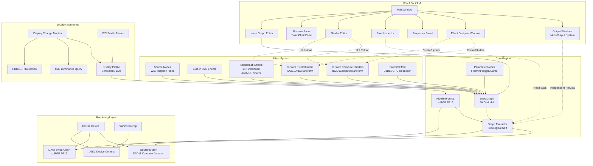
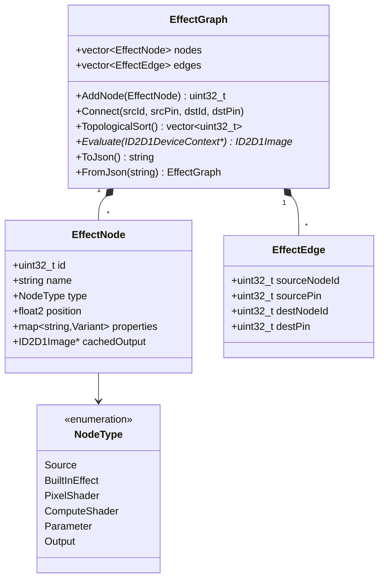
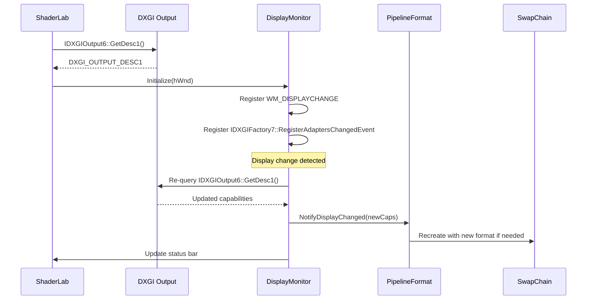
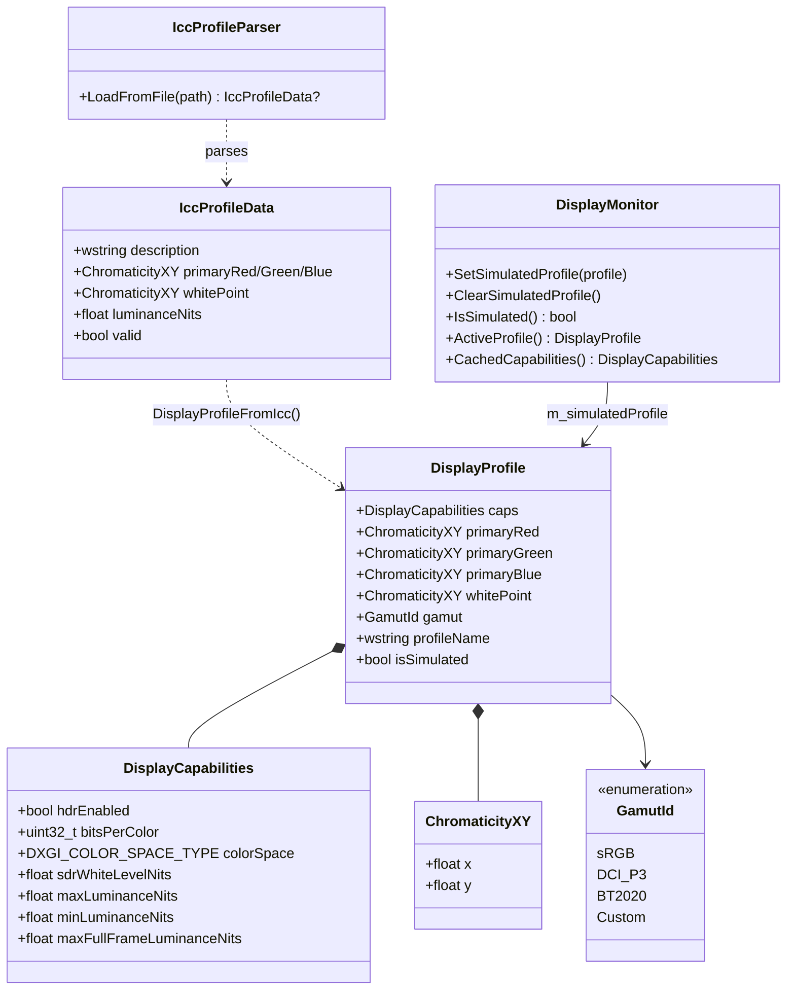
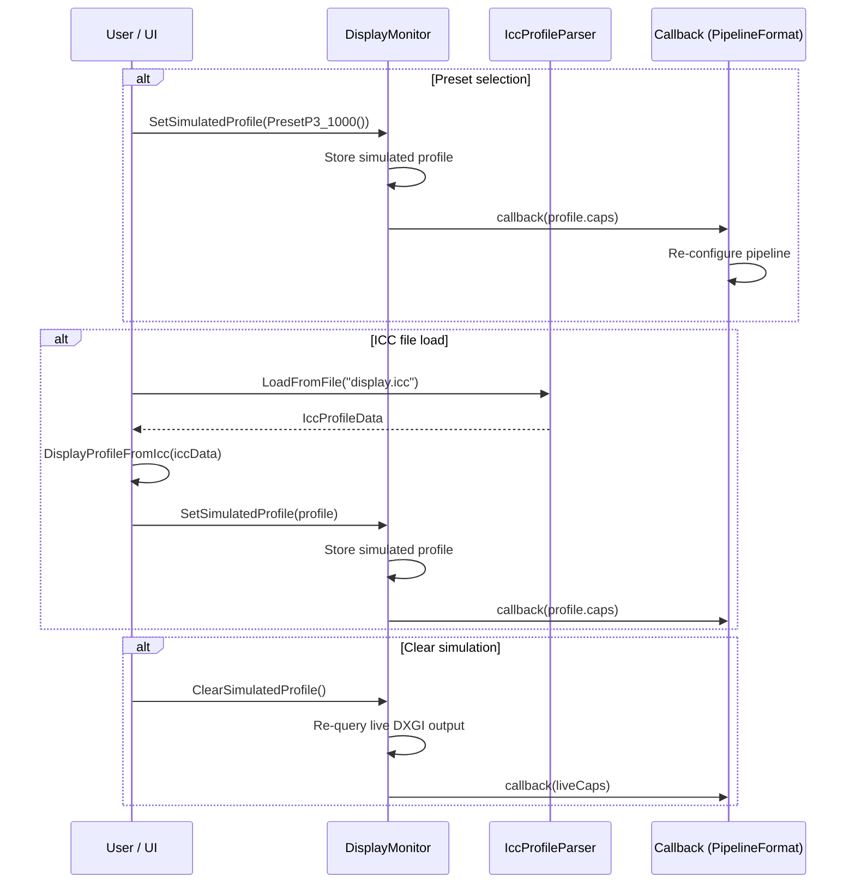
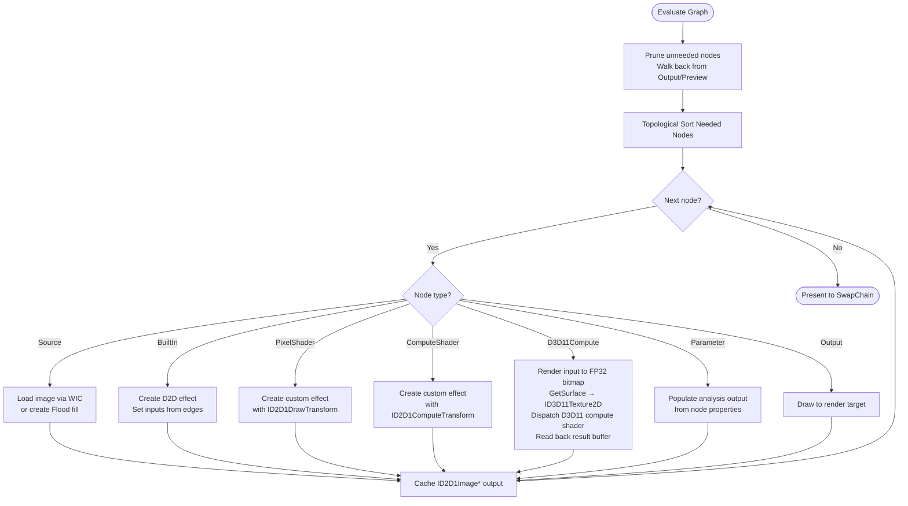
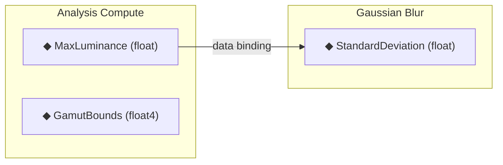
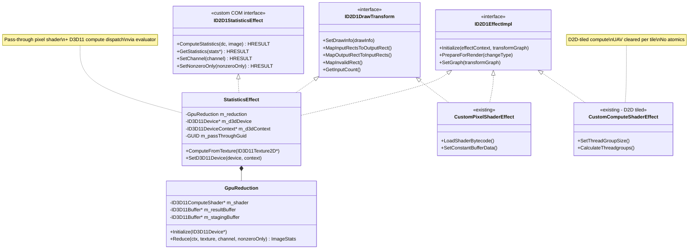

# ShaderLab

**HDR / WCG / SDR Shader Effect Development and Debugging Tool**

A WinUI 3 desktop application (C++/WinRT) for developing, testing, and debugging Direct2D and Win2D shader effects with full HDR and wide color gamut support.

---

## Table of Contents

- [Architecture Overview](#architecture-overview)
- [Pipeline Format Strategy](#pipeline-format-strategy)
- [Effect Graph Model](#effect-graph-model)
- [Display Monitoring](#display-monitoring)
- [Display Profile Mocking](#display-profile-mocking)
- [Topological Evaluation](#topological-evaluation)
- [ShaderLab Built-in Effects](#shaderlab-built-in-effects)
- [Compute Shader Analysis Pipeline](#compute-shader-analysis-pipeline)
- [D2D / D3D11 Hybrid Compute System](#d2d--d3d11-hybrid-compute-system)
  - [Problem](#problem)
  - [COM Class Hierarchy](#com-class-hierarchy)
  - [Data Flow](#data-flow-d2d--d3d11-handoff)
  - [Three Effect Types Compared](#three-effect-types-compared)
  - [Usage: Standalone D2D Application](#usage-standalone-d2d-application)
  - [Usage: ShaderLab Evaluator](#usage-shaderlab-evaluator-optimized-path)
  - [GPU Reduction Shader Pattern](#gpu-reduction-shader-pattern)
  - [Known Limitations](#known-limitations)
- [Effect Designer](#effect-designer)
- [Multi-Output Windows](#multi-output-windows)
- [Animation System](#animation-system)
- [Parameter Nodes](#parameter-nodes)
- [Effect Versioning System](#effect-versioning-system)
- [Conditional Parameter Visibility](#conditional-parameter-visibility)
- [Working Space Integration](#working-space-integration)
- [Image Statistics Effect](#image-statistics-effect)
- [Copy / Paste Nodes](#copy--paste-nodes)
- [Auto-Arrange](#auto-arrange)
- [Node Graph Visual Enhancements](#node-graph-visual-enhancements)
- [MCP Server (AI Agent Integration)](#mcp-server-ai-agent-integration)
- [Build Instructions](#build-instructions)
- [Project Structure](#project-structure)
- [Decision Log](#decision-log)

---

## Architecture Overview



## Pipeline Format Strategy

The rendering pipeline always uses **scRGB FP16** (`DXGI_FORMAT_R16G16B16A16_FLOAT` with `DXGI_COLOR_SPACE_RGB_FULL_G10_NONE_P709`). Linear floating-point preserves full HDR range and precision; scRGB covers the full BT.2020 gamut including negative values. DWM/ACM handles the final display conversion. There is no built-in tone mapper — users build tone mappers as graph effects for full accuracy by default.

## Effect Graph Model



## Display Monitoring



## Display Profile Mocking

Allows overriding the live display's characteristics with values from a preset or ICC profile, enabling tone mapping development targeting arbitrary displays without physical hardware.





## Topological Evaluation



---

## Decision Log

| # | Decision | Rationale | Date |
|---|----------|-----------|------|
| 1 | C++/WinRT, not C# | Direct COM access to ID2D1EffectImpl, ID2D1DrawTransform, ID2D1ComputeTransform for custom effect authoring. No marshaling overhead. | Day 1 |
| 2 | packages.config NuGet (not PackageReference) | Standard for C++/WinRT WinUI 3 projects; matches VS template wiring for .props/.targets imports. | Day 1 |
| 3 | scRGB FP16 as default pipeline format | Linear floating-point preserves HDR range and precision; scRGB covers full BT.2020 gamut with negative values. | Day 1 |
| 4 | Configurable PipelineFormat (not hardwired) | Users need sRGB for SDR debugging, HDR10 for PQ content, FP32 for precision work. Format affects swap chain, RTs, tone mapper, inspector. | Day 1 |
| 5 | Node-based DAG graph editor as primary UI | Visual effect chaining matches D2D effect graph model naturally. Enables per-node preview and pixel inspection. | Day 1 |
| 6 | Live HLSL editing with D3DCompile hot-reload | Core value prop: edit shader code, see results immediately. D3DReflect discovers constant buffers for auto-generated UI. | Day 1 |
| 7 | Win2D interop via native headers | Use Win2D's built-in effect wrappers where convenient, fall back to raw D2D for custom effects. Native interop via GetWrappedResource/CreateDrawingSession. | Day 1 |
| 8 | MSIX packaged desktop app | Required for WinUI 3 full functionality, AppContainer=false for full trust (DirectX device access). | Day 1 |
| 9 | Clean project at E:\source\ShaderLab | Avoid MSIX/manifest conflicts from nesting inside existing workspace. Fresh project with all NuGet wiring from scratch. | Day 1 |
| 10 | Kahn's algorithm for topological sort | Linear-time O(V+E), naturally detects cycles (sorted count ≠ node count), simple queue-based — no recursion. | Day 2 |
| 11 | Windows.Data.Json for graph serialization | Ships with WinRT (zero extra dependencies), sufficient for graph persistence. PropertyValue variant uses tagged type/value pairs for round-trip fidelity. | Day 2 |
| 12 | Hidden message-only window for WM_DISPLAYCHANGE | Decouples display monitoring from XAML window; no subclassing needed. HWND_MESSAGE keeps it invisible. | Day 2 |
| 13 | jthread + event for adapter hot-plug | IDXGIFactory7::RegisterAdaptersChangedEvent fires a Win32 event; std::jthread with stop_token provides clean shutdown without manual flag management. | Day 2 |
| 14 | Header-only PipelineFormat with inline constants | Four formats as `inline const` globals; `AllFormats[]` array for UI enumeration; `RecommendedFormat(caps)` ties display detection to default selection. No .cpp needed. | Day 2 |
| 15 | CreateSwapChainForComposition + ISwapChainPanelNative | WinUI 3 SwapChainPanel requires composition swap chain; SetColorSpace1 configures HDR/SDR color space on the swap chain. D2D1Bitmap1 wraps back buffer as render target. | Day 2 |
| 16 | Per-node D2D effect cache in GraphEvaluator | Effects created once and reused across frames; only properties re-applied on dirty nodes. GetPropertyIndex maps string keys to D2D indices. Topological walk guarantees upstream outputs are ready before wiring. | Day 2 |
| 17 | WIC HDR-aware image loading with format-split | SDR images→PBGRA 32bpp, HDR images→RGBA Half 64bpp (FP16). Flood source uses CLSID_D2D1Flood with D2D1_FLOOD_PROP_COLOR. Both cached per node ID. | Day 2 |
| 18 | Singleton EffectRegistry with categorized D2D catalog | 40+ built-in D2D effects across 9 categories (Blur, Color, Composition, Transform, Detail, Lighting, Distort, HDR, Analysis). EffectDescriptor stores CLSID, pin layout, and default properties. CreateNode() factory produces fully-configured EffectNodes. Case-insensitive name lookup + CLSID lookup for flexibility. | Day 3 |
| 19 | ID2D1EffectImpl + ID2D1DrawTransform for custom pixel shaders | CustomPixelShaderEffect implements both interfaces; registered via CLSID with D2D factory. Only InputCount exposed as D2D property; shader bytecode and constant buffer managed host-side for simplicity. ShaderCompiler wraps D3DCompile + D3DReflect with debug/release flags. PackConstantBuffer maps PropertyValue variant to cbuffer layout via reflection offsets. | Day 3 |
| 20 | ID2D1ComputeTransform for custom compute shaders | CustomComputeShaderEffect mirrors pixel shader pattern with ID2D1ComputeTransform + ID2D1ComputeInfo. CalculateThreadgroups divides output rect by configurable group size (default 8×8×1). CheckFeatureSupport validates compute shader hardware support at Initialize. Reuses ShaderCompiler with cs_5_0 target. | Day 3 |
| 21 | ShaderEditorController for live HLSL hot-reload | Compile-on-demand from TextBox text or file; D3DReflect auto-discovers cbuffer variables and maps D3D_SVT_FLOAT/INT/UINT/BOOL to PropertyValue defaults. Error parsing extracts line number from D3DCompile output. Default PS/CS templates provided. Controller is view-agnostic (no TextBox dependency). | Day 3 |
| 22 | Canvas-based NodeGraphController with D2D rendering | Visual node layout from EffectNode::position, D2D bezier edge curves, color-coded headers per NodeType, hit-test for nodes/pins, drag-move/connection/selection, pan/zoom transform. DWrite text format for node titles. Decoupled from XAML — renders via ID2D1DeviceContext. | Day 3 |
| 23 | GPU readback via D2D1Bitmap1 for pixel inspection | Renders 1×1 target bitmap at pixel coordinates, copies to CPU_READ bitmap, maps for float4 read. Converts scRGB linear → sRGB gamma, PQ (ST.2084), BT.709 luminance (80 nit ref white). Tracked position persists across re-evaluations. | Day 3 |
| 24 | D2D built-in effects for tone mapping | WhiteLevelAdjustment for SDR↔HDR white scaling, HdrToneMap for HDR→SDR, ColorMatrix for exposure (2^stops). Five modes: None, Reinhard, ACES Filmic, Hable, SDR Clamp. Reference math implementations for custom shader fallback. | Day 3 |
| 25 | DispatcherQueueTimer at 16ms for render loop | ~60 FPS render tick drives graph evaluation → tone mapping → swap chain present. FPS counter updated every second in status bar. Ctrl+Enter compiles shader from TextBox. Custom effects (pixel + compute) registered with D2D factory at startup. | Day 3 |
| 26 | Display profile mocking with ICC parser | DisplayProfile wraps DisplayCapabilities with CIE xy chromaticities and gamut ID. Six presets cover sRGB→BT.2020 at various luminances. IccProfileParser reads binary ICC files (v2/v4) extracting rXYZ/gXYZ/bXYZ/wtpt/lumi/desc tags. DisplayMonitor.SetSimulatedProfile overrides live caps and fires existing callback, so the entire downstream pipeline (tone mapper, pipeline format) adapts without changes. | Day 4 |
| 27 | ShaderLab effects library with embedded HLSL + shared color math | 9 built-in effects (4 analysis, 5 source) with HLSL embedded as string constants in ShaderLabEffects.cpp. Shared color math library (BT.709/BT.2020/P3 matrices, PQ/HLG transfer functions, CIE xy conversions) prepended to each shader. Auto-compiled at first use via ShaderCompiler. Categories: Analysis (Luminance Heatmap, OOG Highlight, CIE Chromaticity, Vectorscope) and Source (Gamut Source, Color Checker, Zone Plate, Gradient Generator, HDR Test Pattern). | Day 5 |
| 28 | Per-component property bindings (Grasshopper-style) | Analysis output fields from compute shaders can be bound to downstream effect properties with per-component picking (float4.x → float). Visual orange diamond data pins on node graph. Bindings participate in topological sort and cycle detection. Bound values resolved every frame (bypass dirty logic). Authored properties never mutated — bindings build effective properties map at evaluation time. | Day 5 |
| 29 | Versioning system (app + graph format) | Version.h defines app version (1.1.0) and graph format version (2). Both stored in saved graph JSON. Forward compatibility check on load — newer format version shows error dialog. Version displayed in status bar and title bar. | Day 5 |
| 30 | Always scRGB FP16 pipeline (no fallback) | Removed sRGB/HDR10/FP32 pipeline format switching. Pipeline is always scRGB FP16. DWM/ACM handles final display conversion. Simplifies swap chain management, tone mapper, and render target creation. PipelineFormat.h retained but only one format used. | Day 5 |
| 31 | MCP server for AI agent integration | Embedded Winsock2 HTTP server with JSON-RPC 2.0 on port 47808. 21 tools for graph manipulation, property control, HLSL compilation, render capture, analysis readback, pixel trace, effect listing, and display info. Enables AI agents (Copilot, Claude, etc.) to programmatically control ShaderLab. Routes in MainWindow.McpRoutes.cpp. | Day 5 |
| 32 | Remove built-in tone mapper | Pipeline passes raw scRGB through. Users build tone mappers as graph effects. Full accuracy by default. | Day 6 |
| 33 | Multi-output windows via OutputWindow | Each Output node gets its own SwapChainPanel window. Shares D2D device context. Bidirectional sync: close window ↔ delete node. | Day 6 |
| 34 | Effect versioning with effectId/effectVersion | Stable IDs survive renames. Per-node and batch upgrade buttons. Preserves user property values on upgrade. | Day 6 |
| 35 | _hidden suffix convention | Properties ending in `_hidden` excluded from UI. Replaces prefix-based filtering. Used for working space injection. | Day 6 |
| 36 | D3D11 compute via evaluator dispatch | Bypass D2D tiling for reduction operations. GpuReduction uses 32×32 thread group with groupshared memory. Only 32 bytes read back to CPU. | Day 6 |
| 37 | ID2D1StatisticsEffect COM interface | D2D-compatible effect wrapper with custom interface for analysis results. Pass-through pixel shader + D3D11 compute dispatch. | Day 6 |
| 38 | Parameter nodes as data-only graph elements | No shader, evaluator handles directly. Teal color, inline slider, don't switch preview. Four types: Float, Integer, Toggle, Gamut. | Day 6 |
| 39 | CPU analysis → GPU reduction for Image Statistics | Moved from pixel shader (512K redundant reads) to CPU readback (exact, single pass) to D3D11 compute (GPU-resident, 32-byte readback). | Day 6 |

---

## Build Instructions

### Prerequisites
- Visual Studio 2022 17.8+ (with C++ Desktop and UWP workloads)
- Windows App SDK 1.8
- Windows 10 SDK (10.0.26100+)

### Build
1. Open `ShaderLab.slnx` in Visual Studio
2. NuGet packages restore automatically
3. Build → Debug x64

### Required Libraries (linked via vcxproj)

| Library | Purpose |
|---------|---------|
| `d3d11.lib` | Direct3D 11 device and context |
| `d2d1.lib` | Direct2D rendering and effects |
| `dxgi.lib` | DXGI swap chain, HDR output queries |
| `d3dcompiler.lib` | Runtime HLSL compilation (D3DCompile) |
| `dxguid.lib` | DirectX GUIDs (IID_ID2D1Factory, etc.) |
| `windowscodecs.lib` | WIC image loading |

---

## Project Structure

```
ShaderLab/
├── ShaderLab.slnx              # Solution file
├── ShaderLab.vcxproj           # Project file (C++/WinRT, NuGet, MSIX)
├── packages.config             # NuGet package manifest
├── Package.appxmanifest        # MSIX app identity
├── app.manifest                # DPI awareness, heap type
├── Version.h                   # App version 1.1.0, graph format version 2
├── README.md                   # This file
├── CHANGELOG.md                # Version history
│
├── pch.h / pch.cpp             # Precompiled header (WinRT, D2D, D3D, Win2D, STL)
├── App.xaml / .h / .cpp        # Application entry point
├── MainWindow.xaml / .h / .cpp # Main window layout and initialization (~5000+ lines)
├── MainWindow.McpRoutes.cpp    # MCP server routes (~1400 lines)
├── MainWindow.idl              # WinRT interface definition
├── EffectDesignerWindow.xaml / .h / .cpp  # Effect Designer modal window
│
├── Graph/                      # Effect graph data model
│   ├── NodeType.h              # NodeType enum (Source, BuiltInEffect, PixelShader, ComputeShader, Parameter, Output)
│   ├── PropertyValue.h         # std::variant type for node properties (float, int, bool, float2-4, string, matrix, vector)
│   ├── EffectNode.h            # EffectNode struct, ParameterDefinition, PropertyBinding, AnalysisFieldDef
│   ├── EffectEdge.h            # EffectEdge struct (source/dest node + pin IDs)
│   ├── EffectGraph.h           # EffectGraph class declaration (DAG, topo sort, JSON, versioning)
│   └── EffectGraph.cpp         # EffectGraph implementation
├── Rendering/                  # D3D/D2D device management, swap chain, pipeline
│   ├── DisplayInfo.h           # DisplayCapabilities struct + monitor primaries
│   ├── DisplayMonitor.h        # DisplayMonitor class (WM_DISPLAYCHANGE + adapter-changed event + simulated profile)
│   ├── DisplayMonitor.cpp      # DisplayMonitor implementation
│   ├── DisplayProfile.h        # DisplayProfile struct, ChromaticityXY, GamutId, preset factory functions
│   ├── IccProfileParser.h      # IccProfileParser class + IccProfileData struct
│   ├── IccProfileParser.cpp    # ICC binary format parsing (v2/v4), XYZ→xy conversion, gamut detection
│   ├── PipelineFormat.h        # PipelineFormat struct (scRGB FP16 always)
│   ├── RenderEngine.h          # RenderEngine class (D3D11 + D2D1 + swap chain lifecycle)
│   ├── RenderEngine.cpp        # RenderEngine implementation (device creation, resize, draw cycle)
│   ├── GraphEvaluator.h        # GraphEvaluator class (topological walk, effect cache, dirty gating, D3D11 dispatch)
│   ├── GraphEvaluator.cpp      # GraphEvaluator implementation (per-node evaluation loop, needed-node pruning)
│   ├── GpuReduction.h          # D3D11 compute reduction (32×32 thread group, groupshared memory, stride pattern)
│   ├── GpuReduction.cpp        # GpuReduction implementation (SRV creation, dispatch, 32-byte readback)
│   ├── D3D11ComputeRunner.h    # Generic D3D11 compute dispatch runner for user-authored shaders
│   └── D3D11ComputeRunner.cpp  # Compile, dispatch, readback via RWStructuredBuffer<float4>
├── Effects/                    # Built-in effect wrappers, custom effect base
│   ├── ShaderLabEffects.h      # 18+ ShaderLab built-in effects (versioned) + shared color math HLSL library
│   ├── ShaderLabEffects.cpp    # Effect registration, embedded HLSL, auto-compile, effectId/effectVersion
│   ├── StatisticsEffect.h      # ID2D1EffectImpl + ID2D1DrawTransform + ID2D1StatisticsEffect interface
│   ├── StatisticsEffect.cpp    # Pass-through pixel shader + D3D11 compute dispatch via ComputeFromTexture()
│   ├── PropertyMetadata.h      # Effect property metadata for UI generation
│   ├── ImageLoader.h           # WIC image loading class (HDR/SDR format detection)
│   ├── ImageLoader.cpp         # WIC decode pipeline (file/stream → FormatConverter → D2D1Bitmap1)
│   ├── SourceNodeFactory.h     # Source node creation (image file + flood fill)
│   ├── SourceNodeFactory.cpp   # PrepareSourceNode: loads images or creates Flood effects
│   ├── EffectRegistry.h        # EffectDescriptor struct + EffectRegistry singleton (catalog API)
│   ├── EffectRegistry.cpp      # 40+ built-in D2D effect registrations (9 categories)
│   ├── ShaderCompiler.h        # D3DCompile + D3DReflect wrapper (compile from file/string, reflect cbuffers)
│   ├── ShaderCompiler.cpp      # HLSL compilation with debug/release flags, constant buffer reflection
│   ├── CustomPixelShaderEffect.h   # ID2D1EffectImpl + ID2D1DrawTransform for user pixel shaders
│   ├── CustomPixelShaderEffect.cpp # Effect registration, PrepareForRender, cbuffer packing from PropertyValue
│   ├── CustomComputeShaderEffect.h   # ID2D1EffectImpl + ID2D1ComputeTransform for user compute shaders
│   └── CustomComputeShaderEffect.cpp # Compute dispatch, CalculateThreadgroups, hardware feature check
├── Controls/                   # Editor controllers and custom UI logic
│   ├── OutputWindow.h              # Multi-output window (per-Output-node OS window, SwapChainPanel)
│   ├── OutputWindow.cpp            # Independent pan/zoom/save, bidirectional sync with graph nodes
│   ├── ShaderEditorController.h    # HLSL compile-on-demand, D3DReflect auto-property generation
│   ├── ShaderEditorController.cpp  # Compile, reflect, error parsing, default PS/CS templates
│   ├── NodeGraphController.h       # Canvas-based node graph editor (layout, hit-test, D2D render)
│   ├── NodeGraphController.cpp     # Bezier edges, color-coded nodes, drag/connect/select, pan/zoom
│   ├── PixelInspectorController.h  # GPU readback, scRGB→sRGB/PQ/luminance conversion
│   ├── PixelInspectorController.cpp # D2D1Bitmap1 CPU_READ readback, tracked pixel position
│   ├── PixelTraceController.h     # Recursive pixel trace through effect graph
│   └── PixelTraceController.cpp   # Per-node pixel readback + analysis output collection
├── ShaderLab/                  # MCP HTTP server (separate compilation unit)
│   ├── McpHttpServer.h            # Winsock2 TCP server, route registration, JSON-RPC
│   └── McpHttpServer.cpp          # HTTP parsing, request dispatch (no PCH)
├── MainWindow.McpRoutes.cpp    # All MCP REST endpoints + JSON-RPC 2.0 handler
├── Shaders/                    # HLSL source files (user shaders)
├── Assets/                     # App icons, splash screen
│
├── .github/
│   └── copilot-instructions.md
├── .context/
│   └── resume.md               # Development resume point
└── packages/                   # NuGet packages (restored)
```

## Compute Shader Analysis Pipeline

Custom compute shaders can act as analysis effects, producing typed output fields that are read back to the CPU and can drive downstream effect properties via data bindings.

### Analysis Output Types

| Type | Pixels | Packing |
|------|--------|---------|
| `float` | 1 | `.x` used |
| `float2` | 1 | `.xy` used |
| `float3` | 1 | `.xyz` used |
| `float4` | 1 | all 4 components |
| `floatarray` | ceil(N/4) | 4 floats packed per pixel |
| `float2array` | N | `.xy` per pixel |
| `float3array` | N | `.xyz` per pixel |
| `float4array` | N | all 4 per pixel |

### D2D Compute Shader Conventions

D2D evaluates compute effects in **tiles**. Key conventions:

- **`_TileOffset`** (int2): Auto-injected at cbuffer offset 0 in `CalculateThreadgroups`. Gives the tile's origin in the full image.
- **`Source.GetDimensions()`**: Returns the full source image size (not tile size).
- **`SampleLevel()`**: Must use normalized UVs via `SampleLevel()`. `Load()` is not available in D2D compute shaders.
- **`Output.GetDimensions()`**: Returns the tile size, not the full image.
- **Constant buffer upload**: Done in `CalculateThreadgroups` (not `PrepareForRender`) for correct per-tile values.

### Shader Pattern
```hlsl
cbuffer Constants : register(b0) {
    int2 _TileOffset;  // Auto-injected per tile
    // User parameters here...
};
Texture2D Source : register(t0);
RWTexture2D<float4> Output : register(u0);
SamplerState Sampler0 : register(s0);

[numthreads(8, 8, 1)]
void main(uint3 DTid : SV_DispatchThreadID) {
    uint srcW, srcH;
    Source.GetDimensions(srcW, srcH);
    uint2 globalPos = DTid.xy + uint2(_TileOffset);
    if (globalPos.x >= srcW || globalPos.y >= srcH) return;
    
    float2 uv = (float2(globalPos) + 0.5) / float2(srcW, srcH);
    float4 color = Source.SampleLevel(Sampler0, uv, 0);
    Output[DTid.xy] = color;
}
```

## ShaderLab Built-in Effects

ShaderLab ships with **18+ built-in effects** implemented in `Effects/ShaderLabEffects.h/.cpp`. Each effect has its HLSL embedded as a string constant, compiled at first use, and shares a common color math library (BT.709/BT.2020/P3 matrices, PQ/HLG transfer functions, CIE xy conversions). Effects are versioned with `effectId` and `effectVersion` for stable upgrade paths.

### Analysis Effects

| Effect | Type | Description |
|--------|------|-------------|
| Luminance Heatmap | Pixel Shader | False-color overlay mapping BT.709 luminance to a heat gradient |
| Nit Map | Pixel Shader | Display-referred luminance visualization (replaces FalseColorOverlay) |
| Out-of-Gamut Highlight | Compute Shader | Highlights pixels outside a target gamut (sRGB, P3, BT.2020, or current monitor) |
| CIE Chromaticity Plot | Compute Shader | Plots image pixels on a CIE 1931 xy chromaticity diagram |
| Vectorscope | Compute Shader | YCbCr vectorscope visualization with graticule |
| Waveform Monitor | Compute Shader | RGB parade waveform display |
| Image Statistics | D3D11 Compute | GPU-accelerated min/max/avg luminance, data-only node (purple, inline values) |

### Source Effects

| Effect | Type | Description |
|--------|------|-------------|
| Color Gamut Chart | Pixel Shader | Generates a full-gamut color sweep |
| Color Checker | Pixel Shader | Macbeth ColorChecker pattern with accurate sRGB patches |
| Zone Plate | Pixel Shader | Sine-wave zone plate for resolution/aliasing testing |
| Gradient Generator | Pixel Shader | Configurable linear/radial gradient with HDR range |
| HDR Test Pattern | Pixel Shader | Luminance step wedge from 0 to 10,000 nits |

### Parameter Nodes

| Type | Description |
|------|-------------|
| Float Parameter | Continuous slider (teal node, inline slider on canvas) |
| Integer Parameter | Discrete slider |
| Toggle Parameter | Boolean on/off |
| Gamut Parameter | Gamut selection dropdown |

## Versioning

ShaderLab uses a dual-version system defined in `Version.h`:

- **App version** (`1.1.0`): Displayed in title bar and status bar. Stored in saved graph files as `appVersion`.
- **Graph format version** (`2`): Stored in saved graph files as `formatVersion`. Used for forward compatibility — loading a graph with a newer format version than the running app shows an error dialog.

Saved JSON graphs include both versions for traceability.

Analysis output fields can be visually connected to downstream effect properties using **data pins** on the node graph canvas.



### Visual Data Pins

- **Image pins**: White circles on node edges (existing D2D image connections)
- **Data pins**: Orange diamonds below image pins
  - Output data pins (right side): analysis fields from compute nodes
  - Input data pins (left side): bindable float/float2/float3/float4 properties
- **Data edges**: Orange bezier curves connecting data pins
- **Type labels**: Each pin shows its type, e.g., `MaxLuminance (float)`

### Binding Rules

| Source → Dest | Behavior |
|---|---|
| float → float | Direct |
| float → float2/3/4 | Replicate (x,x,x,0) |
| float4 → float | Component picker (.x/.y/.z/.w) |
| float4 → float4 | Direct |
| array → array | Direct |
| array ↔ scalar | Rejected |

### Evaluation

- Bindings participate in **topological sort** (source must evaluate before destination)
- **Cycle detection** covers both image edges and binding edges
- Bound values resolved **every frame** (bypass dirty logic — upstream analysis may change)
- **Authored properties never mutated** — bindings build an effective properties map at evaluation time

## Multi-Output Windows

Each **Output** node in the graph gets its own OS window with an independent SwapChainPanel, pan/zoom, and save-to-file. Implemented in `Controls/OutputWindow.h/.cpp`.

- **Bidirectional sync**: Closing the window deletes the Output node from the graph; deleting the Output node closes the window.
- **Shared D2D device context**: All output windows share the same D3D11/D2D1 device stack from `RenderEngine`.
- **Independent viewport**: Each window has its own pan/zoom transform, separate from the main preview panel.

## Animation System

ShaderLab supports animated parameters and video sources:

- **`isAnimatable` flag**: ParameterDefinition marks parameters that auto-advance over time (e.g., Phase, Speed).
- **Play/Pause toolbar toggle**: Animation starts paused. Press Play to begin advancing animatable parameters.
- **Phase/Speed auto-advance**: Animatable float parameters increment each frame based on Speed.
- **Video sources**: Video source nodes participate in the animation timeline.

## Parameter Nodes

Parameter nodes are data-only graph elements (no HLSL shader) that expose a single value for binding to downstream effect properties.

- **Four types**: Float, Integer, Toggle, Gamut
- **Teal color** on the node graph canvas
- **Inline slider**: Rendered directly on the D2D canvas for quick adjustment
- **No preview switch**: Clicking a parameter node does not change the preview target
- **Evaluator-populated**: The graph evaluator populates analysis output fields directly from node properties (no shader dispatch)

## Effect Versioning System

Each ShaderLab effect carries an `effectId` (stable GUID) and `effectVersion` (integer). This enables safe upgrades when effects are updated with new parameters or shader changes.

- **`effectId`**: Stable identifier that survives effect renames.
- **`effectVersion`**: Monotonically increasing version per effect.
- **Per-node "Update Effect" button**: Shown in Properties panel when a node's version is behind the registry.
- **"Update Effects (N)" batch button**: Toolbar button to upgrade all outdated nodes at once.
- **Property preservation**: On upgrade, existing user property values are preserved where parameter names match.

## Conditional Parameter Visibility

Effect parameters support conditional visibility via the `visibleWhen` field on `ParameterDefinition`.

- **Format**: `"ParamName == value"` (e.g., `"Mode == 1"`, `"EnableHDR == true"`)
- **Hidden from UI**: When the condition is false, the parameter is hidden from both the Properties panel and data pins on the graph canvas.
- **Dynamic**: Visibility re-evaluates whenever the controlling parameter changes.

## D2D / D3D11 Hybrid Compute System

### Problem

D2D's custom compute shader API (`ID2D1ComputeTransform`) has fundamental limitations that prevent full-image reduction operations:

| Limitation | Impact |
|-----------|--------|
| **Per-tile UAV clearing** | D2D clears the output `RWTexture2D<float4>` before each tile dispatch. Scatter writes don't accumulate across tiles. |
| **No custom UAV binding** | `ID2D1ComputeInfo::SetResourceTexture` binds read-only `ID2D1ResourceTexture` (register t), not UAVs (register u). |
| **No uint atomics on output** | The output UAV is `RWTexture2D<float4>`. `InterlockedMin`/`InterlockedMax`/`InterlockedAdd` require `RWBuffer<uint>`. |
| **No input as D3D11 texture** | `PrepareForRender` doesn't expose the input image as a D3D11 surface. The effect context is deliberately isolated from the device. |

The built-in `CLSID_D2D1Histogram` effect works around these via private D2D internals not exposed through the public API.

### Solution: Evaluator-Owned D3D11 Dispatch

The graph evaluator owns a **raw D3D11 compute dispatch path** that bypasses D2D's tiling entirely. D2D handles the effect graph wiring (input/output connections), while D3D11 handles the actual computation.

### COM Class Hierarchy



### Data Flow: D2D → D3D11 Handoff

```mermaid
flowchart TD
    subgraph D2D_Graph["D2D Effect Graph (Evaluator)"]
        SRC[Source Node<br/>ID2D1Image*] --> FX[Upstream Effect<br/>Gamut Map / Delta E / etc.]
        FX --> CACHE["cachedOutput<br/>(deferred ID2D1Image*)"]
    end

    subgraph Realize["Realize to D3D11 Texture"]
        CACHE --> CREATE["dc->CreateBitmap()<br/>DXGI_FORMAT_R32G32B32A32_FLOAT"]
        CREATE --> DRAW["dc->BeginDraw()<br/>dc->DrawImage(cachedOutput)<br/>dc->EndDraw()"]
        DRAW --> SURFACE["bitmap->GetSurface()<br/>→ IDXGISurface"]
        SURFACE --> QI["surface->QueryInterface()<br/>→ ID3D11Texture2D"]
    end

    subgraph D3D11_Compute["D3D11 Compute Dispatch"]
        QI --> SRV["CreateShaderResourceView()<br/>register(t0)"]
        SRV --> CBUF["Update Constant Buffer<br/>(Width, Height, Channel, NonzeroOnly)"]
        CBUF --> CLEAR["ClearUnorderedAccessViewUint()<br/>(reset result buffer)"]
        CLEAR --> DISPATCH["ctx->Dispatch(1, 1, 1)<br/>32×32 = 1024 threads"]
    end

    subgraph GPU_Reduction["GPU Reduction (groupshared)"]
        DISPATCH --> STRIDE["Each thread strides<br/>across entire image"]
        STRIDE --> LOCAL["Per-thread accumulators<br/>min, max, sum, count"]
        LOCAL --> SHARED["groupshared parallel reduction<br/>log2(1024) = 10 steps"]
        SHARED --> WRITE["Thread 0 writes<br/>8 uints to RWBuffer"]
    end

    subgraph Readback["Result Readback (32 bytes)"]
        WRITE --> COPY["CopyResource()<br/>→ staging buffer"]
        COPY --> MAP["Map() + read 8 uints"]
        MAP --> STATS["ImageStats struct<br/>min, max, mean, samples, nonzero"]
        STATS --> ANALYSIS["node.analysisOutput.fields<br/>(data pins on graph)"]
    end
```



### Three Effect Types Compared

| | D2D Pixel Shader | D2D Compute Shader | D3D11 Hybrid Compute |
|---|---|---|---|
| **COM class** | `CustomPixelShaderEffect` | `CustomComputeShaderEffect` | `StatisticsEffect` |
| **D2D interface** | `ID2D1DrawTransform` | `ID2D1ComputeTransform` | `ID2D1DrawTransform` (pass-through) |
| **Custom interface** | — | — | `ID2D1StatisticsEffect` |
| **Shader target** | `ps_5_0` | `cs_5_0` | `cs_5_0` (dispatched by host) |
| **Execution** | D2D renders directly | D2D dispatches per-tile | Evaluator dispatches via D3D11 |
| **Tiling** | D2D-managed | D2D-managed (UAV cleared) | **None** — single dispatch |
| **Atomics** | N/A | No (float4 UAV only) | **Yes** (`RWBuffer<uint>`) |
| **groupshared** | N/A | Yes (per-tile only) | **Yes** (full image) |
| **Shader linking** | Yes (D2D optimizes) | No | No |
| **Image output** | Yes | Yes | Optional (pass-through or none) |
| **Analysis output** | Via pixel readback | Via pixel readback | Via `GetStatistics()` or data pins |
| **CustomShaderType** | `PixelShader` | `ComputeShader` | `D3D11ComputeShader` |

### Usage: Standalone D2D Application

```cpp
// Register at startup (once)
StatisticsEffect::RegisterEffect(d2dFactory1.get());

// Create effect and configure (once)
winrt::com_ptr<ID2D1Effect> effect;
dc->CreateEffect(StatisticsEffect::CLSID_StatisticsEffect, effect.put());

winrt::com_ptr<ID2D1StatisticsEffect> stats;
effect->QueryInterface(IID_ID2D1StatisticsEffect, stats.put_void());
stats->SetDeviceContext(dc, effect.get());  // weak cache — dc must outlive effect
stats->SetChannel(0);         // 0=luminance, 1=R, 2=G, 3=B, 4=A
stats->SetNonzeroOnly(TRUE);  // exclude zero pixels

// Per-frame render loop
effect->SetInput(0, someUpstreamImage);

dc->BeginDraw();
dc->DrawImage(effect.get());  // pass-through: output == input
// ... render other content to your swap chain ...

// GetStatistics MUST be called inside BeginDraw/EndDraw.
// D2D deferred images only materialize during an active draw session.
Rendering::ImageStats result;
stats->GetStatistics(&result);

dc->EndDraw();
dc->Present();

printf("Min=%.4f Max=%.4f Mean=%.4f Samples=%u Nonzero=%.1f%%\n",
    result.min, result.max, result.mean, result.samples,
    100.f * result.nonzeroPixels / result.totalPixels);
```

The lazy path (`GetStatistics` with cached dc) internally calls `effect->GetOutput()`, renders to an FP32 bitmap, dispatches the D3D11 compute shader, and caches the results. **`GetStatistics` must be called between `BeginDraw` and `EndDraw`** — D2D's deferred `ID2D1Image*` from `GetOutput()` only materializes to real pixels during an active draw session. Subsequent calls return cached results until the next `DrawImage` invalidates them via `PrepareForRender`.

For callers who prefer explicit control, `ComputeStatistics(dc, image)` and `ComputeFromTexture(texture)` are also available.

### Usage: ShaderLab Evaluator (Optimized Path)

```cpp
// In GraphEvaluator::Evaluate(), for D3D11ComputeShader nodes:

// 1. Render upstream D2D output to FP32 bitmap
winrt::com_ptr<ID2D1Bitmap1> gpuTarget;
dc->CreateBitmap(D2D1::SizeU(w, h), nullptr, 0, fp32Props, gpuTarget.put());
dc->SetTarget(gpuTarget.get());
dc->BeginDraw();
dc->DrawImage(upstreamNode->cachedOutput);
dc->EndDraw();

// 2. Get D3D11 texture (zero-copy — same DXGI surface)
winrt::com_ptr<IDXGISurface> surface;
gpuTarget->GetSurface(surface.put());
winrt::com_ptr<ID3D11Texture2D> d3dTexture;
surface->QueryInterface(d3dTexture.put());

// 3. Dispatch GPU reduction (single call)
auto stats = m_gpuReduction.Reduce(d3dCtx, d3dTexture.get(), channel, nonzeroOnly);

// 4. Populate analysis output for graph data pins
node->analysisOutput.fields = { {"Min", stats.min}, {"Max", stats.max}, ... };
```

### GPU Reduction Shader Pattern

```hlsl
// GpuReduction.cpp — embedded HLSL (cs_5_0)

cbuffer Constants : register(b0) {
    uint Width, Height, Channel, NonzeroOnly;
};
Texture2D<float4> Input : register(t0);
RWBuffer<uint> Result : register(u0);  // 8 uints = 32 bytes

#define GROUP_SIZE 32
#define THREAD_COUNT (GROUP_SIZE * GROUP_SIZE)  // 1024

groupshared float gs_min[THREAD_COUNT];
groupshared float gs_max[THREAD_COUNT];
groupshared float gs_sum[THREAD_COUNT];
groupshared uint  gs_count[THREAD_COUNT];

[numthreads(GROUP_SIZE, GROUP_SIZE, 1)]
void main(uint3 GTid : SV_GroupThreadID) {
    uint tid = GTid.x + GTid.y * GROUP_SIZE;
    float tMin = 1e30, tMax = -1e30, tSum = 0;
    uint tCount = 0;

    // Each thread strides across entire image
    for (uint y = GTid.y; y < Height; y += GROUP_SIZE)
        for (uint x = GTid.x; x < Width; x += GROUP_SIZE) {
            float v = GetValue(Input[int2(x,y)], Channel);
            tMin = min(tMin, v); tMax = max(tMax, v);
            tSum += v; tCount++;
        }

    gs_min[tid] = tMin; gs_max[tid] = tMax;
    gs_sum[tid] = tSum; gs_count[tid] = tCount;
    GroupMemoryBarrierWithGroupSync();

    // Parallel reduction in shared memory (10 steps for 1024 threads)
    for (uint stride = THREAD_COUNT/2; stride > 0; stride >>= 1) {
        if (tid < stride) {
            gs_min[tid] = min(gs_min[tid], gs_min[tid+stride]);
            gs_max[tid] = max(gs_max[tid], gs_max[tid+stride]);
            gs_sum[tid] += gs_sum[tid+stride];
            gs_count[tid] += gs_count[tid+stride];
        }
        GroupMemoryBarrierWithGroupSync();
    }

    // Thread 0 writes final results
    if (tid == 0) {
        Result[0] = asuint(gs_min[0]);
        Result[1] = asuint(gs_max[0]);
        Result[2] = asuint(gs_sum[0]);
        Result[4] = gs_count[0];
    }
}
```

### Known Limitations

- **D2D draw session required**: `ComputeStatistics(dc, image)` must be called with a dc that has an active D2D draw session (between `BeginDraw`/`EndDraw`) for chained effects to render correctly. D2D's deferred `ID2D1Image*` from `GetOutput()` only materializes to pixels during an active draw session. In ShaderLab, `ProcessDeferredCompute` runs inside the main `BeginDraw`/`EndDraw` pass.
- **No shader linking**: D3D11 compute shaders are opaque to D2D. They don't participate in D2D's shader linking optimization for chained pixel shader effects.
- **Device sharing**: The D3D11 device must be the same one backing D2D. The effect acquires it lazily via `ID2D1Device2::GetDxgiDevice()` on first `ComputeStatistics` call.
- **Single thread group**: Current `GpuReduction` dispatches `(1,1,1)` — one group of 1024 threads. For images larger than ~33 megapixels (1024² pixels per thread), a multi-dispatch pyramid would be needed.

## Effect Designer

The Effect Designer is a modal window for authoring custom shader effects directly inside ShaderLab. It supports three shader types:

### Supported Types

| Type | Target | Execution | Output |
|------|--------|-----------|--------|
| **Pixel Shader** | `ps_5_0` | D2D render pipeline | Image (RGBA) |
| **D2D Compute Shader** | `cs_5_0` | D2D per-tile dispatch | Image or analysis data |
| **D3D11 Compute Shader** | `cs_5_0` | Host-side D3D11 dispatch | Analysis data only |

### D3D11 Compute Shader Workflow

D3D11 compute shaders run outside D2D's tiling system, enabling full-image reductions with atomics and groupshared memory. The Effect Designer generates a scaffold with the stride-based reduction pattern:

```hlsl
Texture2D<float4> Source : register(t0);
RWStructuredBuffer<float4> Result : register(u0);

cbuffer Constants : register(b0)
{
    uint Width;   // Auto-injected
    uint Height;  // Auto-injected
    // User parameters start at offset 8
};

groupshared float4 gs_sum[32 * 32];

[numthreads(32, 32, 1)]
void main(uint3 GTid : SV_GroupThreadID)
{
    uint tid = GTid.y * 32 + GTid.x;
    float4 acc = float4(0, 0, 0, 0);

    // Stride over entire image
    for (uint y = GTid.y; y < Height; y += 32)
        for (uint x = GTid.x; x < Width; x += 32)
            acc += Source.Load(int3(x, y, 0));

    gs_sum[tid] = acc;
    GroupMemoryBarrierWithGroupSync();

    // Parallel reduction
    for (uint s = 512; s > 0; s >>= 1) {
        if (tid < s) gs_sum[tid] += gs_sum[tid + s];
        GroupMemoryBarrierWithGroupSync();
    }

    if (tid == 0)
        Result[0] = gs_sum[0] / float(Width * Height);
}
```

**Key differences from D2D compute:**
- No `_TileOffset` — single dispatch covers the full image
- `Width`/`Height` auto-injected at cbuffer offset 0 (user params at offset 8)
- Output is `RWStructuredBuffer<float4>` (not `RWTexture2D<float4>`)
- Results map to typed analysis output fields (one `float4` per field)
- Supports atomics, full-image groupshared memory, and arbitrary reduction patterns

### Opening Built-in Effects

ShaderLab's built-in effects can be opened in the Effect Designer via the **"Edit in Effect Designer"** button in the Properties panel. The designer loads the effect's HLSL source, parameters, and analysis field definitions. Edits can be compiled and pushed back into the running graph.

### Export (Future)

The Effect Designer will support exporting D3D11 compute effects as standalone C++ header/module files. The export includes the HLSL source, input/parameter/output schema, and the dispatch contract. Developers can then customize the C++ post-processing (e.g., histogram → median computation) in their own codebase.

## Working Space Integration

ShaderLab effects that operate in a specific color space receive **working space primaries** from the active display profile at render time.

- **Hidden properties**: Working space chromaticities are stored as properties with the `_hidden` suffix (e.g., `WsRedX_hidden`, `WsRedY_hidden`, `WsGreenX_hidden`, etc.).
- **Injected at render time**: The evaluator injects these values from `DisplayMonitor::ActiveProfile()` before each evaluation.
- **UI exclusion**: Properties ending in `_hidden` are excluded from the Properties panel and data pins.

## Image Statistics Effect

The **Image Statistics** effect is a GPU-accelerated, data-only analysis node:

- **Purple color** on the graph canvas (data-only node type).
- **Inline value display**: Statistics (min/max/average luminance, etc.) are rendered directly on the node canvas.
- **D3D11 compute path**: Uses `StatisticsEffect` + `GpuReduction` for full-image reduction.
- **No visual output**: The node produces analysis output fields only — no image output.

## Copy / Paste Nodes

- **Ctrl+C / Ctrl+V**: Copy selected nodes and paste with offset.
- **Deep copy**: Each pasted node gets a fresh GUID.
- **Internal edge preservation**: Edges between copied nodes are preserved in the paste.

## Auto-Arrange

- **Ctrl+L** or toolbar button: Automatically arranges nodes in topological-depth columns.
- Nodes are sorted by their topological depth (distance from source nodes) and arranged in evenly-spaced columns.

## Node Graph Visual Enhancements

### Color Coding by Node Type

| Color | Node Type |
|-------|-----------|
| Green | Source nodes (images, generators) |
| Blue | Built-in D2D effects |
| Red | Custom pixel shader effects |
| Orange | Custom compute shader effects |
| Teal | Parameter nodes |
| Purple | Data-only nodes (Image Statistics) |
| Gray | Output nodes |

### Inline Data Display

- **Data pin values**: Shown inline on the node canvas (current bound value).
- **Enum labels**: Enum-typed properties show their label (not raw integer) on data pins.
- **Image input pin labels**: Derived from effect input names (e.g., "Source", "Destination").
- **"No Input" text**: Displayed on image input pins with broken/missing connections.

## MCP Server (AI Agent Integration)

ShaderLab includes an embedded HTTP server implementing the **Model Context Protocol (MCP)** JSON-RPC 2.0 for programmatic control by AI agents.

### Connection

- Default port: **47808** (auto-increments if in use)
- Transport: Streamable HTTP (`POST /` for JSON-RPC)
- Enable: MCP toggle in toolbar, `--mcp` flag, or `config.json`

### Tools (21 total)

| Tool | Description |
|------|-------------|
| `graph_add_node` | Add built-in D2D or ShaderLab effect |
| `graph_remove_node` | Remove a node |
| `graph_connect` | Connect image pins |
| `graph_disconnect` | Disconnect image pins |
| `graph_set_property` | Set a node property |
| `graph_get_node` | Get node details + analysis results |
| `graph_save_json` | Serialize graph to JSON |
| `graph_load_json` | Load graph from JSON |
| `graph_clear` | Clear entire graph (keeps Output) |
| `effect_compile` | Compile HLSL (+ optional analysisFields) |
| `set_preview_node` | Set which node is previewed |
| `render_capture` | Capture preview as PNG (HDR clipped to SDR) |
| `registry_get_effect` | Get built-in effect metadata |
| `graph_bind_property` | Bind property to analysis field |
| `graph_unbind_property` | Remove binding |
| `read_analysis_output` | Read typed analysis fields from compute node |
| `read_pixel_trace` | Pixel trace at normalized coords (per-node values) |
| `list_effects` | List all effects by category |
| `graph_overview` | Compact graph summary (nodes, edges, preview) |
| `get_display_info` | Display caps, active profile, pipeline, version |
| `graph_rename_node` | Rename a node |

### Known Limitations

- **Compile-before-connect**: First-time compile of a compute shader node that's already connected to the render pipeline crashes D2D. Workaround: compile the shader while the node is disconnected, then wire it in. Recompiles of already-compiled nodes work fine.
- **FP16 precision**: Analysis readback values show minor quantization (e.g., 0.1 → 0.099976) due to the D2D output buffer using 16-bit float precision.
- **`uint` cbuffer params don't work in D2D pixel shaders**: Values pack correctly in the constant buffer but the shader never sees updates. Use `float` with threshold comparisons (`> 0.5`, `> 1.5`) instead.
- **HLSL optimizer removes unreferenced cbuffer vars**: With `D3DCOMPILE_WARNINGS_ARE_ERRORS`, variables not referenced on ALL code paths are optimized out. Read all cbuffer vars at top of `main()` before branches.
