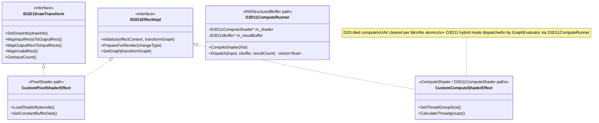

# D2D / D3D11 Hybrid Compute System

## Problem

D2D's custom compute shader API (`ID2D1ComputeTransform`) has fundamental limitations that prevent full-image reduction operations:

| Limitation | Impact |
|-----------|--------|
| **Per-tile UAV clearing** | D2D clears the output `RWTexture2D<float4>` before each tile dispatch. Scatter writes don't accumulate across tiles. |
| **No custom UAV binding** | `ID2D1ComputeInfo::SetResourceTexture` binds read-only `ID2D1ResourceTexture` (register t), not UAVs (register u). |
| **No uint atomics on output** | The output UAV is `RWTexture2D<float4>`. `InterlockedMin`/`InterlockedMax`/`InterlockedAdd` require `RWBuffer<uint>`. |
| **No input as D3D11 texture** | `PrepareForRender` doesn't expose the input image as a D3D11 surface. The effect context is deliberately isolated from the device. |

The built-in `CLSID_D2D1Histogram` effect works around these via private D2D internals not exposed through the public API.

## Solution: Evaluator-Owned D3D11 Dispatch

The graph evaluator owns a **raw D3D11 compute dispatch path** that bypasses D2D's tiling entirely. D2D handles the effect graph wiring (input/output connections), while D3D11 handles the actual computation.

## COM Class Hierarchy



## Data Flow: D2D → D3D11 Handoff

```mermaid
flowchart TD
    subgraph D2D_Graph["D2D Effect Graph (Evaluator)"]
        SRC[Source Node<br/>ID2D1Image*] --> FX[Upstream Effect<br/>Gamut Map / Delta E / etc.]
        FX --> CACHE["cachedOutput<br/>(deferred ID2D1Image*)"]
    end

    subgraph Realize["Realize to D3D11 Texture"]
        CACHE --> CREATE["dc->CreateBitmap()<br/>DXGI_FORMAT_R32G32B32A32_FLOAT"]
        CREATE --> DRAW["dc->SetTarget(bitmap)<br/>dc->DrawImage(cachedOutput)<br/>dc->SetTarget(prev)"]
        DRAW --> FLUSH["dc->Flush()<br/>⚠ Required — D2D batches<br/>commands until Flush/EndDraw"]
        FLUSH --> SURFACE["bitmap->GetSurface()<br/>→ IDXGISurface"]
        SURFACE --> QI["surface->QueryInterface()<br/>→ ID3D11Texture2D"]
    end

    subgraph D3D11_Compute["D3D11 Compute Dispatch"]
        QI --> SRV["CreateShaderResourceView()<br/>register(t0)"]
        SRV --> CBUF["Update Constant Buffer<br/>(Width, Height, Channel, NonzeroOnly)"]
        CBUF --> CLEAR["ClearUnorderedAccessViewUint()<br/>(reset result buffer)"]
        CLEAR --> DISPATCH["ctx->Dispatch(1, 1, 1)<br/>32×32 = 1024 threads"]
    end

    subgraph GPU_Reduction["GPU Reduction (groupshared)"]
        DISPATCH --> STRIDE["Each thread strides<br/>across entire image"]
        STRIDE --> LOCAL["Per-thread accumulators<br/>min, max, sum, count"]
        LOCAL --> SHARED["groupshared parallel reduction<br/>log2(1024) = 10 steps"]
        SHARED --> WRITE["Thread 0 writes<br/>8 uints to RWBuffer"]
    end

    subgraph Readback["Result Readback (32 bytes)"]
        WRITE --> COPY["CopyResource()<br/>→ staging buffer"]
        COPY --> MAP["Map() + read 8 uints"]
        MAP --> STATS["ImageStats struct<br/>min, max, mean, samples, nonzero"]
        STATS --> ANALYSIS["node.analysisOutput.fields<br/>(data pins on graph)"]
    end
```



## Three Effect Types Compared

| | D2D Pixel Shader | D2D Compute Shader | D3D11 Hybrid Compute |
|---|---|---|---|
| **COM class** | `CustomPixelShaderEffect` | `CustomComputeShaderEffect` (D2D-tiled mode) | `CustomComputeShaderEffect` (D3D11 mode) |
| **D2D interface** | `ID2D1DrawTransform` | `ID2D1ComputeTransform` | `ID2D1DrawTransform` (pass-through) |
| **Shader target** | `ps_5_0` | `cs_5_0` | `cs_5_0` (dispatched by host) |
| **Execution** | D2D renders directly | D2D dispatches per-tile | Evaluator dispatches via D3D11 |
| **Tiling** | D2D-managed | D2D-managed (UAV cleared) | **None** — single dispatch |
| **Atomics** | N/A | No (float4 UAV only) | **Yes** (RWStructuredBuffer / RWBuffer) |
| **groupshared** | N/A | Yes (per-tile only) | **Yes** (full image) |
| **Shader linking** | Yes (D2D optimizes) | No | No |
| **Image output** | Yes | Yes | Optional (pass-through or none) |
| **Analysis output** | Via pixel readback | Via pixel readback | Via `RWStructuredBuffer<float4> Result` |
| **`CustomShaderType`** | `PixelShader` | `ComputeShader` | `D3D11ComputeShader` |

The `D3D11ComputeShader` mode is what powers Channel / Luminance / Chromaticity Statistics, the gamut analysis effects, and any user-authored "analyze the whole image" shader created via the Effect Designer. Internally it dispatches through `Rendering::D3D11ComputeRunner`.

## Usage: ShaderLab Evaluator (Optimized Path)

```cpp
// In GraphEvaluator::ProcessDeferredCompute(), for D3D11ComputeShader nodes:

// 1. Render upstream D2D output to FP32 bitmap
winrt::com_ptr<ID2D1Bitmap1> gpuTarget;
dc->CreateBitmap(D2D1::SizeU(w, h), nullptr, 0, fp32Props, gpuTarget.put());
winrt::com_ptr<ID2D1Image> prevTarget;
dc->GetTarget(prevTarget.put());
dc->SetTarget(gpuTarget.get());
dc->Clear(D2D1::ColorF(0, 0, 0, 0));
dc->DrawImage(upstreamNode->cachedOutput);
dc->SetTarget(prevTarget.get());

// 2. Flush D2D command batch — CRITICAL for D2D→D3D11 handoff.
//    D2D batches DrawImage commands until EndDraw() or Flush().
//    Without this, D3D11 reads uninitialized zeros from the texture.
dc->Flush();

// 3. Get D3D11 texture (zero-copy — same DXGI surface)
winrt::com_ptr<IDXGISurface> surface;
gpuTarget->GetSurface(surface.put());
winrt::com_ptr<ID3D11Texture2D> d3dTexture;
surface->QueryInterface(d3dTexture.put());

// 4. Dispatch GPU reduction (single call)
auto stats = m_gpuReduction.Reduce(d3dCtx, d3dTexture.get(), channel, nonzeroOnly);

// 5. Populate analysis output for graph data pins
node->analysisOutput.fields = { {"Min", stats.min}, {"Max", stats.max}, ... };
```

## Known Limitations

- **D2D→D3D11 flush required**: When rendering a D2D effect chain to a bitmap and then reading it with D3D11, `dc->Flush()` **must** be called between `DrawImage` and any D3D11 access to the underlying texture. D2D batches draw commands until `EndDraw()` or `Flush()` — without an explicit flush, D3D11 reads zeros from the texture. Applied in `DispatchUserD3D11Compute` in `GraphEvaluator`.
- **D2D draw session required**: `ProcessDeferredCompute` must run inside an active `BeginDraw`/`EndDraw` session because `DispatchUserD3D11Compute` calls `dc->DrawImage` internally to pre-render the upstream chain into an FP32 bitmap. Outside a draw session that DrawImage silently no-ops and the compute reads a black input texture. The GUI's `RenderFrame`, the headless host's `runEval` / `RunRender`, and the test bench all wrap the call accordingly.
- **No shader linking**: D3D11 compute shaders are opaque to D2D. They don't participate in D2D's shader linking optimization for chained pixel shader effects.
- **Single thread group per dispatch**: `D3D11ComputeRunner` dispatches `(1,1,1)` — one group of 1024 threads. For images larger than ~33 megapixels (1024² pixels per thread), a multi-dispatch pyramid would be needed.


---

Back to [docs/](../README.md) • [Repo root](../../README.md)