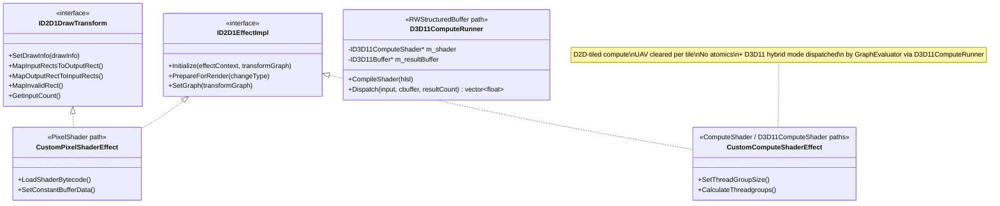

# D2D / D3D11 Hybrid Compute System

## Problem

D2D's custom compute shader API (`ID2D1ComputeTransform`) has fundamental limitations that prevent full-image reduction operations:

| Limitation | Impact |
|-----------|--------|
| **Per-tile UAV clearing** | D2D clears the output `RWTexture2D<float4>` before each tile dispatch. Scatter writes don't accumulate across tiles. |
| **No custom UAV binding** | `ID2D1ComputeInfo::SetResourceTexture` binds read-only `ID2D1ResourceTexture` (register t), not UAVs (register u). |
| **No uint atomics on output** | The output UAV is `RWTexture2D<float4>`. `InterlockedMin`/`InterlockedMax`/`InterlockedAdd` require `RWBuffer<uint>`. |
| **No input as D3D11 texture** | `PrepareForRender` doesn't expose the input image as a D3D11 surface. The effect context is deliberately isolated from the device. |

The built-in `CLSID_D2D1Histogram` effect works around these via private D2D internals not exposed through the public API.

## Solution: Evaluator-Owned D3D11 Dispatch

The graph evaluator owns a **raw D3D11 compute dispatch path** that bypasses D2D's tiling entirely. D2D handles the effect graph wiring (input/output connections), while D3D11 handles the actual computation.

## COM Class Hierarchy


```mermaid
classDiagram
    class ID2D1EffectImpl {
        <<interface>>
        +Initialize(effectContext, transformGraph)
        +PrepareForRender(changeType)
        +SetGraph(transformGraph)
    }

    class ID2D1DrawTransform {
        <<interface>>
        +SetDrawInfo(drawInfo)
        +MapInputRectsToOutputRect()
        +MapOutputRectToInputRects()
        +MapInvalidRect()
        +GetInputCount()
    }

    class D3D11ComputeRunner {
        <<RWStructuredBuffer<float4> path>>
        -ID3D11ComputeShader* m_shader
        -ID3D11Buffer* m_resultBuffer
        +CompileShader(hlsl)
        +Dispatch(input, cbuffer, resultCount) vector~float~
    }

    class CustomPixelShaderEffect {
        <<PixelShader path>>
        +LoadShaderBytecode()
        +SetConstantBufferData()
    }

    class CustomComputeShaderEffect {
        <<ComputeShader / D3D11ComputeShader paths>>
        +SetThreadGroupSize()
        +CalculateThreadgroups()
    }

    ID2D1EffectImpl <|.. CustomPixelShaderEffect
    ID2D1DrawTransform <|.. CustomPixelShaderEffect
    ID2D1EffectImpl <|.. CustomComputeShaderEffect

    note for CustomComputeShaderEffect "D2D-tiled compute\nUAV cleared per tile\nNo atomics\n+ D3D11 hybrid mode dispatched\n by GraphEvaluator via D3D11ComputeRunner"
```

## Data Flow: D2D → D3D11 Handoff


```mermaid
flowchart TD
    subgraph D2D_Graph["D2D Effect Graph (Evaluator)"]
        SRC[Source Node<br/>ID2D1Image*] --> FX[Upstream Effect<br/>Gamut Map / Delta E / etc.]
        FX --> CACHE["cachedOutput<br/>(deferred ID2D1Image*)"]
    end

    subgraph Realize["Realize to D3D11 Texture"]
        CACHE --> CREATE["dc->CreateBitmap()<br/>DXGI_FORMAT_R32G32B32A32_FLOAT"]
        CREATE --> DRAW["dc->SetTarget(bitmap)<br/>dc->DrawImage(cachedOutput)<br/>dc->SetTarget(prev)"]
        DRAW --> FLUSH["dc->Flush()<br/>⚠ Required — D2D batches<br/>commands until Flush/EndDraw"]
        FLUSH --> SURFACE["bitmap->GetSurface()<br/>→ IDXGISurface"]
        SURFACE --> QI["surface->QueryInterface()<br/>→ ID3D11Texture2D"]
    end

    subgraph D3D11_Compute["D3D11 Compute Dispatch"]
        QI --> SRV["CreateShaderResourceView()<br/>register(t0)"]
        SRV --> CBUF["Update Constant Buffer<br/>(Width, Height, Channel, NonzeroOnly)"]
        CBUF --> CLEAR["ClearUnorderedAccessViewUint()<br/>(reset result buffer)"]
        CLEAR --> DISPATCH["ctx->Dispatch(1, 1, 1)<br/>32×32 = 1024 threads"]
    end

    subgraph GPU_Reduction["GPU Reduction (groupshared)"]
        DISPATCH --> STRIDE["Each thread strides<br/>across entire image"]
        STRIDE --> LOCAL["Per-thread accumulators<br/>min, max, sum, count"]
        LOCAL --> SHARED["groupshared parallel reduction<br/>log2(1024) = 10 steps"]
        SHARED --> WRITE["Thread 0 writes<br/>8 uints to RWBuffer"]
    end

    subgraph Readback["Result Readback (32 bytes)"]
        WRITE --> COPY["CopyResource()<br/>→ staging buffer"]
        COPY --> MAP["Map() + read 8 uints"]
        MAP --> STATS["ImageStats struct<br/>min, max, mean, samples, nonzero"]
        STATS --> ANALYSIS["node.analysisOutput.fields<br/>(data pins on graph)"]
    end
```

## Three Effect Types Compared

| | D2D Pixel Shader | D2D Compute Shader | D3D11 Hybrid Compute |
|---|---|---|---|
| **COM class** | `CustomPixelShaderEffect` | `CustomComputeShaderEffect` (D2D-tiled mode) | `CustomComputeShaderEffect` (D3D11 mode) |
| **D2D interface** | `ID2D1DrawTransform` | `ID2D1ComputeTransform` | `ID2D1DrawTransform` (pass-through) |
| **Shader target** | `ps_5_0` | `cs_5_0` | `cs_5_0` (dispatched by host) |
| **Execution** | D2D renders directly | D2D dispatches per-tile | Evaluator dispatches via D3D11 |
| **Tiling** | D2D-managed | D2D-managed (UAV cleared) | **None** — single dispatch |
| **Atomics** | N/A | No (float4 UAV only) | **Yes** (RWStructuredBuffer / RWBuffer) |
| **groupshared** | N/A | Yes (per-tile only) | **Yes** (full image) |
| **Shader linking** | Yes (D2D optimizes) | No | No |
| **Image output** | Yes | Yes | Optional (pass-through or none) |
| **Analysis output** | Via pixel readback | Via pixel readback | Via `RWStructuredBuffer<float4> Result` |
| **`CustomShaderType`** | `PixelShader` | `ComputeShader` | `D3D11ComputeShader` |

The `D3D11ComputeShader` mode is what powers Channel / Luminance / Chromaticity Statistics, the gamut analysis effects, and any user-authored "analyze the whole image" shader created via the Effect Designer. Internally it dispatches through `Rendering::D3D11ComputeRunner`.

## Usage: ShaderLab Evaluator (Optimized Path)

```cpp
// In GraphEvaluator::ProcessDeferredCompute(), for D3D11ComputeShader nodes:

// 1. Render upstream D2D output to FP32 bitmap
winrt::com_ptr<ID2D1Bitmap1> gpuTarget;
dc->CreateBitmap(D2D1::SizeU(w, h), nullptr, 0, fp32Props, gpuTarget.put());
winrt::com_ptr<ID2D1Image> prevTarget;
dc->GetTarget(prevTarget.put());
dc->SetTarget(gpuTarget.get());
dc->Clear(D2D1::ColorF(0, 0, 0, 0));
dc->DrawImage(upstreamNode->cachedOutput);
dc->SetTarget(prevTarget.get());

// 2. Flush D2D command batch — CRITICAL for D2D→D3D11 handoff.
//    D2D batches DrawImage commands until EndDraw() or Flush().
//    Without this, D3D11 reads uninitialized zeros from the texture.
dc->Flush();

// 3. Get D3D11 texture (zero-copy — same DXGI surface)
winrt::com_ptr<IDXGISurface> surface;
gpuTarget->GetSurface(surface.put());
winrt::com_ptr<ID3D11Texture2D> d3dTexture;
surface->QueryInterface(d3dTexture.put());

// 4. Dispatch GPU reduction (single call)
auto stats = m_gpuReduction.Reduce(d3dCtx, d3dTexture.get(), channel, nonzeroOnly);

// 5. Populate analysis output for graph data pins
node->analysisOutput.fields = { {"Min", stats.min}, {"Max", stats.max}, ... };
```

## Known Limitations

- **D2D→D3D11 flush required**: When rendering a D2D effect chain to a bitmap and then reading it with D3D11, `dc->Flush()` **must** be called between `DrawImage` and any D3D11 access to the underlying texture. D2D batches draw commands until `EndDraw()` or `Flush()` — without an explicit flush, D3D11 reads zeros from the texture. Applied in `DispatchUserD3D11Compute` in `GraphEvaluator`.
- **The draw-session contract is SPLIT, and both halves matter.** `ProcessDeferredCompute` must run **inside** an active `BeginDraw`/`EndDraw` session, because it pre-renders each compute input with `dc->DrawImage` into an FP32 bitmap; outside a session that `DrawImage` silently no-ops and the compute reads a black input. But `GraphEvaluator::Evaluate` must run **outside** one: the D2D Histogram and custom-analysis readbacks open their *own* `BeginDraw`, and nesting that fails with `D2DERR_WRONG_STATE` (`0x88990001`). (Until 2026-09-25 `Evaluate` also pre-rendered compute inputs that way, via the now-deleted `PreRenderInputBitmap`; see below.) Any post-dispatch `Evaluate` sweep that must happen inside the session runs under `SetDeferredComputeFrozen(true)`: it cannot re-queue a compute node, and the Histogram defers its read to the next frame. `MainWindow::RenderFrameToOffscreen`, the headless `runEval` and `RunRender` all use this exact shape.
- **Compute inputs are pre-rendered in exactly one place: inside `ProcessDeferredCompute`, after any producer in the same pass has been dispatched.** That makes them fresh by construction across `compute -> compute` and `compute -> pixel shader -> compute` chains. There used to be a second, `Evaluate`-time snapshot "taken while properties are fresh"; it predated the producer's dispatch, so it had to be discarded for exactly the inputs where freshness matters, and it allocated a new full-size FP32 bitmap (133 MB at 4K) per input per dirty frame. Targets now persist, keyed by producing node + output pin (decision #95), and an input that is already an FP32 bitmap covering exactly its bounds -- another compute node's output -- is bound without a copy. Inputs are resolved from the graph at dispatch time; the image recorded in the queue is only a fallback. Unbounded inputs (Flood, Tile, Border, Turbulence) are refused with a runtime error, and fractional bounds are snapped outward to whole pixels (`Effects::SnapComputeInputRect`).
- **Deferred compute runs in topological order, and the Direct2D nodes between dispatches are re-evaluated before they are read** (decision #127). The queue is filled across the host's `Evaluate` passes, so it is sorted by `EffectGraph::TopologicalSort` before dispatching. A dispatch changes its node's pixels and analysis values, but a Direct2D node downstream of it (a `CIE Chromaticity Plot` reading a `CIE Histogram`, a tone mapper whose `SourcePeakNits` is bound to a statistics node) was wired, sized and bound by `Evaluate` before the dispatch ran -- on the first frame it is not wired at all, since its producer had no output yet. So before dispatching a consumer, `ProcessDeferredCompute` walks the consumer's Direct2D inputs (stopping at compute nodes) and, if any is dirty and a dispatch has run since the last refresh, re-runs `Evaluate` frozen: nothing is queued and no readback opens a draw session. Without it a `Side by Side` fed by `histogram -> plot` failed with `0x8007139F` on the first frame (the plot had empty bounds) and stayed failed on a paused graph. A compute node is queued even when its input 0 has no image yet, as long as that input's producer is queued in the same cycle; the image is resolved after the producer dispatches.
- **A wired input that is not ready fails the dispatch by name, and a failed dispatch leaves no output.** An input with no image or empty bounds (an upstream shader still compiling, a failed producer) sets `Input N has no image yet; its upstream is not ready` instead of dispatching into a variadic node whose `InputMask` and derived size would disagree. Any failed dispatch clears the node's `cachedOutput` and dirties its downstream, so the preview and *Save image* show nothing rather than the last good frame, which read as current. A successful dispatch clears the node's `dirty`; a frozen `Evaluate` leaves a dirty compute node dirty (it cannot queue it), so a change found after the dispatch -- a binding value read back late, an input re-dirtied -- is dispatched on the next frame instead of being dropped.
- **Size limits.** A compute input is copied into one D3D11 texture, so it can be at most 16384 px on a side (`D3D11_REQ_TEXTURE2D_U_OR_V_DIMENSION`); a larger one is refused with a runtime error naming the limit, never truncated. The pre-render is FP32, 16 bytes per pixel: 265 MB for a 7680x2160 desktop, 398 MB at 11520x2160, per compute input. Custom **pixel shaders** have no size limit of their own -- Direct2D tiles them -- and their output rect is the union of their image inputs. Only an edge that no input bounds (Flood, Tile, Border, Turbulence) is pinned: left/top to 0, right/bottom to the widest bounded input or 4096, because `TEXCOORD` is normalised over that rect and an infinite one sends every pixel to the same texel (decision #116).
- **A compute node is queued at most once per evaluate cycle.** `m_queuedComputeThisEval` lives until `ProcessDeferredCompute` drains the queue, so a second `Evaluate` pass would otherwise re-queue a binding consumer of a node queued in the first -- two dispatches of the same node. The dispatch reads the node's state when it runs, so one entry is always current.
- **Shader variants are identified by DXBC checksum.** The bridge treats `SetCompiledBytecode` with the installed checksum as a no-op and keeps a few created shaders per node; the evaluator memoizes variant bytecode and cbuffer reflection by checksum (decision #96). The evaluator installs whatever the binding plan implies before every dispatch -- there is no restore-to-baseline afterwards.
- **A compute node re-dispatches on a PULLED dirty flag, and the pull includes property bindings.** `needsCompute` has no "my input image changed" term of its own -- it reads `node->dirty`, which `Evaluate` sets at the node's visit by asking whether anything it reads changed earlier in the same pass (`m_outputChangedThisEval`). Two reasons this is a pull and not the push pass it used to be. A **property binding is an invalidation edge but not a graph edge**: a `Clock` has no output pins and no edges, so a push along edges never reaches what it animates. And a node **becomes dirty mid-pass**, when `ResolveBindings` sees a bound value move -- invisible to a pass that already ran, and cleared before the next one, so the change propagated on no frame at all. The symptom was silent and convincing: an analysis node downstream of animated content dispatched on the single frame its `analysisOutput.fields` was still empty, then reported those fields forever while its input kept moving. If you add a new site that sets `node->dirty` during the main loop, mark the node with `MarkOutputChanged` there too, or its consumers will not learn. One exception is deliberate: a video Source whose bound `Time` moved goes into `m_fieldsChangedThisEval` instead, which wakes nodes bound to its analysis fields but not the nodes reading its image; its image changes only on an upload, which dirties it directly (see [animation-system.md](../ui-ux/animation-system.md#video-playback)).
- **Readback is blocking, asynchronous or skipped per dispatch.** `D3D11ComputeRunner` has a 3-slot staging ring. Blocking (`Map` straight after submit) drains the whole GPU pipeline and is what headless, the tests and MCP-forced frames get. With `Performance::SetAsyncAnalysisReadbackEnabled(true)` -- the GUI only -- and skip-readback on, a needed readback is queued instead; `Evaluate` polls it with `DO_NOT_WAIT` at the start of each pass, unpacks it, and dirties everything bound to the node. `HasPendingReadbacks()` tells the host to keep rendering until it lands (decision #97). A readback is skipped only for a node whose every bound consumer reads the value on the GPU in the variant it actually ran last; a consumer on its generic fallback while a variant compiles reads the cbuffer and keeps the readback on (decision #114).
- **The analysis readback happens inside the DISPATCH, so forcing a frame is not enough to refresh it.** `isReadbackNeeded` gates the GPU->CPU copy, and the host's CPU-analysis interest set holds only the **GUI-selected node** and its binding sources -- so over MCP, where nothing is selected, no dispatch carries `readback=true`. Clearing the skip flag and re-rendering still copies nothing if the node happens to be clean that frame. `GET /analysis/{id}` therefore dirties the node before its forced frame. Any other route that means to report fresh analysis values must do the same.
- **Compute never issues a multi-call sequence on the shared immediate context.** That context also carries Direct2D's work (both D2D contexts share the device), and `SetMultithreadProtected` makes single calls safe, not sequences — a dispatch issued call by call could run with its bindings clobbered by another thread and write nothing while returning `S_OK`. `D3D11ComputeRunner` records everything on its own deferred context and submits once via `ExecuteCommandList(list, TRUE)`; the immediate context sees only that call and the readback `Map`. `TRUE` preserves the immediate context's state for whoever else is mid-sequence on it. Anything new that issues D3D11 commands on this device should follow the same pattern rather than take `ID2D1Multithread`, which would tie it to Direct2D.
- **Generator compute nodes** (no image inputs — e.g. `ICtCp Gamut Boundary LUT`) are fed a 1×1 zero placeholder as input 0, because the dispatch gate, the deferred queue and the bridge's pre-render all assume one. The placeholder is never dirty, so a generator re-dispatches only when its own properties move. Size its output with hidden `OutputWidth`/`OutputHeight` defaults — the explicit-size path — not `OutputSize`/`DiagramSize`, which route to the single-group dispatch.
- **Image-output size, in order:** a built-in's `deriveImageOutputSize` hook (given each wired input's pre-rendered size, `{0, 0}` for an unwired pin), then explicit `OutputWidth` + `OutputHeight`, then `DiagramSize`/`OutputSize`, then input 0's size. An output past 16384 px on a side is refused with a runtime error before the dispatch, as an over-size input is. `Side by Side` uses the hook: at Native its output is the tile arrangement, which depends on how many inputs are wired and how big the first one is (decision #118).
- **Variadic compute nodes** work as variadic pixel shaders do: every unwired pin holds the 1×1 zero placeholder and the evaluator writes `InputMask` (bit i = pin i wired) before each dispatch. Each input arrives at its own native size, so `GetDimensions` on its texture is exact -- unlike a D2D pixel shader input, which may sit in a larger atlas allocation.
- **No shader linking**: D3D11 compute shaders are opaque to D2D. They don't participate in D2D's shader linking optimization for chained pixel shader effects.
- **Whole-image reductions are multi-group by opt-in.** A data-only node is dispatched `(1,1,1)` by default. A shader that writes `SHADERLAB_REDUCE_SCRATCH` (from `shaderlab_params.hlsli`) is instead dispatched `SHADERLAB_REDUCE_GROUPS` (64) groups wide, with a uint scratch buffer at `u2`: each group writes a partial block, then `ShaderLabReduceIsLastGroup(tid)` (an atomic counter in scratch word 0) elects the last group to finish, which folds the partials and writes `Result`. Only the first `SHADERLAB_REDUCE_CLEARED` words are zeroed per dispatch -- counter plus any `InterlockedAdd` accumulators -- so partials above that must be written in full by every group. The runner detects opt-in by reflecting `_SLScratch`, which keeps saved graphs carrying the old single-group HLSL dispatching as before (decision #98). All five built-in statistics / scatter effects use it. The macro adds one groupshared `uint` for the last-group flag; a shader whose own groupshared already fills the 32 KB `cs_5_0` limit writes `SHADERLAB_REDUCE_SCRATCH_SHARED_FLAG(flag)` instead, after declaring its arrays, naming a groupshared word it no longer needs at that point (Gamut Coverage passes its first bin, which it has already folded and reloads afterwards). That form adds a barrier after the flag is read so the shader cannot overwrite it early.
- **Scatter-to-image effects run as two dispatches by opt-in.** A shader whose image pixels are bins the input is scattered into (CIE Histogram) writes `SHADERLAB_IMAGE_PASS(type)` at file scope instead of `SHADERLAB_REDUCE_SCRATCH`. That declares a `_SLPassConstants` cbuffer at `b1` holding `ShaderLabPass`, the scratch buffer at `u2`, and `RWStructuredBuffer<type> _SLPixelAccum` at `u3`. The runner reflects the two names (and the structured buffer's stride, which reflection reports in `NumSamples`), allocates one `type` per image-output pixel, and records in one command list: clear the scratch head and the output image, dispatch pass 0 with one thread per input-0 pixel (`ceil(W / numthreads.x) x ceil(H / numthreads.y)`), then pass 1 with one thread per output pixel. The caller's dispatch size is ignored. D3D11 orders the two dispatches, so pass 1 sees every pass-0 atomic. The accumulator is zeroed only when it is created (size or stride changed) or a shader is installed; after that **pass 1 must zero whatever pass 0 accumulated into**, which costs only the touched bins instead of a full clear every frame. `ShaderLabPass` is a cbuffer value rather than a UAV word because `fxc` rejects a barrier under a branch on anything it cannot prove uniform (X3663). The accumulator is `pixels x stride` bytes -- 256 MB for a 4096-square CIE Histogram -- and a failure to create it, like any other failure inside the runner, surfaces as the node's runtime error through `D3D11ComputeRunner::LastDispatchResult` (decision #119).


---

Back to [docs/](../README.md) • [Repo root](../../README.md)