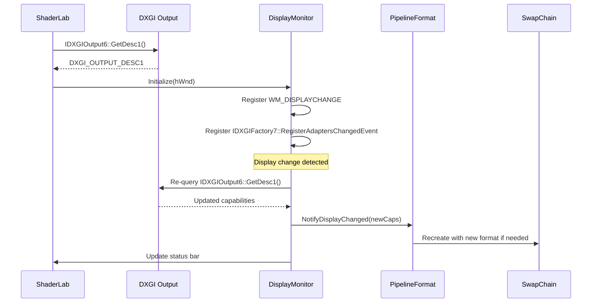

# Display Monitoring

## SDR white level

`DisplayCapabilities::sdrWhiteLevelNits` is queried from the OS via `DisplayConfigGetDeviceInfo(DISPLAYCONFIG_DEVICE_INFO_GET_SDR_WHITE_LEVEL)`, decoded as `nits = SDRWhiteLevel / 1000 * 80`. This value tracks the user's **Settings → Display → HDR → "SDR content brightness"** slider when HDR is on; when HDR is off it falls back to 80 nits.

The value is exposed to graphs through the **`Working Space` parameter node** (see [Working Space Integration](#working-space-integration)) on its `SdrWhiteNits` analysis output. Effects that need to know the nit value of scRGB 1.0 (the entire ICtCp suite) consume it via property bindings — wire `working_space.SdrWhiteNits` into the effect's nit-target parameter and it tracks both the OS slider and any simulated `DisplayProfile` preset automatically. There is no longer any per-effect "follow the live monitor" or "follow the working space" host-side plumbing; the Working Space node is the single explicit path.

---

Back to [docs/](../README.md) • [Repo root](../../README.md)