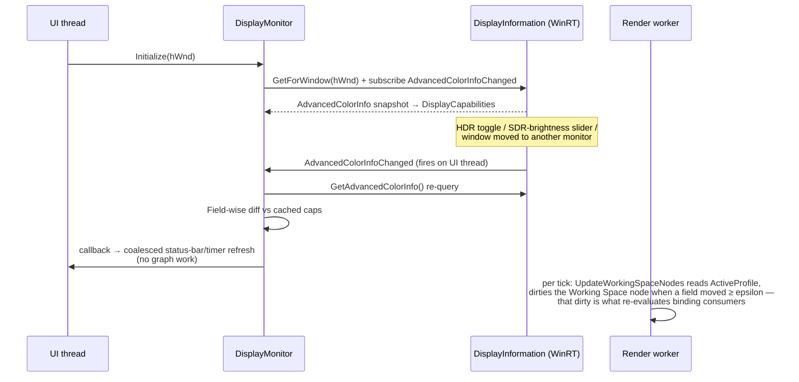

# Display Monitoring

Display capabilities are sourced from the WinRT
**`Windows.Graphics.Display.AdvancedColorInfo`** API. At startup the GUI
host binds a `DisplayInformation` object to the main window via the
desktop interop factory (`IDisplayInformationStaticsInterop::GetForWindow`,
`windows.graphics.display.interop.h`) and subscribes to its
**`AdvancedColorInfoChanged`** event. This requires **Windows 11 22H2
(10.0.22621)** — the app's declared minimum OS.

```mermaid
sequenceDiagram
    participant UI as UI thread
    participant DM as DisplayMonitor
    participant DI as DisplayInformation (WinRT)
    participant RW as Render worker

    UI->>DM: Initialize(hWnd)
    DM->>DI: GetForWindow(hWnd) + subscribe AdvancedColorInfoChanged
    DI-->>DM: AdvancedColorInfo snapshot → DisplayCapabilities

    Note over DI: HDR toggle / SDR-brightness slider /<br/>window moved to another monitor
    DI->>DM: AdvancedColorInfoChanged (fires on UI thread)
    DM->>DI: GetAdvancedColorInfo() re-query
    DM->>DM: Field-wise diff vs cached caps
    DM->>UI: callback → coalesced status-bar/timer refresh<br/>(no graph work)
    RW->>RW: per tick: UpdateWorkingSpaceNodes reads ActiveProfile,<br/>dirties the Working Space node when a field moved ≥ epsilon —<br/>that dirty is what re-evaluates binding consumers
```

One `AdvancedColorInfo` snapshot supplies everything in
`DisplayCapabilities`: the active color kind (SDR / WCG / HDR →
`activeColorMode` 0/1/2), kind availability (`hdrSupported` /
`wcgSupported` via `IsAdvancedColorKindAvailable`), the four luminance
values (peak, min, max-full-frame, SDR white level), and the four EDID
chromaticity points (RGB primaries + white point). `bitsPerColor` is
derived from the active kind (WCG/HDR → 10, SDR → 8) since WinRT does
not expose scanout depth. The `GetForWindow`-bound object hooks the
window's message loop, so moving the window between monitors re-targets
the reported display automatically — no `WM_DISPLAYCHANGE` handling, no
monitor polling, and no DXGI adapter-change registration remain.

The event fires on the UI thread (the thread whose `DispatcherQueue`
created the binding). The callback does **no graph work at all** — the
render worker's per-tick `UpdateWorkingSpaceNodes` is the sole
propagation path (single-writer discipline), and nothing else in the
graph depends on display state ("bind, don't hide"). This matters
because **adaptive-color displays fire the event at ambient-sensor
rate** with sub-nit luminance drift: the callback's UI refresh is
coalesced behind a pending flag, and the Working Space sync applies
per-field dead-bands (1 nit on luminance, 0.0005 on chromaticity) so
sensor jitter neither re-evaluates the graph nor floods the UI thread.
Slider drags move multiple nits and propagate on the next tick.
`DisplayInformation` is agile, so on-demand re-queries
(`QueryCurrentCapabilities`) are safe from any thread — MCP routes run
them on the render worker in the GUI host.

**WinUI 3 prerequisite**: `GetForWindow` requires a running
`Windows.System.DispatcherQueue` on the calling thread — and WinUI 3
threads only run `Microsoft.UI.Dispatching.DispatcherQueue`, a distinct
type. `MainWindow::InitializeRendering` creates the system queue via
`CreateDispatcherQueueController` (the same pattern system-backdrop
controllers use) before binding; without it the call throws and the
monitor serves struct defaults. Binding/query failures are recorded in
`DisplayMonitor::LastError()` and surfaced as the optional
`monitorStatus` field of `get_display_info`, so a broken binding is
diagnosable rather than masquerading as an SDR panel.

**Headless host**: no window and no `DispatcherQueue`, so
`InitializeForPrimaryMonitor()` takes a one-shot snapshot of the primary
monitor via `GetForMonitor` (no change events). When no display is
reachable (CI, session 0) the monitor serves struct-default
capabilities.

## SDR white level

`DisplayCapabilities::sdrWhiteLevelNits` comes from
`AdvancedColorInfo::SdrWhiteLevelInNits`. It tracks the user's
**Settings → Display → HDR → "SDR content brightness"** slider live —
slider moves raise `AdvancedColorInfoChanged`, so the value updates
without any polling; when HDR is off it reports 80 nits (scRGB 1.0).

The value is exposed to graphs through the **`Working Space` parameter node** (see [Working Space Integration](#working-space-integration)) on its `SdrWhiteNits` analysis output. Effects that need to know the nit value of scRGB 1.0 (the entire ICtCp suite) consume it via property bindings — wire `working_space.SdrWhiteNits` into the effect's nit-target parameter and it tracks both the OS slider and any simulated `DisplayProfile` preset automatically. There is no longer any per-effect "follow the live monitor" or "follow the working space" host-side plumbing; the Working Space node is the single explicit path.

---

Back to [docs/](../README.md) • [Repo root](../../README.md)
