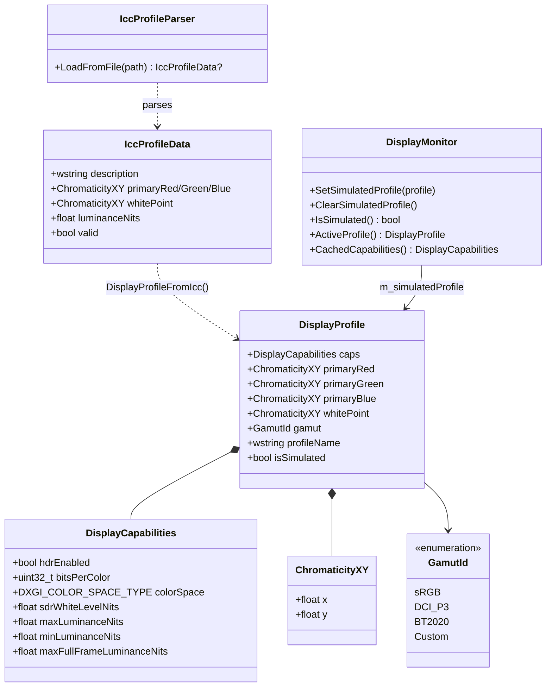
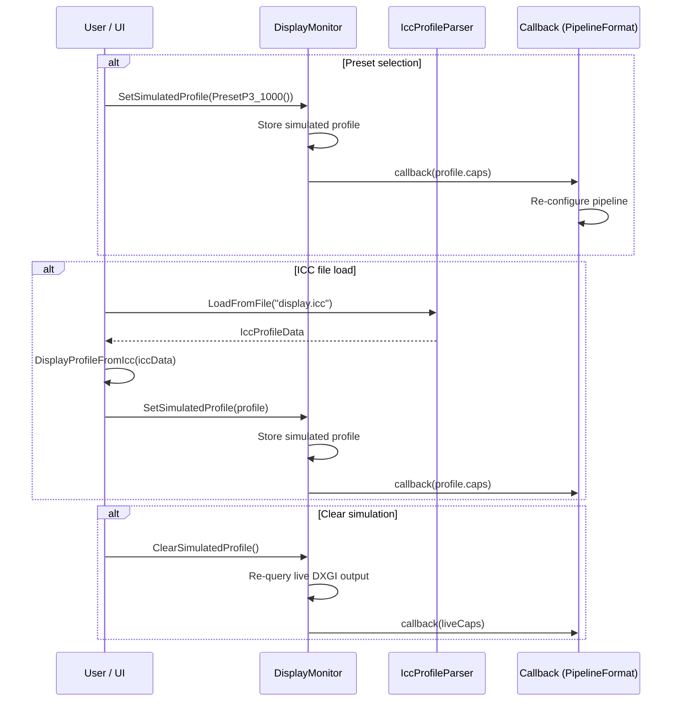

# Display Profile Mocking

Allows overriding the live display's characteristics with values from a preset or ICC profile, enabling tone mapping development targeting arbitrary displays without physical hardware.

---

Back to [docs/](../README.md) • [Repo root](../../README.md)