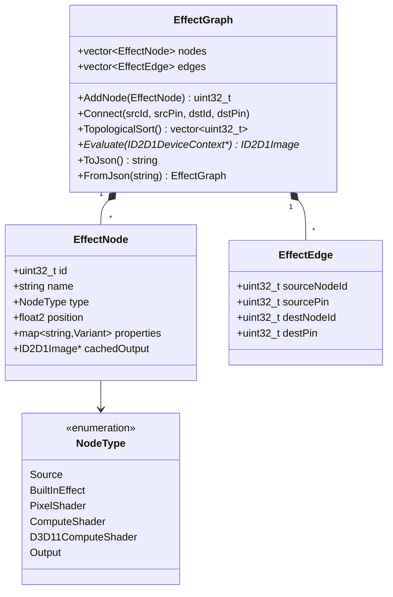

# Effect Graph Model

`NodeType::Output` carries no shader — it is a sink that the evaluator draws to. Parameter and clock nodes (Float / Integer / Toggle / Gamut / Clock / Numeric Expression) are stored as `ComputeShader`-typed nodes whose `customEffect.hlslSource` is empty; the evaluator special-cases them into a CPU-side data path (see [Parameter Nodes](#parameter-nodes) and [Numeric Expression Node](#numeric-expression-node-exprtk)).

---

Back to [docs/](../README.md) • [Repo root](../../README.md)