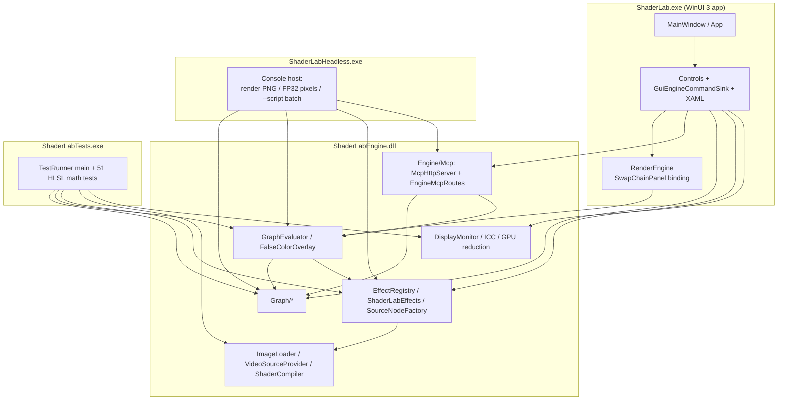

# Architecture Overview

```mermaid
graph TB
    subgraph App["ShaderLab.exe (WinUI 3 app)"]
        MW[MainWindow / App]
        UI[Controls + GuiEngineCommandSink + XAML]
        RE[RenderEngine<br/>SwapChainPanel binding]
    end

    subgraph Engine["ShaderLabEngine.dll"]
        EG[Graph/*]
        EV[GraphEvaluator / FalseColorOverlay]
        FX[EffectRegistry / ShaderLabEffects / SourceNodeFactory]
        IO[ImageLoader / VideoSourceProvider / ShaderCompiler]
        MON[DisplayMonitor / ICC / GPU reduction]
        MCP[Engine/Mcp: McpHttpServer + EngineMcpRoutes]
    end

    subgraph Tests["ShaderLabTests.exe"]
        TR[TestRunner main + 51 HLSL math tests]
    end

    subgraph Headless["ShaderLabHeadless.exe"]
        HC[Console host:<br/>render PNG / FP32 pixels / --script batch]
    end

    MW --> UI
    UI --> RE
    UI --> MCP
    RE --> EV
    UI --> EG
    UI --> FX
    UI --> MON
    EV --> EG
    EV --> FX
    FX --> IO
    MCP --> EG
    MCP --> EV
    TR --> EG
    TR --> EV
    TR --> FX
    TR --> IO
    TR --> MON
    HC --> EG
    HC --> EV
    HC --> FX
    HC --> MCP
```

---

Back to [docs/](../README.md) • [Repo root](../../README.md)