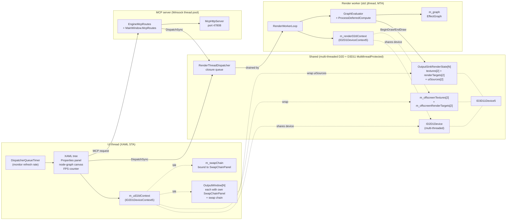
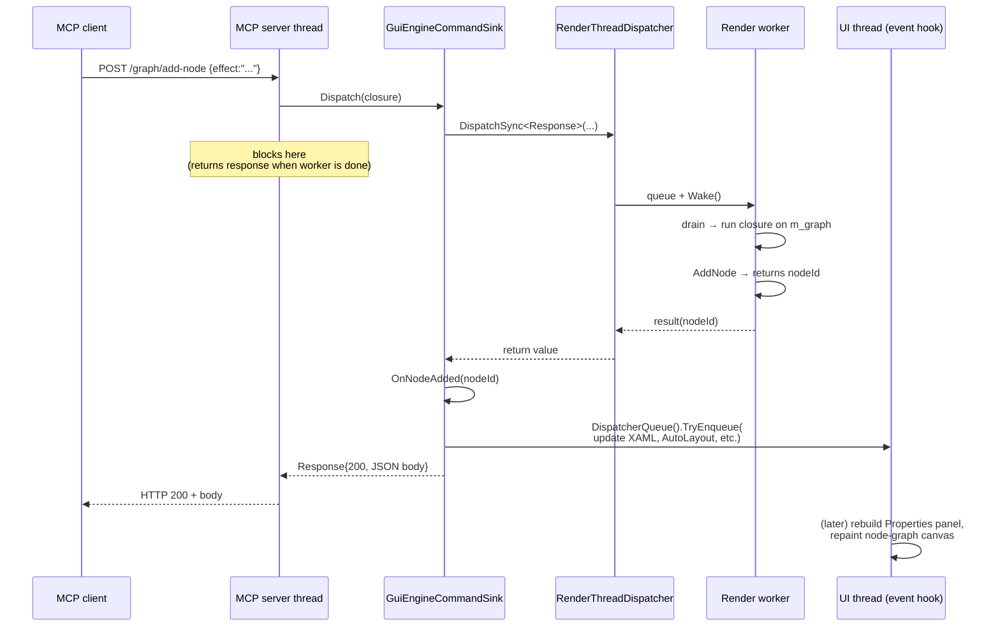
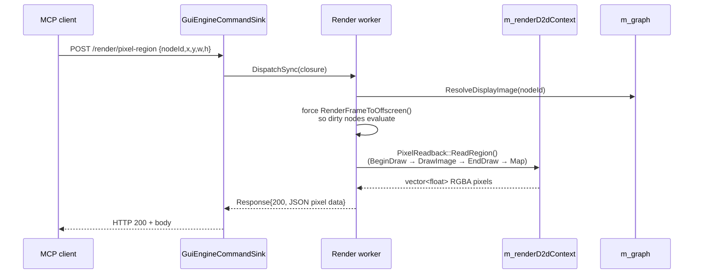
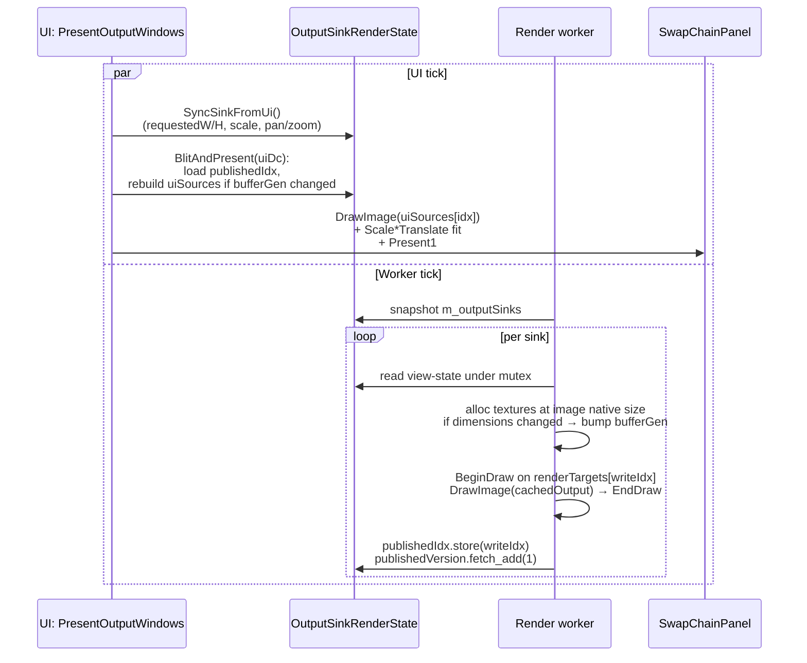
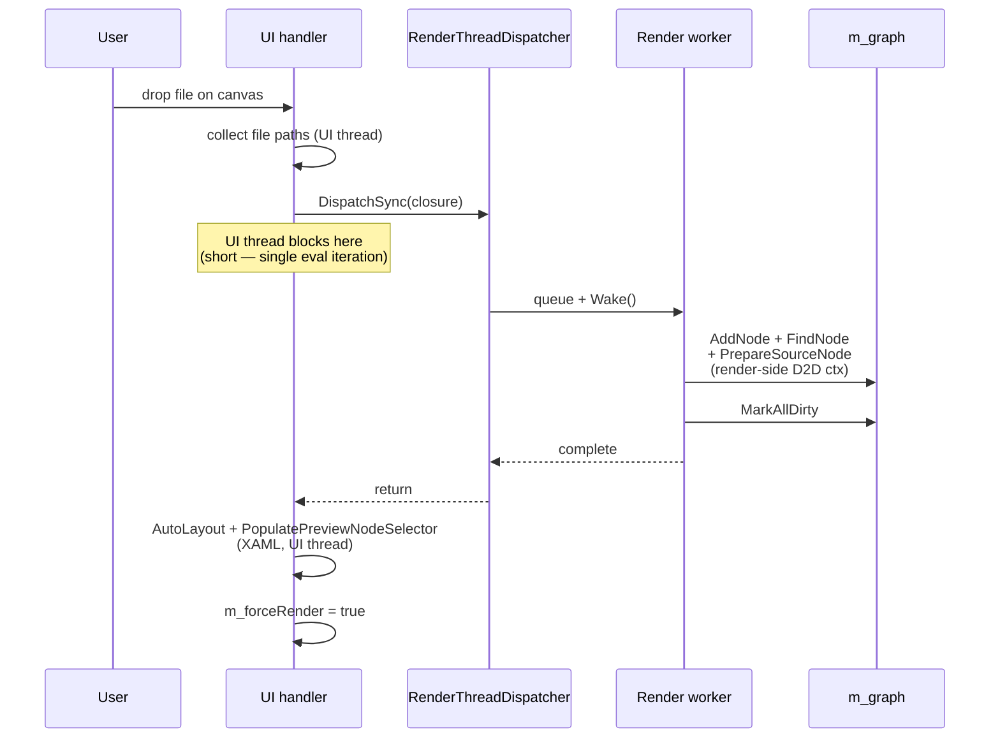
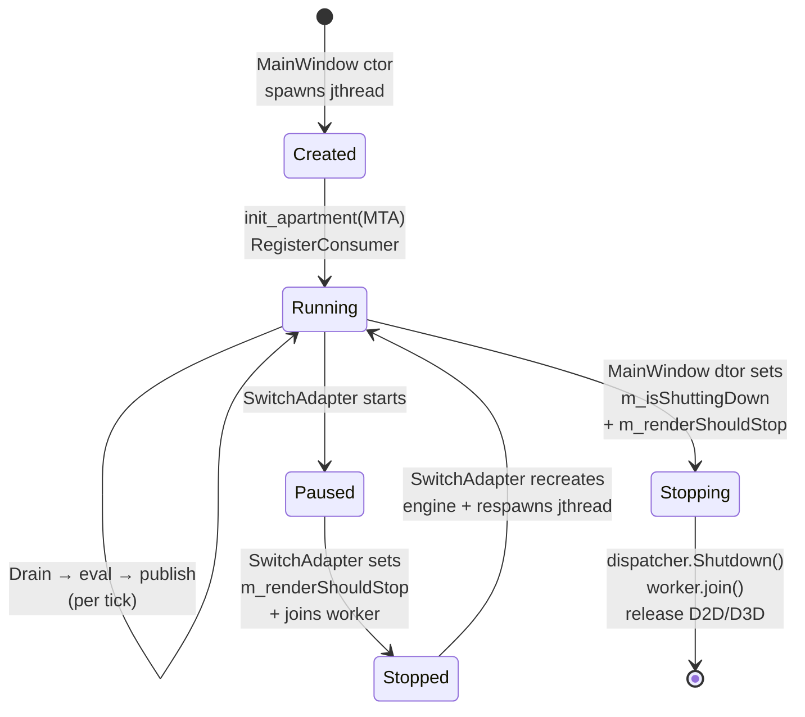

# Threading Model

ShaderLab uses a two-thread architecture: a **UI thread** (XAML STA) for input,
layout, and composition, and a **render worker** (`std::jthread` running MTA) for
all D3D11/D2D graph evaluation. They communicate through a closure-based
dispatcher and a double-buffered offscreen blit.

## High-level component map

Who owns what, and which thread accesses each piece. Solid arrows = ownership
(allocation + lifetime), dotted arrows = access from the other side.



## Per-tick sequence (steady state)

The "happy path" with no input, no MCP, no graph mutations — just the UI tick
draining new frames the worker produced.

```mermaid
sequenceDiagram
    participant UI as UI thread (STA)
    participant Disp as RenderThreadDispatcher
    participant W as Render worker (MTA)
    participant Off as Offscreen[2]
    participant Swap as SwapChainPanel

    loop @ monitor refresh
        UI->>UI: OnRenderTick fires<br/>(DispatcherQueueTimer)
        UI->>UI: UpdateFpsText / status bar
        UI->>UI: m_nodeGraphController.Render()<br/>(editor canvas, UI D2D ctx)
        UI->>UI: BlitOffscreenToSwapChain():<br/>compare publishedVersion vs m_lastBlitted
        alt new frame ready
            UI->>Off: wrap textures[publishedIdx] on UI ctx
            UI->>Swap: BeginDraw + DrawImage + EndDraw + Present1
        else no new frame
            Note over UI,Swap: skip Present;<br/>compositor keeps last frame
        end
        UI->>UI: PresentOutputWindows()<br/>(same blit pattern per Output)
    end

    loop @ monitor refresh
        W->>Disp: Drain() any queued closures
        W->>W: RenderFrameToOffscreen(dt):<br/>dirty BFS, pick idx = published ^ 1<br/>BeginDraw → Evaluate → ProcessDeferredCompute<br/>→ DrawImage → EndDraw
        W->>Off: publishedIdx.store(idx)
        W->>Off: publishedVersion.fetch_add(1)
        W->>W: RenderOutputSinks()<br/>(per-sink double-buffer + bufferGen)
    end
```

The two loops are independent — the UI tick never blocks on the worker, and
the worker never blocks on the UI. The handoff is two atomic stores per
frame.

## MCP mutation (e.g. `/graph/add-node`, `/graph/set-property`)

The MCP server's Winsock thread receives the request, parses the JSON body,
and asks `GuiEngineCommandSink::Dispatch` to marshal the work. The sink
posts a closure to the dispatcher and blocks until the worker has run it.



The closure runs on the worker thread while no eval iteration is in flight
(the dispatcher drains the queue at the top of each loop). Re-entrant calls
from inside a worker closure are detected and run inline so a hook that
itself calls `DispatchSync` doesn't deadlock.

## MCP readback (`/render/pixel-region`, `/render/capture-node`, `/render/pixel-trace`)

Readback routes follow the same dispatch path but the closure body does the
heavy lifting (force a render, then `Map()` the staging texture or walk the
graph reading pixels).



The `Map()` call inside `PixelReadback` is synchronous — it blocks the worker
thread until the GPU finishes the copy. That's fine because the worker has
nothing else to do; the UI thread keeps ticking independently.

`/render/pixel-trace` follows the same shape but the closure body walks the
graph (`PixelTraceController::BuildTrace`) reading 1×1 pixels from each
node's cachedOutput in turn.

## Output windows

Each Output node owns a `shared_ptr<OutputSinkRenderState>`. The UI side
(`OutputWindow`) writes view-state (panel size, pan/zoom, autoFit, closed)
into the sink under a mutex. The render side reads view-state and writes
into the sink's offscreen textures. A buffer-generation handshake lets the
UI rebuild source-bitmap wrappers on its own context when the worker
recreates the offscreen.



The render side renders at the **source image's native size** (stateless about
panel display size or DPI). The UI side handles fit-to-panel on blit. This
keeps the worker free of XAML-context queries and lets each window's
`compositionScale` change without coordinating with the worker.

## User input on UI thread that mutates the graph

Drag-and-drop, Properties-panel slider edits, toolbar add-node, paste, etc.



Anything XAML-touching (canvas layout, panel rebuild, selector populate)
stays on the UI thread after the dispatcher returns. Anything touching
`m_graph` or D3D11/D2D goes inside the closure.

## Worker lifecycle



`Shutdown()` on the dispatcher cancels any pending `DispatchSync` waiters
with `std::runtime_error` so the MCP server thread / UI handlers don't hang.
The worker's outer loop checks `m_renderShouldStop` after each drain so a
mutation queued during shutdown still runs but the next eval pass is
skipped.

## Why two threads

Graph evaluation can take 50-100 ms per frame on heavy 4K HDR chains. Doing
that on the UI dispatcher starved input event delivery — dropdown highlights,
hover, and clicks visibly stalled. Decoupling makes the UI Present cost
sub-millisecond regardless of graph eval throughput.

## Why offscreen-blit (not direct Present-from-render-thread)

`IDXGISwapChain1::Present1` on a chain bound to a XAML `SwapChainPanel` throws
`RPC_E_WRONG_THREAD` from a render-thread MTA, even with multi-threaded D2D and
D3D11 `MultithreadProtected`. The XAML composition integration path is
STA-bound. The render thread therefore writes to offscreen `ID3D11Texture2D`
buffers; the UI thread blits the latest published buffer onto the
SwapChainPanel-bound swap chain.

## Resources

| Resource | Owned by | Notes |
|---|---|---|
| `m_d3dDevice`, `m_d3dContext` | `RenderEngine` | D3D11 immediate context with `ID3D10Multithread::SetMultithreadProtected(TRUE)`. Both threads call into it. |
| Multi-threaded D2D device | `RenderEngine` | Single device, two contexts. |
| `m_d2dDeviceContext` | UI thread | Editor canvas, blit-to-swap-chain, file-save capture. |
| `m_renderD2dContext` | Render thread | `BeginDraw` → graph eval → `EndDraw` per tick. |
| `m_swapChain` | Bound to UI's `SwapChainPanel`. UI thread Presents. |
| `m_offscreenTextures[2]` + `m_offscreenRenderTargets[2]` | Render thread writes; UI thread reads via `m_offscreenSourceBitmapUi[2]` (UI-context wrappers). |
| `m_graph` | Logical single writer/reader on render thread. UI mutations route through `RenderThreadDispatcher::DispatchSync` (worker drains the queue between iterations, so a closure runs while the worker is implicitly paused). |
| `m_outputWindows` (XAML) | UI thread |
| `m_outputSinks` (`OutputSinkRenderState`) | shared_ptr<>; UI thread mutates the vector under `m_outputSinksMutex`; render thread snapshots and reads. |

## Dispatcher

`Rendering::RenderThreadDispatcher` is a closure queue with one consumer (the
worker) and many producers (UI thread, MCP server thread). `DispatchSync`
blocks until the closure has run and returns its result. Re-entrant calls
from inside the consumer thread run inline (the dispatcher detects this with
a thread-local flag).

## MCP routes

`MainWindow::GuiEngineCommandSink::Dispatch` (the engine sink the GUI host
provides to `EngineMcpRoutes`) marshals the closure to the render thread.
Mutating routes (`/graph/add-node`, `/graph/set-property`, …) and readback
routes (`/render/capture-node`, `/render/pixel-region`, `/render/pixel-trace`)
all run on the worker. Engine context (`graph`, `dc`, `d3dDevice`, etc.)
points at render-thread resources.

## Output windows (P12)

Each Output node owns an `OutputSinkRenderState` (shared between UI thread's
`OutputWindow` and render thread's `m_outputSinks` snapshot). The render
worker writes into the sink's offscreen at the source image's native size
(stateless about the panel's display size or DPI). The UI thread does the
fit-to-panel transform (`Scale(zoom)*Translation(pan)` with
`SetDpi(96 * compositionScale)`) when blitting into the window's swap chain
back buffer.

A buffer-generation handshake (`bufferGen` vs `uiObservedGen`) lets the UI
rebuild its source-bitmap wrappers when the worker recreates the offscreen
on a size change, without locking on the read path.

## Pixel trace + capture (P13)

Pixel inspection / pixel trace / per-node capture all walk `m_graph` and
read pixel values from `cachedOutput` via `DrawImage` to a 1×1 staging
texture. They're routed through the render dispatcher so `m_graph` is stable
for the duration of the readback.

## What stays on UI thread

- XAML mutations (Properties panel rebuilds, node-graph canvas, FPS counter,
  flyouts).
- Editor `m_graphSwapChain` Present (the editor canvas renders cheaply,
  sub-ms — kept on UI for simplicity).
- File pickers, dialogs.
- Settings / per-monitor profile UI.

## Adapter switch

UI thread orchestrates: stop the worker → `m_renderDispatcher.Shutdown()` →
`m_renderEngine.Shutdown()` → recreate engine on new adapter → restart
worker. MCP routes return 503 during the swap (the dispatcher is shut down).

## Two-phase shutdown

`MainWindow::~MainWindow`:
1. `m_isShuttingDown = true` (UI thread guard for in-flight callbacks)
2. Stop MCP server (no more incoming routes)
3. Stop UI render timer
4. `m_renderDispatcher.Shutdown()` (cancels pending closures)
5. Stop + join render worker
6. Release output windows, offscreen wrappers, evaluator cache, display monitor, render engine

---

Back to [docs/](../README.md) • [Repo root](../../README.md)
