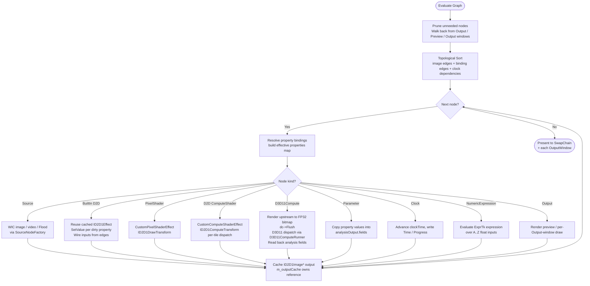

# Topological Evaluation

The evaluator runs at the **monitor's refresh rate** (clamped to 60–240 Hz) on the **render worker thread** (P7+). The UI thread starts a `DispatcherQueueTimer` whose interval is set from `EnumDisplaySettings(ENUM_CURRENT_SETTINGS).dmDisplayFrequency`, but its only per-tick job is to drain the dispatcher queue (handling MCP / user commands) and blit the latest published offscreen to the SwapChainPanel-bound swap chain. The actual graph evaluate runs on the worker, dirty-gated (`Evaluate` is skipped entirely unless any node is dirty, an output window is open, the preview wants a fit, or `m_forceRender` was set by user input). The interval is re-applied on every display change (so dragging the window across monitors picks up the new rate). See [Threading Model](threading-model.md).

---

---

Back to [docs/](../README.md) • [Repo root](../../README.md)