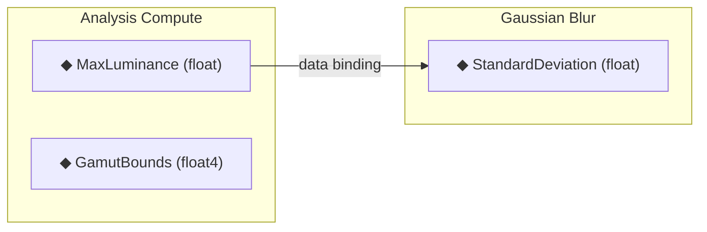

# Property Bindings (Data Pins)

Analysis output fields can be visually connected to downstream effect properties using **data pins** on the node graph canvas.

## Visual Data Pins

- **Image pins**: White circles on node edges (existing D2D image connections)
- **Data pins**: Orange diamonds below image pins
  - Output data pins (right side): analysis fields from compute nodes
  - Input data pins (left side): bindable float/float2/float3/float4 properties
- **Data edges**: Orange bezier curves connecting data pins
- **Type labels**: Each pin shows its type, e.g., `MaxLuminance (float)`

## Binding Rules

| Source → Dest | Behavior |
|---|---|
| float → float | Direct |
| float → float2/3/4 | Replicate (x,x,x,0) |
| float4 → float | Component picker (.x/.y/.z/.w) |
| float4 → float4 | Direct |
| array → array | Direct |
| array ↔ scalar | Rejected |

## Evaluation

- Bindings participate in **topological sort** (source must evaluate before destination)
- **Cycle detection** covers both image edges and binding edges
- Bound values resolved **every frame** (bypass dirty logic — upstream analysis may change)
- **Authored properties never mutated** — bindings build an effective properties map at evaluation time

---

Back to [docs/](../README.md) • [Repo root](../../README.md)